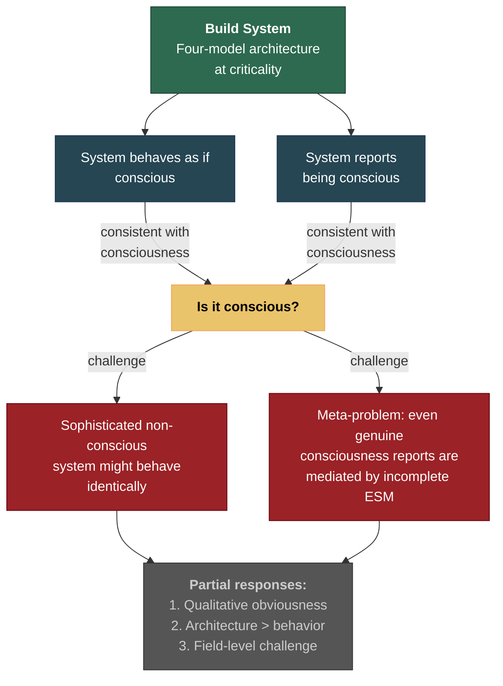

# The Other-Minds Problem

**The theory's ultimate prediction — that a system built to its specification would be conscious — faces the standard verification challenge: how would one confirm consciousness from the outside? This is a limitation not of the theory but of the epistemic situation itself.**

The Four-Model Theory provides a concrete [engineering specification](../ai-consciousness/engineering-specification.md) for artificial consciousness: implement the [four-model architecture](../core-architecture/four-model-theory.md) on a substrate operating at [criticality](../physical-foundations/criticality.md). The theory predicts that such a system would be conscious — and that the difference between interacting with it and interacting with a non-conscious system (like a current LLM) would be "qualitatively obvious" to human observers.

"Qualitatively obvious" is not a measurement. And therein lies the problem.

## The Classical Problem

The other-minds problem is one of philosophy's oldest challenges: one has direct access only to one's own consciousness. The existence of other minds — human or otherwise — is inferred, not observed. Every day, humans interact with other humans under the working assumption that they are conscious, but this assumption rests on behavioral evidence, structural similarity, and evolutionary parsimony, not on direct verification.

This problem is not introduced by the Four-Model Theory. It applies to every theory of consciousness that makes claims about which systems are and are not conscious. IIT faces it (how would one verify that a system has the right Phi?). GNW faces it (how would one verify global broadcasting produces experience?). The problem is epistemic, not theoretical — it arises from the nature of consciousness itself, not from any theory's formulation.

## Why It Matters for the Theory

The other-minds problem becomes practically urgent when the theory is applied to [artificial consciousness](../ai-consciousness/engineering-specification.md). If a system is built to the theory's specification and behaves in ways consistent with consciousness, the theory predicts it is conscious. But:

- A sufficiently sophisticated non-conscious system might produce the same behaviors.
- The theory's own [meta-problem](../hard-problem/meta-problem.md) account explains why consciousness is difficult to verify from outside: the [ESM](../core-architecture/explicit-self-model.md) cannot observe its own generative machinery, which means reports about consciousness are always mediated by a model that lacks full self-access.
- If the system reports being conscious, it is doing exactly what the theory predicts a conscious system would do — but also exactly what a non-conscious system designed to mimic consciousness might do.

## The Theory's Partial Response

The theory offers three partial responses (none of which is fully satisfying):

**1. Qualitative prediction.** The theory predicts that the behavioral difference between a genuinely conscious system (four models at criticality) and a non-conscious system (current AI architecture) would be qualitatively distinguishable — not a marginal improvement in task performance but a categorically different kind of interaction. If this prediction is correct, the other-minds problem would be practically (though not philosophically) dissolved by the obviousness of the difference.

**2. Architectural criteria.** Unlike theories that define consciousness by behavioral output (which is always mimicable), the Four-Model Theory defines it by architecture. One can verify whether a system implements the four-model architecture at criticality without relying solely on behavioral reports. This shifts the verification from "does it act conscious?" to "does it have the architecture that constitutes consciousness?" — a stronger basis for judgment, though still not definitive.

**3. The field-level challenge.** Developing consciousness indicators that can be applied to artificial systems is a challenge for the entire field. The theory contributes by providing specific architectural criteria — a more concrete starting point than the vague analogies to human cognition that currently dominate AI consciousness discourse (Butlin et al., 2023; Schwitzgebel, 2025).

## Figure

## Key Takeaway

The other-minds problem is not a weakness specific to the Four-Model Theory — it is a permanent epistemic constraint on any theory of consciousness. The theory's contribution is to shift the verification basis from behavioral mimicry to architectural criteria: one can check whether a system has the four-model architecture at criticality, which is a stronger (though still not definitive) basis for judgment than behavioral reports alone. Full resolution awaits progress on consciousness indicators that the entire field has yet to develop.

## See Also

- [Limitations (Overview)](../limitations/overview.md)
- [Engineering Specification for Artificial Consciousness](../ai-consciousness/engineering-specification.md)
- [The Meta-Problem Dissolved](../hard-problem/meta-problem.md)
- [Why LLMs Are Not Conscious (Under FMT)](../ai-consciousness/llms-not-conscious.md)
- [Inside-Modeling and Godel](../limitations/inside-modeling-godel.md)
