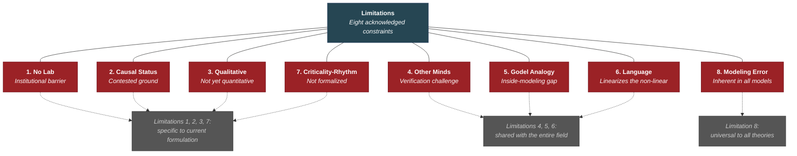

# Limitations

**The theory acknowledges eight specific limitations — from the absence of an institutional laboratory to the inherent epistemological constraints of a conscious system modeling itself. These are stated explicitly because intellectual honesty requires it, and because knowing where a theory is weak is as important as knowing where it is strong.**

Every theory is a model, and every model carries inherent modeling error. The Four-Model Theory does not claim to be a final or complete account of consciousness. It claims to be a useful one — generating testable predictions and unifying phenomena that other frameworks address in isolation. To the extent that it is wrong, its [predictions](../predictions/confirmed.md) are designed to reveal where.

## The Eight Limitations

### 1. No Institutional Laboratory

The theory's predictions were derived theoretically and have not been tested in the author's own laboratory. This does not affect their validity as predictions, but it means empirical testing depends on the willingness of established laboratories to take them up. The predictions in Section 8 of the consciousness paper are designed to be testable with existing equipment and paradigms — the barrier is institutional, not technical.

### 2. The Causal Status Controversy

The theory holds that qualia lack independent causal power over the substrate, yet the simulation is functionally essential — the substrate's mechanism for consequence-evaluation (the [dual evaluation architecture](../bridge/dual-evaluation-intelligence.md)). This position occupies contested ground between two camps: philosophers who insist consciousness must have independent causal efficacy, and strict epiphenomenalists who object that the feedback loop smuggles causation back in under another name. The [process view](../philosophical/process-not-agent.md) is internally consistent but will draw fire from both sides.

### 3. Qualitative Rather Than Quantitative

The theory's predictions are stated in qualitative terms: "criticality increases," "permeability changes," "ESM redirects." Quantitative formalization — specifying thresholds numerically, deriving predictions as mathematical consequences — would strengthen the predictions and enable more precise experimental testing. This is acknowledged as a priority for future work (see [Open Question 2](../open-questions/overview.md)).

### 4. The Other-Minds Problem

The ultimate prediction — that a system built to the theory's specification would be conscious — faces the standard [other-minds problem](../limitations/other-minds.md): verification of consciousness from the outside is fundamentally challenging. The theory predicts the difference would be "qualitatively obvious," but qualitative obviousness is not a measurement. This is a challenge for the entire field, not specific to this theory.

### 5. Inside-Modeling and Godel

The brain modeling itself faces a structural limitation analogous to Godel's incompleteness: the instrument is the object of study. See [Inside-Modeling and Godel](../limitations/inside-modeling-godel.md) for full treatment.

### 6. Language Linearizes Non-Linear Phenomena

Any theoretical framework expressed in natural language necessarily serializes phenomena that may be inherently parallel and non-linear. The four models operate simultaneously in high-dimensional state spaces; describing them sequentially in prose introduces a representational loss that no amount of careful writing can eliminate. This limitation applies to all consciousness theories, not only this one.

### 7. Criticality-Rhythm Relationship Not Formalized

The theory argues that biological rhythms (sleep-wake cycling, ultradian rhythms, neurotransmitter depletion and replenishment) govern how long the substrate can maintain the critical regime. This relationship between dynamical criticality and biochemical rhythm is proposed qualitatively; a formal model linking neurotransmitter kinetics to criticality maintenance and breakdown remains to be developed.

### 8. Every Model Has Modeling Error

The Four-Model Theory is itself a model — and every model is a simplification that carries inherent modeling error. The four-model taxonomy identifies the minimum architecture; the actual brain likely has more fine-grained structure. The real/virtual distinction may be less sharp than the current formulation assumes (see [Are the Implicit Models Also Virtual?](../open-questions/implicit-models-virtual.md)). The theory does not claim to be the final word — it claims to be a productive starting point that generates testable consequences. To the extent that it is wrong, the predictions are designed to reveal where.

## Limitations vs. Open Questions

The distinction between [limitations](../limitations/overview.md) and [open questions](../open-questions/overview.md) is worth noting. Open questions are areas where the theory identifies specific researchable problems — questions it generates and helps to sharpen. Limitations are constraints on the theory itself — features of its current formulation, its author's circumstances, or its epistemological status that constrain what it can claim. Open questions invite research. Limitations invite humility.

## Figure

## Key Takeaway

The theory's limitations are stated explicitly because a theory that hides its weaknesses is less trustworthy than one that acknowledges them. Several of these limitations (other-minds, inside-modeling, language linearization) are shared with every consciousness theory. Others (no lab, qualitative predictions, causal status) are specific to the theory's current formulation and could be addressed through collaboration, formalization, and empirical testing. The modeling error limitation is universal — a permanent feature of any theory about anything.

## See Also

- [The Other-Minds Problem](../limitations/other-minds.md)
- [Inside-Modeling and Godel](../limitations/inside-modeling-godel.md)
- [Open Questions (Overview)](../open-questions/overview.md)
- [Consciousness as Process, Not Agent](../philosophical/consciousness-as-process.md)
- [The Criticality Requirement](../physical-foundations/criticality.md)
