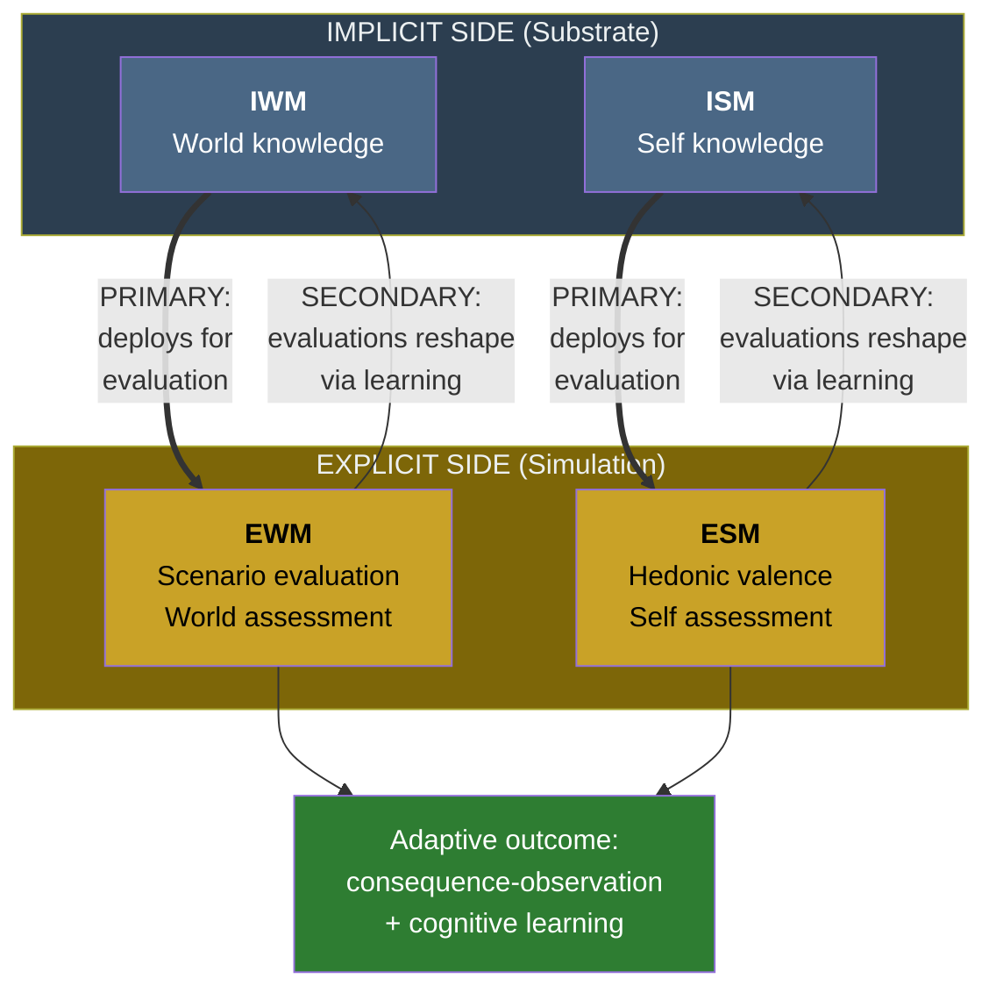

# The Dual Evaluation Architecture

**The substrate deploys the virtual simulation as its evaluation mechanism, and the simulation's evaluations feed back to reshape the substrate — a bidirectional architecture that makes consciousness functional without granting it independent causal power.**

A persistent question in consciousness studies is whether consciousness *does* anything. The epiphenomenalist position — that consciousness is a causally inert by-product — is widely dismissed as absurd (why would evolution produce it?), yet many mechanistic theories implicitly struggle to specify what functional work the experience itself performs, as opposed to the neural mechanisms that accompany it. The Four-Model Theory resolves this through the **dual evaluation architecture**: the relationship between implicit and explicit is not one-way but bidirectional, and the explicit simulation serves a specific adaptive function.

## The Primary Direction: Substrate Deploys Simulation

The implicit models (IWM + ISM) do not generate the conscious simulation as an idle accompaniment to their processing. They deploy it as an **evaluation mechanism**. The substrate presents decisions, actions, and their anticipated consequences to the simulation so that the [EWM](../core-architecture/explicit-world-model.md) and [ESM](../core-architecture/explicit-self-model.md) can:

- **Assess outcomes** — evaluate whether a contemplated action would succeed or fail.
- **Run scenarios** — simulate alternative courses of action and compare their consequences.
- **Register hedonic valence** — tag situations, memories, and prospects as pleasant or aversive.

This is not accompaniment. It is the substrate's mechanism for **consequence-observation** — the adaptive function that natural selection shaped the four-model architecture to perform. The explicit models provide something the implicit models cannot: a unified, integrated evaluation of the organism's current situation, drawing on both world-knowledge and self-knowledge simultaneously.

## The Secondary Direction: Simulation Reshapes Substrate

The traffic is not one-way. The explicit models also evaluate independently, albeit with significantly less computational bandwidth. The conscious simulation operates at approximately 20 Hz with a processing delay of roughly 500 ms, while the substrate processes at vastly higher throughput. The virtual evaluation is real but bandwidth-limited.

Over time, these conscious evaluations — the explicit system's independent assessments of situations, actions, and outcomes — feed back to reshape the implicit models through learning. When a conscious experience is evaluated as important, frightening, or rewarding, that evaluation modifies the substrate: synaptic weights change, connectivity patterns shift, future implicit processing is altered. The result is **two-way traffic**:

1. **Implicit uses explicit for evaluation** (primary direction): the substrate generates the simulation to assess consequences.
2. **Explicit evaluations reshape implicit** (secondary direction): conscious assessments modify the substrate through learning, shaping the very system that generates them.

## The Clock Pointer Analogy

The theory illustrates this relationship through an analogy. Consciousness is to the substrate as a clock's display is to its gear train. The energy source drives the gears, which drive the pointer. Nowhere does the virtual interaction between pointer and numeral cause anything mechanical. Yet without that interaction, the clock cannot be said to function — or malfunction. Remove the display and the mechanism still runs, but it no longer serves its purpose.

Similarly, [qualia](../hard-problem/virtual-qualia.md) — as constitutive elements of the simulation — lack independent causal power over the substrate. The conscious self does not reach down and push neurons around. But the simulation is the substrate's mechanism for doing what it needs to do: evaluate, predict, and adapt. Consciousness is not an agent that causes things — it is a process the substrate performs for concrete adaptive reasons.

## Not Epiphenomenalism

This makes the theory's position distinct from classical epiphenomenalism. In epiphenomenalism, consciousness is a by-product with no functional role — a steam whistle on a locomotive. In the Four-Model Theory, the virtual models are in continuous feedback with the implicit models: the simulation's outputs feed back to update implicit processing, shaping future behavior. Empirical evidence supports this feedback direction: research has demonstrated that the subjective vividness of voluntary mental imagery — a phenomenal property of the explicit simulation — causally primes detection of subliminal visual stimuli, showing that virtual-level properties modulate substrate-level perceptual processing.

## Cognitive Learning: The Decisive Advantage

The dual evaluation architecture confers a specific adaptive advantage that no simpler system can replicate: it enables **cognitive learning** — the induction of general theories from particular observations — as distinct from reinforcement learning, which requires surviving the learning trial. By modeling another organism's experience (projecting the ESM onto an observed other), a conscious system can learn from observed deaths without personal exposure. The classic example: a mushroom kills another animal. Through the EWM's simulation of consequences and the ESM's capacity for perspective-projection, the observing organism induces "some mushrooms are poisonous" without ever eating one. No reinforcement-only system can replicate this.

## Figure

## Key Takeaway

The dual evaluation architecture resolves the causal role problem without granting consciousness independent causal power. The substrate deploys the conscious simulation as its evaluation mechanism (primary direction), and the simulation's assessments feed back to reshape the substrate through learning (secondary direction). This bidirectional traffic makes consciousness genuinely functional — the system's mechanism for consequence-observation and future-oriented adaptation — while maintaining the theory's commitment to [process physicalism](../philosophical/process-physicalism.md). The simulation is not a passenger. It is what the substrate is *for*.

## See Also

- [Consciousness as Process, Not Agent](../philosophical/consciousness-as-process.md)
- [Process Physicalism](../philosophical/process-physicalism.md)
- [The Real/Virtual Split](../core-architecture/real-virtual-split.md)
- [Virtual Qualia](../hard-problem/virtual-qualia.md)
- [The Implicit-Explicit Boundary](../mechanisms/implicit-explicit-boundary.md)
- [Cognitive Learning vs. Reinforcement Learning](../bridge/cognitive-learning.md)
