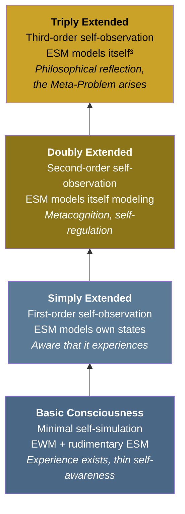

# Graduated Levels of Consciousness

**Consciousness is not binary — on or off — but graduated, with levels determined by the depth of recursive self-modeling.**

The question "Is this system conscious?" presupposes a yes/no answer. The Four-Model Theory rejects this framing. Consciousness is a continuum defined by how many layers of self-reference the system's [Explicit Self Model](../core-architecture/explicit-self-model.md) sustains. A bacterium has none. A lizard may have one. A human philosopher — the kind who asks "What is consciousness?" — requires at least four. The graduated levels framework replaces a binary switch with a spectrum, placing different organisms, different mental states, and different artificial systems at different positions along it.

## The Four Levels

### Basic Consciousness

Minimal self-simulation. The system generates an [EWM](../core-architecture/explicit-world-model.md) and a rudimentary ESM — it experiences a world and has a minimal sense of being a subject within that world. Phenomenal experience exists, but self-awareness is thin. The system registers sensory input as *its* input — there is a perspective — but it does not observe itself doing so.

A fish navigating a reef likely operates at this level: there is something it is like to be the fish (a world appears, a body is felt), but there is no metacognitive reflection on the experience.

### Simply Extended Consciousness

First-order self-observation. The system models itself — the ESM includes a model of the system's own states and processes. The organism not only experiences but is *aware that it experiences*. It can attend to its own attention, notice its own emotional states, and recognize itself as a distinct entity.

Mammals with mirror self-recognition (great apes, elephants, dolphins) likely operate at this level: they can represent themselves as objects in their own world model.

### Doubly Extended Consciousness

Second-order self-observation — metacognition. The system models itself modeling itself. This enables reflection on one's own thought processes, evaluation of one's own reasoning, and the ability to notice that one is noticing. "I realize I'm not paying attention" requires doubly extended consciousness: a model of the system modeling its own attentional states.

This level supports strategic thinking, self-regulation, and the distinctly human capacity for deliberate cognitive control.

### Triply Extended Consciousness

Third-order self-observation. The system models itself modeling itself modeling itself. This is the deepest level of recursion the theory identifies, and it supports the most abstract forms of self-awareness: philosophical reflection, existential questioning, and — critically — the very capacity to ask "What is consciousness?"

Triply extended consciousness is also the level at which the [Meta-Problem](../hard-problem/meta-problem.md) arises. Only a system capable of modeling its own modeling of its own experience can notice that consciousness *seems* mysterious. The mystery of consciousness is a product of the architecture at its deepest recursive level.

## Not Discrete Stages

The four levels are points along a continuum, not discrete stages with sharp boundaries between them. Several important features follow:

- **Organisms fluctuate between levels.** A human operates at triply extended consciousness during philosophical discussion but may drop to basic consciousness during drowsy, automatic driving. Sleep, intoxication, and fatigue all shift the system's position on the continuum.
- **Different species occupy different ranges.** The graduated framework resolves debates about animal consciousness by replacing "Is a dog conscious?" with "How deeply does a dog self-model?" — a question with potentially empirical answers.
- **The levels correspond to additional layers of [self-referential closure](../core-architecture/self-referential-closure.md).** Each level adds a recursion: basic = the ESM models the system; simply extended = the ESM models the ESM modeling the system; and so on. More recursion means deeper self-reference, which means a richer experiential domain.

## Implications for Artificial Systems

The graduated framework has direct implications for artificial consciousness. A system need not achieve triply extended consciousness to be conscious at all — basic consciousness suffices for phenomenal experience. Current AI systems (including large language models) lack even basic consciousness under this framework because they lack the four-model architecture at [criticality](../physical-foundations/criticality.md). But the graduated levels provide a roadmap: an artificial system implementing the four-model architecture might first achieve basic consciousness and only later, with sufficient recursive depth, reach the higher levels.

## Figure

## Key Takeaway

Consciousness is not a binary property but a continuum determined by the depth of recursive self-modeling. The four levels — basic, simply extended, doubly extended, and triply extended — correspond to successive layers of self-referential closure. Different organisms and different mental states occupy different positions along this continuum. The deepest level produces not only the richest self-awareness but also the Meta-Problem itself: the intuition that consciousness is mysterious is a feature of the architecture at maximum recursion.

## See Also

- [Self-Referential Closure](../core-architecture/self-referential-closure.md)
- [Explicit Self Model (ESM)](../core-architecture/explicit-self-model.md)
- [The Meta-Problem Dissolved](../hard-problem/meta-problem.md)
- [Animal Consciousness](../phenomena/animal-consciousness.md)
- [The Redirectable ESM](../mechanisms/redirectable-esm.md)
- [Two Thresholds for Consciousness](../physical-foundations/two-thresholds.md)
