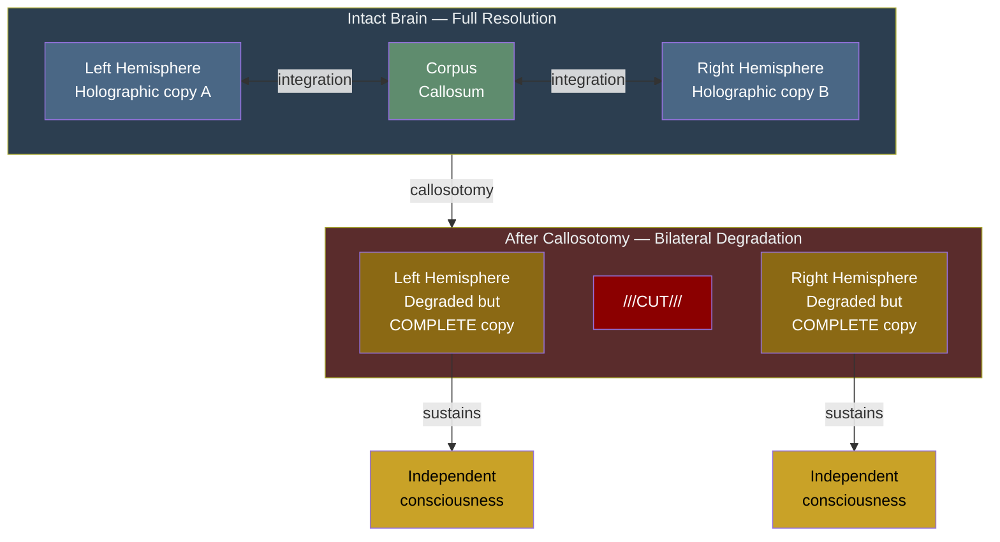

# Holographic Storage

**The implicit models store information in a distributed manner: each part contains a degraded version of the whole, explaining why brain damage produces graded deficits rather than categorical knowledge loss.**

The term "holographic" is an analogy, not a claim about optical holography. Just as cutting a hologram in half produces two complete but lower-resolution images, splitting a neural network produces two degraded but functionally complete copies of the stored information. This property -- well-established in computational neuroscience as distributed representation -- is central to the theory's account of [split-brain phenomena](../phenomena/split-brain.md) and graceful degradation under brain damage.

## The Patchwork Hologram

The cortex is not a uniform holographic medium. It is better described as a **patchwork hologram** ([Gruber, 2015](https://doi.org/10.5281/zenodo.18669891)): locally holographic within individual functional areas, fractally self-similar across cortical columns, and globally emergent at the whole-brain scale.

- **Within a single Brodmann area**, information is distributed across the local network. Damage degrades but does not destroy stored representations. A lesion to part of visual cortex reduces visual acuity and resolution but does not delete specific visual memories.
- **Across areas**, the cortical column architecture provides a fractal repetition of the same six-layer computational motif, adapted by local connectivity patterns to different functional specializations.
- **At the global level**, the interaction of these locally holographic patches produces emergent properties -- binding, unified experience, coherent world-modeling -- that are not present in any individual patch.

This patchwork structure resolves a longstanding tension. Lashley's engram experiments (1950) demonstrated that memory is not localized: progressive cortical ablation produced graded memory impairment proportional to tissue removed, not catastrophic loss at specific regions. Yet functionally specialized cortical areas (Brodmann, 1909) -- with distinct processing characteristics and distinct lesion syndromes -- appear to contradict a purely holographic account. The patchwork principle reconciles both: information is holographically distributed *within* functional areas (explaining Lashley's graded degradation) while remaining functionally organized *across* areas (explaining specialization).

## Split-Brain Evidence

The holographic storage principle makes a specific prediction about callosotomy (split-brain surgery): severing the corpus callosum should produce **bilateral degradation** rather than clean hemispheric specialization. Each hemisphere should retain a degraded but complete copy of the models, not half of the models at full resolution.

This is precisely what [Pinto et al. (2017)](https://doi.org/10.1093/brain/aww358) found. Split-brain patients showed unified consciousness with split perception -- each hemisphere sustained independent awareness, but both showed graded deficits rather than the clean left-right division predicted by the traditional "two minds" account. The holographic principle predicted this: cutting a distributed system in half produces two complete-but-degraded copies, not two clean halves.

## Graceful Degradation

Holographic storage explains a broader pattern in clinical neuroscience: brain damage almost always produces *degradation* rather than *deletion*. Stroke patients do not lose discrete categories of knowledge (as would be expected if information were stored locally); they show reduced fluency, slower access, and lower confidence across domains related to the damaged region. The information is distributed across the network, so removing part of the network reduces resolution without eliminating content.

This property is well-characterized in the computational literature on neural networks: distributed representations (Hinton, McClelland, & Rumelhart, 1986) exhibit graceful degradation as a fundamental consequence of their architecture. The theoretical contribution of the Four-Model Theory is not the discovery of this property but its integration into a specific account of consciousness and its use as an explanatory mechanism for split-brain and other dissociation phenomena.

## The Holography-Criticality Nexus

The relationship between holographic storage and [criticality](../physical-foundations/criticality.md) is an open research question. Three conjectures remain unresolved:

1. Does a holographic substrate necessarily produce Class 4 (edge-of-chaos) dynamics?
2. Does a Class 4 automaton with holographic rule structure have special computational properties?
3. Do Class 4 dynamics necessarily produce holographic emergent behavior?

If any of these conjectures holds, it would establish a deep connection between the theory's storage mechanism and its computational prerequisite for consciousness -- suggesting that holographic organization and criticality are not independent requirements but two aspects of the same underlying principle.

## Figure

*Holographic storage predicts bilateral degradation, not clean splitting. Each hemisphere retains a complete but lower-resolution copy of all four models.*

## Key Takeaway

Holographic storage means information is distributed across the substrate such that each part contains a degraded version of the whole. This explains graceful degradation under brain damage and predicts bilateral degradation (not clean hemispheric splitting) after callosotomy -- a prediction confirmed by [Pinto et al. (2017)](https://doi.org/10.1093/brain/awx220). The relationship between holographic storage and criticality remains an open and potentially deep question.

## See Also

- [Split-Brain Phenomena](../phenomena/split-brain.md)
- [The Real/Virtual Split](../core-architecture/real-virtual-split.md)
- [The Criticality Requirement](../physical-foundations/criticality.md)
- [The Five-System Hierarchy](../physical-foundations/five-system-hierarchy.md)
- [Implicit World Model (IWM)](../core-architecture/implicit-world-model.md)
