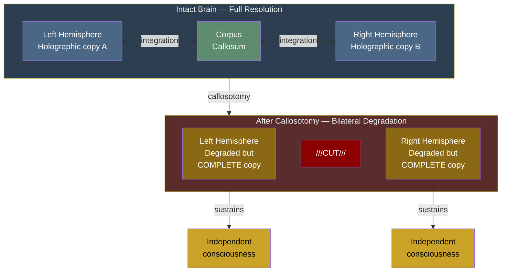

# Holographic Storage

**The implicit models store information in a distributed manner: each part contains a degraded version of the whole, so damage within a functional area degrades stored content rather than deleting it.**

The term "holographic" is an analogy, not a claim about optical holography. Just as cutting a hologram in half produces two complete but lower-resolution images, splitting a neural network produces two degraded but functionally complete copies of the stored information. This property -- well-established in computational neuroscience as distributed representation -- is central to the theory's account of [split-brain phenomena](../phenomena/split-brain.md) and graceful degradation under brain damage.

## The Patchwork Hologram

The cortex is not a uniform holographic medium. It is better described as a **patchwork hologram** ([Gruber, 2015](https://www.amazon.com/Emergenz-Bewusstseins-German-Matthias-Gruber/dp/1326652079)): locally holographic within individual functional areas, iterated across cortical columns, and globally emergent at the whole-brain scale.

- **Within a single Brodmann area**, information is distributed across the local network. Damage degrades but does not destroy stored representations.
- **Across areas**, the cortical column architecture repeats the same six-layer computational motif, adapted by local connectivity patterns to different functional specializations.
- **At the global level**, the interaction of these locally holographic patches produces emergent properties -- binding, unified experience, coherent world-modeling -- that are not present in any individual patch.

This patchwork structure resolves a longstanding tension. Lashley's engram experiments (1950) demonstrated that memory is not localized: progressive cortical ablation produced graded memory impairment proportional to tissue removed, not catastrophic loss at specific regions. Yet functionally specialized cortical areas (Brodmann, 1909) -- with distinct processing characteristics and distinct lesion syndromes -- appear to contradict a purely holographic account. The patchwork principle reconciles both: information is holographically distributed *within* functional areas (explaining Lashley's graded degradation) while remaining functionally organized *across* areas (explaining specialization).

## Split-Brain Evidence

The holographic storage principle makes a specific prediction about callosotomy (split-brain surgery): severing the corpus callosum should produce **bilateral degradation** rather than clean hemispheric specialization. Each hemisphere should retain a degraded but complete copy of the implicit models, not half of them at full resolution. The explicit models are not themselves split — they are processes, not stored structures — but are regenerated independently by each hemisphere from its reduced substrate.

[Pinto et al. (2017)](https://doi.org/10.1093/brain/aww358) observed graded deficits rather than a clean left-right division. The authors concluded that callosotomy divides perception without creating two independent conscious perceivers; the theory reinterprets the same data as two degraded simulations, each regenerated from a complete-but-degraded copy of the implicit models.

## Graceful Degradation

Within a functional area, holographic storage predicts *degradation* rather than *deletion*: the information is distributed across the local network, so removing part of the network reduces resolution without eliminating content. This is the pattern of Lashley's graded impairment. Across areas the patchwork principle predicts specialization instead, which is why damage to different areas produces distinct lesion syndromes.

This property is well-characterized in the computational literature on neural networks: distributed representations (Hinton, McClelland, & Rumelhart, 1986) exhibit graceful degradation as a fundamental consequence of their architecture. The theoretical contribution of the Four-Model Theory is not the discovery of this property but its integration into a specific account of consciousness and its use as an explanatory mechanism for split-brain and other dissociation phenomena.

## The Holography-Criticality Nexus

Whether holographic storage and the [Class 4 regime](../physical-foundations/criticality.md) are formally linked is an open question. Gruber (2015) named three possible relationships between holographic systems and Class 4 automata, restated in the cosmology paper ([Gruber, 2026, §6.1](https://doi.org/10.5281/zenodo.18698605)); the Four-Model Theory paper does not state them. As open conjectures:

1. Does a holographic substrate necessarily produce Class 4 dynamics?
2. Can a Class 4 automaton have a rule structure that is itself holographic?
3. Do Class 4 dynamics necessarily produce holographic emergent behavior?

None of the three has been proved or refuted. See [The Holography-Criticality Nexus](../formal/holography-criticality.md).

## Figure

```mermaid
graph TD
    subgraph Intact["Intact Brain — Full Resolution"]
        direction LR
        L_Full["Left Hemisphere<br/>Holographic copy A"]
        CC["Corpus<br/>Callosum"]
        R_Full["Right Hemisphere<br/>Holographic copy B"]
        L_Full <-->|"integration"| CC
        CC <-->|"integration"| R_Full
    end

    subgraph Split["After Callosotomy — Bilateral Degradation"]
        direction LR
        L_Deg["Left Hemisphere<br/>Degraded but<br/>COMPLETE copy"]
        Gap["///CUT///"]
        R_Deg["Right Hemisphere<br/>Degraded but<br/>COMPLETE copy"]
    end

    Intact -->|"callosotomy"| Split

    L_Deg -->|"sustains"| L_Con["Independent<br/>consciousness"]
    R_Deg -->|"sustains"| R_Con["Independent<br/>consciousness"]

    style Intact fill:#2c3e50,color:#ecf0f1
    style Split fill:#5a2c2c,color:#ecf0f1
    style L_Full fill:#4a6785,color:#fff
    style R_Full fill:#4a6785,color:#fff
    style CC fill:#5f8c6e,color:#fff
    style L_Deg fill:#8b6914,color:#fff
    style R_Deg fill:#8b6914,color:#fff
    style Gap fill:#8b0000,color:#fff
    style L_Con fill:#c9a227,color:#000
    style R_Con fill:#c9a227,color:#000
```

*Holographic storage predicts bilateral degradation, not clean splitting. Each hemisphere retains a complete but lower-resolution copy of the implicit models and regenerates its own explicit models from it.*

## Key Takeaway

Holographic storage means information is distributed across the substrate such that each part contains a degraded version of the whole. This explains graceful degradation under brain damage and predicts bilateral degradation (not clean hemispheric splitting) after callosotomy -- the theory's reading of the graded deficits reported by [Pinto et al. (2017)](https://doi.org/10.1093/brain/aww358), against those authors' own conclusion. Whether holographic storage is formally linked to the Class 4 regime is an open question.

## See Also

- [Split-Brain Phenomena](../phenomena/split-brain.md)
- [The Real/Virtual Split](../core-architecture/real-virtual-split.md)
- [Criticality: Signature, Not Requirement](../physical-foundations/criticality.md)
- [The Five-System Hierarchy](../physical-foundations/five-system-hierarchy.md)
- [Implicit World Model (IWM)](../core-architecture/implicit-world-model.md)
