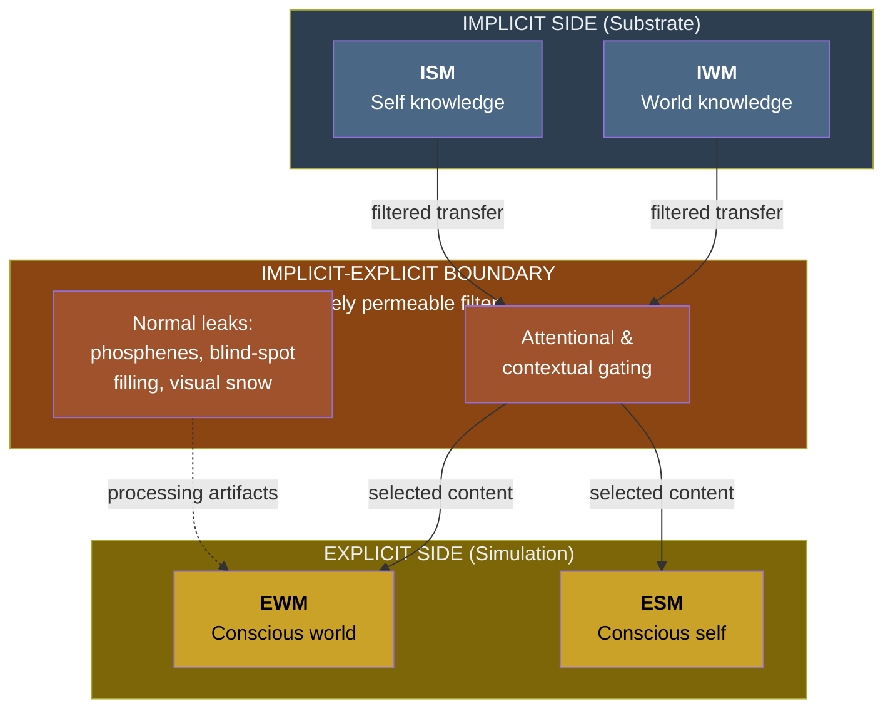

# The Implicit-Explicit Boundary

**Information becomes conscious when it crosses the selectively permeable boundary between the implicit models (substrate-level) and the explicit models (phenomenal simulation).**

The Four-Model Theory divides the architecture into a real side (IWM + ISM) and a virtual side (EWM + ESM). Between them lies the **implicit-explicit boundary** — the functional interface that determines what substrate-level knowledge enters the conscious simulation at any given moment. This boundary is not a wall. It is a graded, selectively permeable filter whose permeability varies across domains, states, and time. Understanding this boundary is essential to understanding why consciousness contains what it does — and why so much is left out.

## Selective Permeability in Normal States

In ordinary waking life, the boundary admits information relevant to the current situation while blocking the vast majority of stored knowledge. The [IWM](../core-architecture/implicit-world-model.md) contains everything the system has ever learned about the world; the [ISM](../core-architecture/implicit-self-model.md) contains everything it has learned about itself. Yet at any given moment, consciousness includes only a tiny fraction of this knowledge — the fraction the simulation currently requires. Attentional and contextual gating mechanisms control what crosses.

Crucially, the boundary is not perfectly opaque even in normal states. Substrate-level processing artifacts routinely leak through: **blind-spot filling** (the visual system interpolating content where the optic nerve exits the retina), **phosphenes** from mechanical pressure on the eye, and **visual snow** phenomena all represent moments where processing-level activity becomes visible within the simulation. These leaks are subtle, but they demonstrate that conscious experience is a simulation generated from substrate processing — not a direct window onto reality.

## A Graded Transition Zone

The implicit-explicit boundary is not a sharp line but a **graded transition zone**. Behavioral complexity follows a gradient — from reflexive chemical-gradient responses through conditioned, goal-directed, and rule-based behavior to fully conscious action. The implicit and explicit memory systems overlap precisely in the middle of this gradient, at the levels of goal-directed and template-based behavior. This overlap zone is the functional locus of [variable permeability](../mechanisms/variable-permeability.md): behavior at these intermediate levels can be driven by either implicit or explicit processing, depending on attentional state, arousal, and contextual demands.

## Pathological and Altered-State Variations

The boundary's permeability is not fixed. Its variation across conditions explains a wide range of phenomena:

- **Psychedelic states** — global increase in permeability. Intermediate processing stages normally confined to the implicit side leak through to the simulation, producing the characteristic visual progression from phosphenes to geometric patterns to complex imagery.
- **Anosognosia** — local decrease in permeability. The ISM registers a deficit (e.g., paralysis), but the transfer to the ESM is blocked for that specific domain. The patient's simulation simply does not include the deficit.
- **Pre-sleep relaxation** — gradually increasing permeability, producing the same bottom-up visual progression as psychedelics: phosphenes, then geometric patterns, then hypnagogic imagery.
- **Meditation** — trained modulation of permeability, enabling selective access to normally implicit processes under voluntary control.

These are not four separate mechanisms. They are four manifestations of a single principle: the implicit-explicit boundary is a dynamically adjustable filter, and its adjustment explains both normal and extraordinary variations in conscious content.

## Connection to the Meta-Problem

The boundary's near-opacity in normal states is central to the theory's account of the [Meta-Problem](../hard-problem/meta-problem.md). The ESM cannot directly observe the ISM's generative machinery because that machinery operates on the implicit side of the boundary. When the ESM attempts to introspect on the basis of its own experience, it encounters principled opacity — and concludes that something vast lies forever beyond the reach of explanation. The mystery of consciousness, on this account, is a prediction of the architecture: a virtual process with a mostly-opaque but imperfect boundary to its own substrate would experience exactly this sense of irreducible depth.

## Figure

## Key Takeaway

The implicit-explicit boundary is the gatekeeper of consciousness. It determines what substrate-level knowledge enters the phenomenal simulation and what remains in the dark. Its selective permeability — variable across states, domains, and time — is the single mechanism that unifies psychedelic phenomenology, anosognosia, pre-sleep imagery, and meditative states under one explanatory principle.

## See Also

- [Variable Permeability](../mechanisms/variable-permeability.md)
- [The Real/Virtual Split](../core-architecture/real-virtual-split.md)
- [The Meta-Problem Dissolved](../hard-problem/meta-problem.md)
- [Virtual Qualia](../hard-problem/virtual-qualia.md)
- [Graduated Levels of Consciousness](../mechanisms/graduated-consciousness.md)
