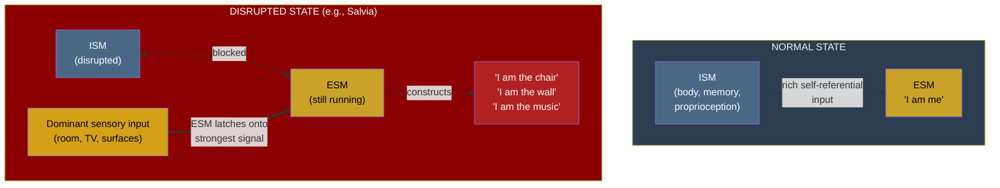

# The Redirectable ESM

**The Explicit Self Model requires input. Disrupt its normal self-referential feed and it does not shut down — it latches onto whatever input dominates, producing radical identity alteration including the experience of "becoming" non-self entities.**

The [ESM](../core-architecture/explicit-self-model.md) is not a static data structure. It is a continuously running process that constructs the conscious self from available input — normally, self-referential signals from the [ISM](../core-architecture/implicit-self-model.md) (body schema, proprioception, interoception, autobiographical memory). But "normally" is a key qualifier. When this self-referential input stream is disrupted, the ESM does not cease to exist. It continues to run, and it needs input. Deprived of its usual feed, it redirects to whatever signal dominates the available input stream.

This redirectability is one of the five core principles of the Four-Model Theory, and it generates some of the theory's most distinctive predictions.

## The Mechanism

In normal waking states, the ESM receives a rich stream of self-referential input: proprioceptive data from the body, interoceptive signals from the viscera, motor-efference copies from the action system, and autobiographical context from the ISM. These inputs constrain the ESM's output to produce the familiar sense of being *you* — a specific person, in a specific body, with a specific history.

When this input is disrupted — by pharmacological action, neurological damage, or extreme physiological states — the ESM's self-construction process is starved. But the process itself continues. Like a radio receiver that has lost its station, the ESM scans for the strongest available signal and locks onto it. The result is that the ESM constructs a self from whatever dominates the remaining input — which may have nothing to do with the organism's actual identity.

## Salvia Divinorum: The Clearest Demonstration

The phenomenology of **salvia divinorum** (Salvinorin A) provides the most dramatic evidence for ESM redirectability. Salvia users reliably report experiences of "becoming" objects or entities in their immediate environment:

- Becoming a piece of furniture in the room
- Becoming a wall or floor surface
- Becoming a character from a television show playing nearby
- Becoming a geometric pattern perceived in the visual field

The Four-Model Theory predicts exactly this pattern. Salvia disrupts normal self-referential input to the ESM rapidly and profoundly. The ESM, starved of self-signals, latches onto whatever sensory input dominates — visual input from the room, auditory input from media, proprioceptive input from the body's contact with surfaces. The identity experience tracks the dominant input in a dose-dependent, input-dependent, and therefore *predictable* manner.

## Ego Dissolution: Not Abolition but Redirection

The standard account of ego dissolution under psychedelics treats it as the *loss* of self. The Four-Model Theory reframes it: ego dissolution is not the abolition of the ESM but its **redirection**. The ESM continues to run — the subject still has experience, still has a perspective — but the content of that experience shifts from "I am me" to "I am the universe" or "I am this pattern" or "I am nothing," depending on what input remains available.

This reframing generates a testable prediction: the *content* of ego dissolution should be controllable. If the ESM latches onto dominant sensory input, then controlling the sensory environment during ego dissolution should control what the subject "becomes." A subject in a room with a dominant auditory stimulus (music, voice) should have a different identity experience than one in a visually dominated environment. This is [Prediction 2](../predictions/prediction-2.md) — arguably the theory's most distinctive empirical prediction, and one that no competing theory generates from first principles.

## Clinical Manifestations

ESM redirectability is not confined to psychedelic experiences. The same mechanism appears in clinical contexts:

- **Cotard's delusion** — patients report believing they are dead or that their organs have disappeared. The ESM receives severely distorted interoceptive input due to neurological damage. Deprived of normal embodied signals, it constructs the best model it can from the available (distorted) input — and "I am dead" is the ESM's interpretation of absent or contradictory body signals. This is the same mechanism that produces "I am a chair" under salvia, operating on clinical rather than pharmacological input.
- **Depersonalization/derealization** — the ESM receives attenuated self-referential input, producing the sense that the self or the world is unreal, distant, or dreamlike. The ESM is running but receiving weak signal — the self-model is generated but thin, producing the characteristic feeling of watching oneself from outside.

## Figure

## Key Takeaway

The ESM is an input-hungry process, not a fixed identity module. When normal self-referential input is disrupted, it does not disappear — it redirects, constructing a self from whatever signal dominates. This single mechanism unifies salvia "becoming" experiences, psychedelic ego dissolution, Cotard's delusion, and depersonalization under one explanatory principle. It also generates the theory's most distinctive prediction: that the content of ego dissolution is controllable via sensory input.

## See Also

- [Explicit Self Model (ESM)](../core-architecture/explicit-self-model.md)
- [The Real/Virtual Split](../core-architecture/real-virtual-split.md)
- [Ego Dissolution](../phenomena/ego-dissolution.md)
- [Prediction 2: Ego Dissolution Content Is Controllable](../predictions/prediction-2.md)
- [Variable Permeability](../mechanisms/variable-permeability.md)
- [Virtual Model Forking](../mechanisms/virtual-model-forking.md)
