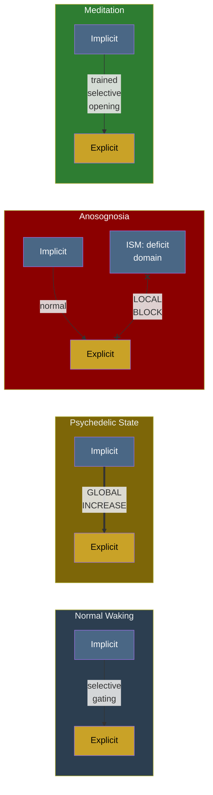

# Variable Permeability

**The permeability of the implicit-explicit boundary is not fixed but dynamically variable — and its variation is the central explanatory mechanism behind the theory's account of altered states, clinical disorders, and contemplative practice.**

Many consciousness theories can describe *that* psychedelic states, anosognosia, and meditation differ from ordinary waking. The Four-Model Theory explains *how* they differ — and why they are all variations of the same underlying mechanism. The [implicit-explicit boundary](../mechanisms/implicit-explicit-boundary.md) acts as a dynamically adjustable filter. What changes across states is the filter's permeability: how much substrate-level information reaches the conscious simulation, and in which domains.

## Four Modes of Variation

Variable permeability manifests in at least four distinct patterns:

### Global Increase: Psychedelics

Psychedelic substances (LSD, psilocybin, DMT, mescaline) produce a **global increase** in boundary permeability. Intermediate processing stages — normally confined to the implicit side — leak through to the [EWM](../core-architecture/explicit-world-model.md) in a characteristic hierarchical order:

1. **V1-level** processing becomes accessible — simple phosphenes, enhanced contrast, breathing in static patterns.
2. **V2/V3-level** processing becomes accessible — geometric patterns, fractals, tessellations (Kluver's form constants).
3. **Higher visual areas** become accessible — faces, figures, complex scenes.
4. **Full intermediate processing** floods through — dream-like visions, narrative sequences.

This progression is not random. It follows the visual processing hierarchy in a predictable, dose-dependent order, because the permeability increase propagates up the hierarchy. The same hierarchical pattern appears under different psychedelic compounds, confirming that it reflects the boundary's structure rather than any particular pharmacological action.

### Local Decrease: Anosognosia

Anosognosia — the clinical inability to recognize one's own deficit — represents the **exact inverse** of the psychedelic mechanism. Following right-hemisphere stroke, a patient may be paralyzed on the left side yet sincerely deny any impairment. The [ISM](../core-architecture/implicit-self-model.md) registers the deficit (the substrate knows the limb is paralyzed), but the transfer to the [ESM](../core-architecture/explicit-self-model.md) is blocked for that specific domain. The patient's simulation does not include the paralysis, so the patient genuinely does not experience it.

This is a **local** decrease in permeability, affecting only the domain of the deficit while leaving other domains intact. The patient remains fully conscious and aware of everything else — the boundary is selectively blocked, not globally thickened.

### Gradual Change: Pre-Sleep

During the transition from wakefulness to sleep, permeability increases gradually. The same bottom-up visual progression observed under psychedelics appears spontaneously: first phosphenes (visible with closed eyes in a dark room), then geometric patterns, then the complex imagery of hypnagogia. The permeability increase occurs as thalamic gating relaxes and the substrate's attentional control loosens during the approach to sleep onset.

This shared phenomenology between psychedelic and pre-sleep states — both producing hierarchically ordered visual content from simple to complex — is a strong prediction of the variable permeability mechanism. Two very different physiological processes produce the same phenomenological progression because they act on the same boundary.

### Trained Modulation: Meditation

Long-term contemplative practice enables **voluntary modulation** of the boundary's permeability. Experienced meditators report access to normally implicit processes — awareness of attentional mechanisms, perception of processing stages, observation of thought-formation prior to conscious articulation. The same mechanism that psychedelics activate globally and involuntarily, meditation activates selectively and under voluntary control.

This explains why advanced meditators and psychedelic users sometimes describe remarkably similar phenomenology despite arriving there through very different routes: both are accessing the same normally implicit processing through increased boundary permeability.

## Normal-State Leaks

Even in ordinary waking states, the boundary is not perfectly opaque. Several everyday phenomena represent subtle permeability:

- **Blind-spot filling** — the visual system interpolating content where the optic nerve exits, making the interpolation process briefly visible.
- **Phosphenes** — mechanical pressure on the eye producing visual percepts from V1-level processing.
- **Visual snow** — persistent perception of faint flickering across the visual field, representing cortical automaton activity leaking through.

These normal leaks are evidence that the implicit-explicit boundary is a graded filter, not a binary gate.

## Figure

## Key Takeaway

Variable permeability is not four separate mechanisms but one mechanism with four modes of variation. Psychedelics globally increase it, anosognosia locally decreases it, pre-sleep gradually increases it, and meditation trains voluntary modulation of it. This single principle connects phenomena that other theories treat as unrelated — and it generates the theory's most distinctive cross-domain prediction: that psychedelics should alleviate anosognosia by compensating for a local block with a global increase.

## See Also

- [The Implicit-Explicit Boundary](../mechanisms/implicit-explicit-boundary.md)
- [Psychedelic Phenomenology](../phenomena/psychedelic-phenomenology.md)
- [Anosognosia](../phenomena/anosognosia.md)
- [Meditation](../phenomena/meditation.md)
- [Prediction 1: Psychedelics Alleviate Anosognosia](../predictions/prediction-1.md)
