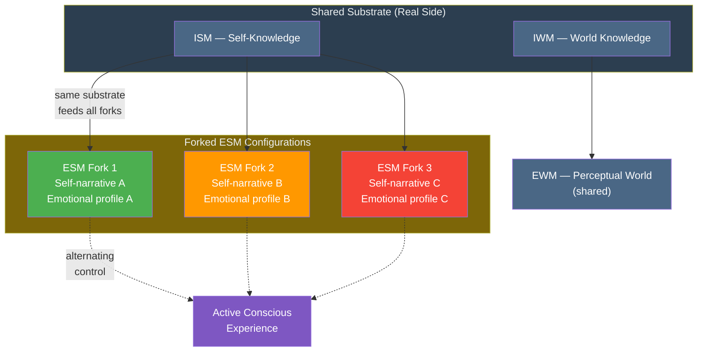

# Virtual Model Forking

**The virtual models can be forked: a single substrate can run multiple configurations of the ESM simultaneously, each constituting a distinct self-simulation on the same hardware.**

Forking is a direct consequence of the [software-like properties](../core-architecture/real-virtual-split.md) of the virtual side. Just as a running program can be forked into multiple instances sharing the same physical hardware, the Explicit Self Model can split into multiple configurations sharing the same neural substrate. Each fork maintains its own self-narrative, emotional profile, and behavioral repertoire. The substrate does not split -- it runs different software.

## The Mechanism

The [ESM](../core-architecture/explicit-self-model.md) is a generated process, not a stored structure. It is constructed dynamically from the [ISM](../core-architecture/implicit-self-model.md) and current input. This generation process admits of multiple stable configurations: different parameter sets for the self-simulation that each produce a coherent, functional self-model.

Under normal conditions, the system maintains a single ESM configuration -- one self, one narrative, one set of behavioral defaults. But the architecture does not *require* uniqueness. The same substrate that generates one self-model can generate several, switching between them or even maintaining partial parallel activity. The constraints are computational, not architectural: the substrate has finite resources, so multiple ESM configurations compete for processing bandwidth.

Crucially, forking occurs specifically at the ESM level. The [IWM](../core-architecture/implicit-world-model.md) (world knowledge), [ISM](../core-architecture/implicit-self-model.md) (substrate-level self-knowledge), and [EWM](../core-architecture/explicit-world-model.md) (perceptual world) are shared across all forks. Each fork sees the same world and draws on the same substrate-level knowledge. What differs is the self-simulation: who "I" am, what "I" feel, how "I" respond.

## Clinical Manifestation: DID

The most dramatic manifestation of virtual model forking is [dissociative identity disorder](../phenomena/did.md). Each alter represents a distinct ESM configuration:

- **Distinct self-narratives.** Different names, ages, genders, personal histories.
- **Distinct emotional profiles.** Different emotional baselines, triggers, and regulatory patterns.
- **Distinct behavioral repertoires.** Different mannerisms, vocal patterns, social strategies.
- **Shared substrate.** All alters operate on the same neural hardware, access the same IWM, and perceive through the same EWM.

The theory predicts that alter switching should produce neural reconfiguration concentrated in ESM-related networks -- specifically the default mode network (medial prefrontal cortex, posterior cingulate cortex, angular gyrus, lateral temporal cortex) -- rather than diffusely distributed across the brain. This spatial prediction is testable and distinguishes the forking account from less specific "integration failure" theories.

## Other Forking Phenomena

DID is the most extreme case, but the forking mechanism operates at lower intensities in other contexts:

- **Internal conflict.** The subjective experience of being "of two minds" about a decision may reflect partial, low-grade ESM forking -- competing self-model configurations that have not fully separated.
- **Role switching.** The behavioral and experiential shifts between professional and personal contexts -- "work self" versus "home self" -- may involve mild ESM reconfiguration, though without the dissociative barriers characteristic of DID.
- **Hypnotic states.** Hypnotic suggestion can produce temporary ESM reconfigurations (different pain thresholds, different behavioral defaults) that share features with forking.

These are speculative extensions, not established predictions. The core claim is about DID; the graded interpretation suggests a continuum rather than a categorical phenomenon.

## Figure

## Key Takeaway

Virtual model forking is a natural consequence of the ESM being a generated process rather than a stored structure. The same substrate can run multiple self-simulations, each with its own narrative and emotional profile, while sharing world knowledge and perceptual experience. DID is the clearest clinical manifestation -- the theory predicts alter-specific neural patterns concentrated in self-model (DMN) networks.

## See Also

- [The Real/Virtual Split](../core-architecture/real-virtual-split.md)
- [Explicit Self Model (ESM)](../core-architecture/explicit-self-model.md)
- [Dissociative Identity Disorder (DID)](../phenomena/did.md)
- [Ego Dissolution](../phenomena/ego-dissolution.md)
- [Self-Referential Closure](../core-architecture/self-referential-closure.md)
