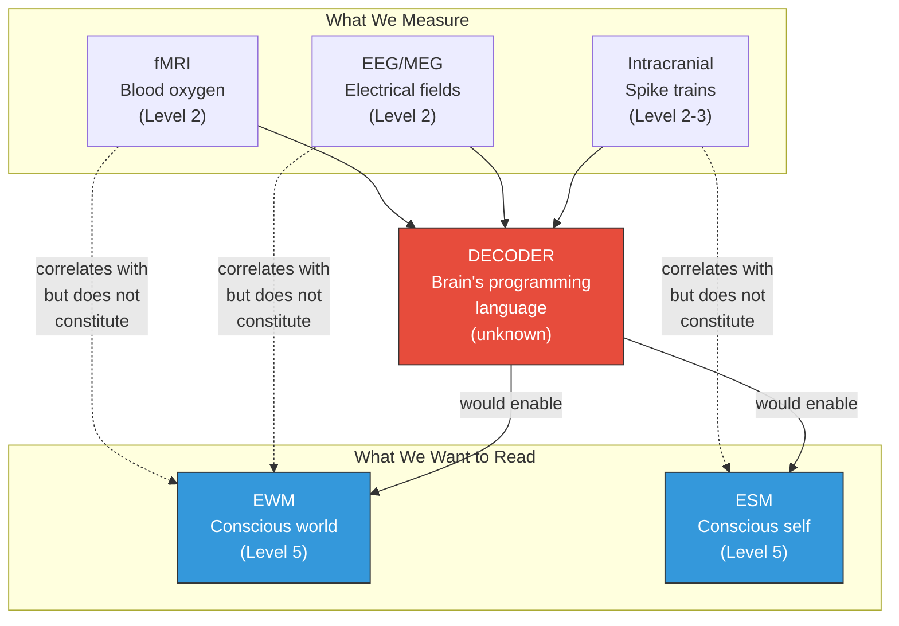

# Decoding the Virtual Side

**Neuroimaging captures substrate-level activity — real-side measurements that correlate with conscious states but do not constitute a readout of the conscious simulation itself.**

The Four-Model Theory's **real/virtual split** has a methodological consequence that deserves explicit treatment. Every existing neuroimaging technique — fMRI, EEG, MEG, PET, intracranial recordings — measures activity at the substrate level. Blood-oxygen-level-dependent signals, electrical field potentials, magnetic flux: these are all properties of Levels 1-4 in the five-system hierarchy. The conscious simulation lives at Level 5 — the virtual system. We are measuring the hardware while trying to read the software.

## The Measurement Problem

This is not a philosophical objection to neuroimaging — it is an engineering constraint. Substrate measurements *correlate* with conscious states, often strongly. When fMRI shows increased activity in the fusiform face area, the subject is almost certainly experiencing a face. When EEG shows high Lempel-Ziv complexity, the subject is almost certainly conscious. These correlations are real and scientifically valuable.

But correlation is not readout. Knowing that transistor group X is active tells you something about what the spreadsheet is computing, but it does not tell you the value in cell A1. Similarly, knowing that neural population Y is active tells you something about what the subject is experiencing, but it does not constitute a direct reading of phenomenal content.

The theory specifies *what* the conscious simulation is (the explicit models — EWM and ESM), *where* it lives (at the virtual level, emergent from substrate dynamics), and *why* it has the properties it has (self-referential closure, criticality, virtual qualia). What it does not provide is the **decoder ring** — the mapping from substrate dynamics to virtual content.

## The Brain's Programming Language

To decode conscious content from neural data would require understanding the brain's "programming language" — the systematic mapping from patterns of substrate activity to the content of the conscious simulation. This is analogous to reverse-engineering a program from observing CPU states: possible in principle, enormously difficult in practice, and requiring knowledge of the instruction set architecture.

Several features make this challenge particularly hard:

**The mapping is many-to-many.** The same conscious content (seeing a red apple) can be realized by different substrate activity patterns (on different occasions, in different contexts, in different brains). Conversely, similar substrate patterns can correspond to different conscious contents (the same neural population activated by different inputs).

**The virtual level has emergent properties.** The conscious simulation has properties — unity, temporal continuity, perspectival structure — that are not present in any individual substrate element. Decoding these emergent properties requires understanding how substrate-level dynamics *compose* into virtual-level content, not merely how individual neurons fire.

**Scale.** The human cortex contains approximately 16 billion neurons with approximately 150 trillion synaptic connections. A "full simulated connectome" — the likely prerequisite for complete decoding — remains far beyond current computational capabilities.

## A Concrete Research Programme

Despite these challenges, the theory's architecture suggests a concrete research programme:

1. **Map the implicit-explicit boundary.** The theory identifies a selectively permeable boundary between implicit and explicit models (see [Variable Permeability](../mechanisms/variable-permeability.md)). Identifying the neural mechanisms of this boundary — where and how information transfers from substrate-level processing to the conscious simulation — would provide the first foothold for decoding.

2. **Exploit pharmacological perturbations.** Psychedelics increase implicit-explicit permeability, making normally implicit processing stages visible in consciousness. Comparing neural activity under psychedelics (where more substrate processing is "visible") with normal waking (where most processing is implicit) could help identify the transfer mechanism.

3. **Leverage artificial systems.** If artificial consciousness is engineered according to the theory's specification, the programming language would be *known by construction*. This would provide a Rosetta Stone for understanding the biological programming language through comparison.

## Figure

*Current neuroimaging measures substrate-level activity (Levels 2-3) that correlates with but does not constitute the conscious simulation (Level 5). A decoder — knowledge of the brain's "programming language" — would bridge this gap. Developing this decoder is a concrete research programme that follows from the theory's architecture.*

## Key Takeaway

The gap between substrate measurement and conscious content readout is not a limitation of current technology alone — it reflects the real/virtual level distinction that the theory identifies. Closing this gap requires discovering the brain's programming language: the systematic mapping from substrate dynamics to virtual content.

## See Also

- [The Real/Virtual Split](../core-architecture/real-virtual-split.md)
- [Five-System Hierarchy](../physical-foundations/five-system-hierarchy.md)
- [Variable Permeability](../mechanisms/variable-permeability.md)
- [The Cortical Automaton](../physical-foundations/cortical-automaton.md)
- [Multi-Level Substrate Architecture](multi-level-substrate.md)

---

Based on: Gruber, M. (2026). The Four-Model Theory of Consciousness. Zenodo. https://doi.org/10.5281/zenodo.19064950
