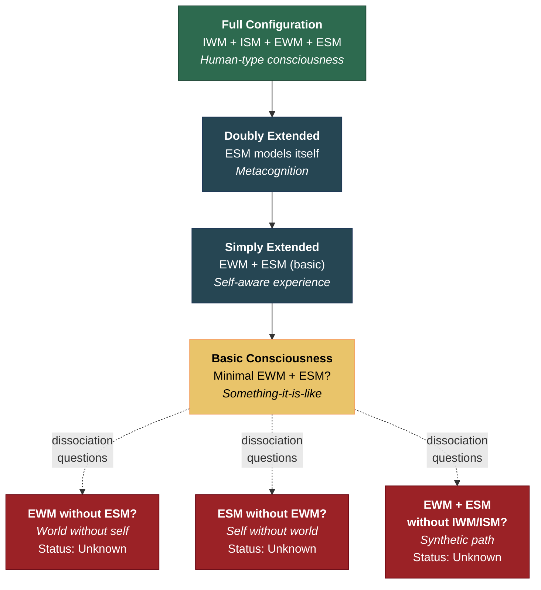

# Minimum Configuration for Consciousness

**Can the four models partially dissociate? Is world-experience without self-experience possible? Self-experience without world-experience? Determining the minimum set of models required for consciousness — and for each graduated level — remains an open empirical question.**

The [Four-Model Theory](../core-architecture/four-model-theory.md) specifies four models as the architecture for full human-type consciousness: the [IWM](../core-architecture/implicit-world-model.md), [ISM](../core-architecture/implicit-self-model.md), [EWM](../core-architecture/explicit-world-model.md), and [ESM](../core-architecture/explicit-self-model.md). The [graduated levels](../mechanisms/graduated-consciousness.md) framework suggests that consciousness is not binary but comes in degrees — from basic consciousness through metacognition to philosophical reflection. But the question of which specific model combinations produce which levels of consciousness remains unresolved.

## The Dissociation Questions

The four models might partially dissociate, raising several specific questions:

**EWM without ESM: World-experience without self-experience.** Is it possible to have a conscious experience of a world without any sense of being a self experiencing it? This would be phenomenal experience without self-reference — a "view from nowhere" that is nevertheless a view. Certain reports from deep meditation and psychedelic states describe something like this: vivid perceptual experience with no sense of self. Whether these reports reflect genuine ESM absence (the model is not running) or merely ESM attenuation (the model is running at minimal intensity) is an open question.

**ESM without EWM: Self-experience without world-experience.** Is it possible to have a sense of self without any experience of an external world? Sensory deprivation and certain meditative states produce something like this — awareness of being aware, with minimal world-content. Dreams during deep sleep might also qualify: brief flickers of self-experience without coherent world-simulation.

**Minimal EWM + minimal ESM: Basic consciousness.** The [graduated levels](../mechanisms/graduated-consciousness.md) framework posits basic consciousness as the minimal level — just enough self-simulation for there to be "something it is like" to be the system. What this requires in terms of model architecture is unspecified. Is basic consciousness possible with a degraded EWM and barely functional ESM? Or does it require all four models at some minimum threshold?

**EWM + ESM without ISM/IWM: Virtual models without substrate models.** This case is relevant to [artificial consciousness](../ai-consciousness/engineering-specification.md). The explicit models are generated from the implicit models in biological systems. Could a synthetic system run explicit models directly, without the implicit substrate models? The theory suggests not — the explicit models are generated *from* implicit models and require them as source material — but this is an architectural assumption that could be tested through simulation.

## Implications for the Boundary Problem

The minimum configuration question is directly connected to the [boundary problem](../foundations/eight-requirements.md): where does consciousness begin? The [two thresholds](../physical-foundations/two-thresholds.md) (criticality + architecture) provide a general answer, but the minimum configuration question asks for specificity: which architectural elements are essential at each level?

The theory's treatment of [animal consciousness](../phenomena/animal-consciousness.md) depends on this question. If consciousness requires all four models, then only systems with the full architecture are conscious. If it requires only the explicit models at some minimum threshold, the boundary may be broader — potentially extending to simpler nervous systems that maintain a rudimentary EWM and ESM.

## The Simulation Path

Resolving this question may require computational simulation rather than (or in addition to) empirical neuroscience. Building models with different configurations — EWM only, ESM only, both at varying intensities, with and without implicit models — and observing which configurations produce the behavioral signatures associated with consciousness could constrain the space of possible minimum configurations.

The [engineering specification](../ai-consciousness/engineering-specification.md) for artificial consciousness depends on this answer: building a conscious artifact requires knowing which components are essential and which are specific to biological implementation.

## Figure

## Key Takeaway

The four models define the full architecture for human-type consciousness, but the minimum configuration — which models are essential, at what thresholds, and in what combinations — remains an open question. Its resolution would constrain the [boundary problem](../foundations/eight-requirements.md), the treatment of animal consciousness, and the engineering specification for artificial consciousness. This is one of the theory's most consequential open questions.

## See Also

- [The Four-Model Theory](../core-architecture/four-model-theory.md)
- [Graduated Levels of Consciousness](../mechanisms/graduated-consciousness.md)
- [Two Thresholds for Consciousness](../physical-foundations/two-thresholds.md)
- [Engineering Specification for Artificial Consciousness](../ai-consciousness/engineering-specification.md)
- [Are the Implicit Models Also Virtual?](../open-questions/implicit-models-virtual.md)
