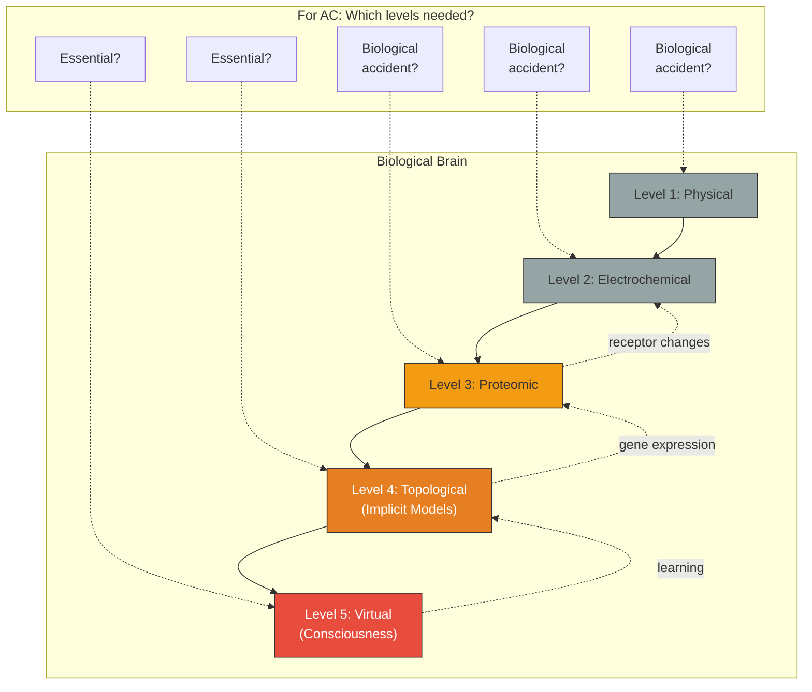

# Multi-Level Substrate Architecture for AC

**The theory claims substrate independence, but the biological brain's five nested levels interact bidirectionally — which levels are essential for artificial consciousness, and which are biological accidents?**

The Four-Model Theory holds that consciousness depends on function (four models at criticality), not on material (biological neurons). In principle, any substrate capable of supporting the required architecture should work. But the biological brain is not a simple two-level system (hardware and software). It is a five-level hierarchy in which each level shapes and is shaped by its neighbors. The question for artificial consciousness is: can you skip levels?

## The Five Levels in Biology

The biological brain implements consciousness through five hierarchically nested systems (see [Five-System Hierarchy](../physical-foundations/five-system-hierarchy.md)):

1. **Physical**: Atoms, molecules, macroscopic tissue structure
2. **Electrochemical**: Ion gradients, action potentials, synaptic transmission
3. **Proteomic**: Receptor configurations, neurotransmitter synthesis, plasticity mechanisms
4. **Topological**: Connectivity architecture — where the implicit models (IWM, ISM) are stored
5. **Virtual**: The dynamic pattern constituting the explicit models (EWM, ESM) — where consciousness exists

Each level is fully determined by the level below, but each also *influences* the levels below it through feedback:

- The virtual system (Level 5), over time, modifies the topological structure (Level 4) through learning — the explicit models reshape the implicit models that generated them.
- The topological system (Level 4) modulates the proteomic system (Level 3) through activity-dependent gene expression.
- The proteomic system (Level 3) alters the electrochemical system (Level 2) through receptor density changes and neurotransmitter availability.

This **bidirectional causal flow** means the levels are not independent layers that can be freely substituted. They form an integrated system where changes at any level propagate both up and down.

## The Engineering Challenge

The substrate independence claim implies that only the functional relationships matter, not the specific physical implementation. But which functional relationships are essential?

**The strong version** of substrate independence says: implement Level 5 (the virtual system — four models at criticality) on *any* substrate, and consciousness follows. The lower levels are biological implementation details. A digital computer running the right algorithm would be conscious.

**The weak version** says: the bidirectional causal flow between levels may be essential. The virtual system's ability to reshape its own substrate (the learning feedback from Level 5 to Level 4) may require that the substrate have certain material properties — plasticity, self-modification, analog dynamics — that are not easily replicated in conventional digital hardware.

The theory itself is agnostic on this question. It identifies the functional requirements (four models, criticality, self-referential closure) but does not specify how many substrate levels are needed to support them. This is an open empirical question — one that may only be answered by attempting to build artificial consciousness and observing what works.

## Three Possible Architectures for AC

| Architecture | Levels Implemented | Hypothesis | Challenge |
|---|---|---|---|
| **Digital simulation** | Level 5 only (simulated on conventional hardware) | The virtual dynamics are all that matters | Can conventional hardware support genuine Class 4 dynamics? |
| **Neuromorphic** | Levels 2-5 (analog, spike-based hardware mimicking neural dynamics) | The electrochemical dynamics matter for criticality | Enormous engineering complexity |
| **Hybrid** | Levels 4-5 (adaptive connectivity + virtual dynamics, novel substrate) | Plasticity matters but physical/proteomic levels are biological accidents | Need novel substrate with right plasticity properties |

The **digital simulation** approach is the most tractable but faces a fundamental question: can a discrete, deterministic digital computer genuinely produce Class 4 dynamics, or does it merely simulate them? Wolfram's own work on cellular automata is digital, suggesting this is possible — but the question of whether digital simulation of criticality *is* criticality (for the purpose of consciousness) remains open.

The **neuromorphic** approach replicates more of the biological hierarchy but may be over-specifying: not everything the brain does is relevant to consciousness. Much of the proteomic and electrochemical infrastructure exists for metabolic, developmental, and evolutionary reasons unrelated to the virtual system.

The **hybrid** approach bets that the key insight is *adaptive connectivity* — a substrate that can modify its own structure in response to the dynamics it supports. This captures the essential Level 4-5 feedback loop without requiring biological fidelity at lower levels.

## Figure

*The biological brain's five-level hierarchy with bidirectional causal flow (solid arrows: upward determination; dashed arrows: downward feedback). For artificial consciousness, the question is which levels are essential (certainly Level 5, probably Level 4) and which are biological implementation details (probably Levels 1-3). The feedback from Level 5 to Level 4 — learning — is likely essential, requiring a substrate with plasticity.*

## Key Takeaway

Substrate independence does not mean the substrate is irrelevant — it means the *specific material* is irrelevant. The functional relationships between levels, especially the bidirectional causal flow between the virtual system and its topological substrate, may be essential. Determining which levels matter is an empirical question that will be answered by building and testing.

## See Also

- [Five-System Hierarchy](../physical-foundations/five-system-hierarchy.md)
- [Substrate Independence](../philosophical/substrate-independence.md)
- [Engineering Specification for AC](../ai-consciousness/engineering-specification.md)
- [Two Thresholds for Consciousness](../physical-foundations/two-thresholds.md)
- [Decoding the Virtual Side](decoding-virtual.md)

---

Based on: Gruber, M. (2026). The Four-Model Theory of Consciousness. Zenodo. https://doi.org/10.5281/zenodo.19064950
