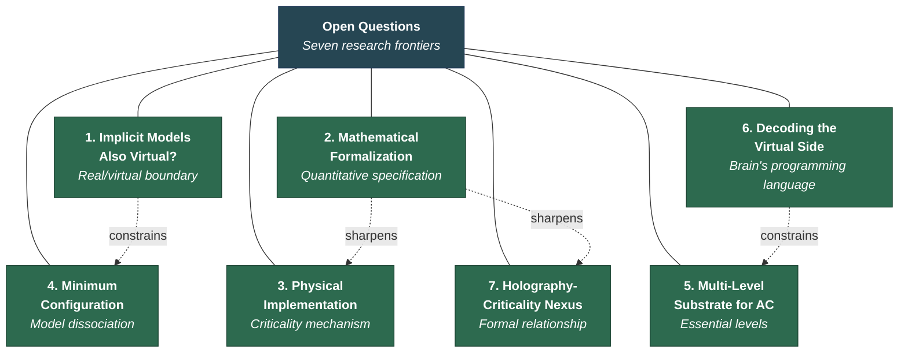

# Open Questions

**The theory acknowledges seven unresolved questions — not as weaknesses but as research frontiers that the theory's framework helps to sharpen. Intellectual honesty requires identifying what remains unknown.**

Every theory operates at a boundary between what it explains and what it does not. The Four-Model Theory's seven open questions are areas where the framework identifies specific problems, provides vocabulary for discussing them, and in several cases constrains the space of possible answers — but does not yet resolve them. They are formulated as well-defined research problems rather than vague gestures at difficulty.

## The Seven Open Questions

### 1. Are the Implicit Models Also Virtual?

The theory classifies the [implicit models](../core-architecture/real-virtual-split.md) (IWM, ISM) as "real side" and the explicit models (EWM, ESM) as "virtual side." But the implicit models are *models*, not raw physics. If they have virtual properties, what constitutes the "real side"? The raw physical substrate with no model-level description? The resolution may have consequences for the theory's treatment of the [Hard Problem dissolution](../hard-problem/dissolution.md). See [Are the Implicit Models Also Virtual?](../open-questions/implicit-models-virtual.md) for full treatment.

### 2. Mathematical Formalization

The theory's [criticality requirement](../physical-foundations/criticality.md) is specified qualitatively (Wolfram's Class 4 regime), not quantitatively. A full formal treatment — defining the four models mathematically, specifying the criticality threshold in measurable quantities, deriving predictions as formal consequences — remains to be developed. The ConCrit framework's mathematical tools provide a starting point. See [Toward Mathematical Formalization](../formal/formalization.md) for details.

### 3. Physical Implementation

Which physical mechanism in the biological brain supports criticality? Candidates include cortical column dynamics, thalamocortical standing waves, glial modulation, and (more speculatively) quantum processes in microtubules. The theory is agnostic: it specifies functional requirements without mandating a specific physical mechanism.

### 4. Minimum Configuration for Consciousness

Can the four models partially dissociate? EWM without ESM (world-experience without self-experience)? ESM without EWM? What is the minimum set required for consciousness versus self-aware consciousness versus full human-type consciousness? See [Minimum Configuration for Consciousness](../open-questions/minimum-configuration.md) for full treatment.

### 5. Multi-Level Substrate Architecture for AC

The biological brain operates as a hierarchy of nested systems (physical, electrochemical, proteomic, topological, virtual). Which levels are essential for [artificial consciousness](../ai-consciousness/engineering-specification.md), and which are specific to biological implementation? The theory's substrate-independence claim implies only the virtual level is strictly required, but bidirectional causal flow between levels suggests decoupling may not be straightforward.

### 6. Decoding the Virtual Side

Neuroimaging captures substrate-level activity (real-side measurements). Decoding conscious content requires understanding the brain's "programming language" — the mapping from substrate dynamics to virtual content. Developing this decoder constitutes a concrete research programme that would provide the most direct test of the [real/virtual distinction](../core-architecture/real-virtual-split.md).

### 7. The Holography-Criticality Nexus

The theory invokes both [holographic storage](../mechanisms/holographic-storage.md) and Class 4 criticality as essential features. Three formal conjectures about their relationship remain unexplored: holographic substrate implies Class 4 dynamics, Class 4 automaton with holographic rule structure, and Class 4 dynamics implies holographic emergent behavior. A system satisfying all three would be a computational fixed point encoding its own structure at every level. See [The Holography-Criticality Nexus](../formal/holography-criticality.md) for full treatment.

## What the Open Questions Share

All seven questions arise *from* the theory rather than being imposed on it from outside. The theory's architecture generates them by specifying structures (the real/virtual split, the four-model minimum, the criticality threshold, the five-system hierarchy) whose boundaries are clear enough to reveal what remains unresolved. This is a feature of a well-specified theory: it knows where its edges are.

Several of these questions are also interdependent. Resolution of question 1 (implicit model status) may constrain question 4 (minimum configuration). Resolution of question 2 (formalization) would sharpen questions 3 and 7 (physical implementation, holography-criticality nexus). Progress on question 6 (decoding) would provide empirical constraints on question 5 (multi-level substrate).

## Figure

## Key Takeaway

The seven open questions are not gaps in the theory's coverage — they are well-defined research problems that the theory generates and that its framework helps to sharpen. A theory that knows where its boundaries are is more useful than one that claims to have none.

## See Also

- [Are the Implicit Models Also Virtual?](../open-questions/implicit-models-virtual.md)
- [Minimum Configuration for Consciousness](../open-questions/minimum-configuration.md)
- [Limitations (Overview)](../limitations/overview.md)
- [The Real/Virtual Split](../core-architecture/real-virtual-split.md)
- [The Criticality Requirement](../physical-foundations/criticality.md)
