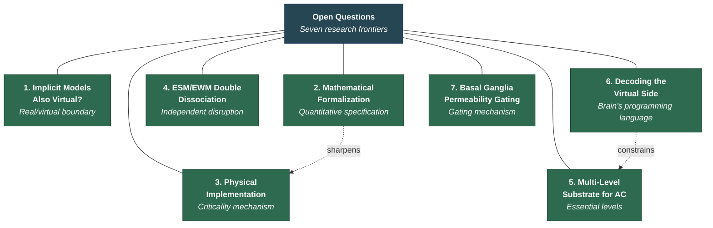

# Open Questions

**The theory names seven unresolved questions, each of which arises from its own framework and is sharpened by it.**

Every theory operates at a boundary between what it explains and what it does not. The Four-Model Theory's seven open questions are areas where the framework identifies specific problems, provides vocabulary for discussing them, and in several cases constrains the space of possible answers — but does not yet resolve them. They are formulated as well-defined research problems rather than vague gestures at difficulty.

## The Seven Open Questions

### 1. Are the Implicit Models Also Virtual?

The theory classifies the [implicit models](../core-architecture/real-virtual-split.md) (IWM, ISM) as "real side" and the explicit models (EWM, ESM) as "virtual side." But the implicit models are *models*, not raw physics. If they have virtual properties, what constitutes the "real side"? The raw physical substrate with no model-level description? The resolution may have consequences for the theory's treatment of the [Hard Problem](../hard-problem/dissolution.md). See [Are the Implicit Models Also Virtual?](../open-questions/implicit-models-virtual.md) for full treatment.

### 2. Mathematical Formalization

The theory's [free-compute requirement](../physical-foundations/criticality.md) is specified qualitatively (Wolfram's Class 4 regime), not quantitatively. A full formal treatment — defining the four models mathematically, specifying the criticality signature in measurable quantities, deriving predictions as formal consequences — remains to be developed. The ConCrit framework's mathematical tools provide a starting point. See [Toward Mathematical Formalization](../formal/formalization.md) for details.

### 3. Physical Implementation

Which physical mechanism in the biological brain supports criticality? Candidates include cortical column dynamics, thalamocortical standing waves, glial modulation, and (more speculatively) quantum processes in microtubules. The theory is agnostic: it specifies functional requirements without mandating a specific physical mechanism.

### 4. ESM/EWM Double Dissociation

The theory's sharpest architectural test: the explicit self-model and the explicit world model should be *independently disruptable*. Selective ESM disruption should produce depersonalization (intact world, absent self); selective EWM disruption something closer to dream-like or hallucinatory states (fragmented world, intact self-awareness). A strict reading of predictive processing predicts that the two covary instead. Existing metacognition data are consistent with the dissociation — across 20 perceptual datasets from the Confidence Database (2,752 participants), metacognitive efficiency is essentially uncorrelated with first-order sensitivity — but a causal perturbation that degrades one model kind while sparing the other, and the converse, remains the decisive test. What the architecture requires is functional selectivity, not the excision of a localized module. The related question of which partial configurations can support any experience is discussed in [Minimum Configuration for Consciousness](../open-questions/minimum-configuration.md).

### 5. Multi-Level Substrate Architecture for AC

The biological brain operates as a hierarchy of nested systems (physical, electrochemical, proteomic, topological, virtual). Which levels are essential for [artificial consciousness](../ai-consciousness/engineering-specification.md), and which are specific to biological implementation? The theory's substrate-independence claim implies only the virtual level is strictly required, but bidirectional causal flow between levels suggests decoupling may not be straightforward.

### 6. Decoding the Virtual Side

Neuroimaging captures substrate-level activity (real-side measurements). Decoding conscious content requires understanding the brain's "programming language" — the mapping from substrate dynamics to virtual content. Developing this decoder constitutes a concrete research programme that would provide the most direct test of the [real/virtual distinction](../core-architecture/real-virtual-split.md).

### 7. The Basal Ganglia Role in Permeability Gating

[Variable permeability](../mechanisms/variable-permeability.md) describes *states* — psychedelics raise it, anosognosia lowers it locally — without specifying the moment-to-moment *mechanism* that gates implicit content into the explicit simulation. One candidate is dopaminergic prediction-error signaling in cortico-basal ganglia-thalamo-cortical loops: the cortex generates candidate model updates, and the basal ganglia evaluate them before gating their entry, in a structure closer to actor-critic learning than to true adversarial training. The framing extends to schizophrenia as a miscalibrated gate — too permissive yields hallucinations and delusions, too conservative yields negative symptoms.

A further formal question, the relationship between [holographic storage](../mechanisms/holographic-storage.md) and the Class 4 regime, is treated in [The Holography-Criticality Nexus](../formal/holography-criticality.md); its three conjectures come from Gruber (2015) and the cosmology paper, not from the Four-Model Theory paper, and all three are open.

## What the Open Questions Share

All seven questions arise *from* the theory rather than being imposed on it from outside. The theory's architecture generates them by specifying structures (the real/virtual split, the four-model minimum, the Class 4 regime, the five-system hierarchy) whose boundaries are clear enough to reveal what remains unresolved.

Several of these questions are also interdependent. Resolution of question 2 (formalization) would sharpen question 3 (physical implementation). The in-silico research program supplies a model-system setting for question 2 and for question 4 (double dissociation), whose causal chains are directly traceable in a synthetic architecture. Progress on question 6 (decoding) would provide empirical constraints on question 5 (multi-level substrate).

## Figure

```mermaid
graph TD
    OQ["<b>Open Questions</b><br/><i>Seven research frontiers</i>"]

    Q1["<b>1. Implicit Models<br/>Also Virtual?</b><br/><i>Real/virtual boundary</i>"]
    Q2["<b>2. Mathematical<br/>Formalization</b><br/><i>Quantitative specification</i>"]
    Q3["<b>3. Physical<br/>Implementation</b><br/><i>Criticality mechanism</i>"]
    Q4["<b>4. ESM/EWM Double<br/>Dissociation</b><br/><i>Independent disruption</i>"]
    Q5["<b>5. Multi-Level<br/>Substrate for AC</b><br/><i>Essential levels</i>"]
    Q6["<b>6. Decoding the<br/>Virtual Side</b><br/><i>Brain's programming language</i>"]
    Q7["<b>7. Basal Ganglia<br/>Permeability Gating</b><br/><i>Gating mechanism</i>"]

    OQ --- Q1
    OQ --- Q2
    OQ --- Q3
    OQ --- Q4
    OQ --- Q5
    OQ --- Q6
    OQ --- Q7

    Q2 -.->|"sharpens"| Q3
    Q6 -.->|"constrains"| Q5

    style OQ fill:#264653,color:#fff,stroke:#1d3557
    style Q1 fill:#2d6a4f,color:#fff,stroke:#1b4332
    style Q2 fill:#2d6a4f,color:#fff,stroke:#1b4332
    style Q3 fill:#2d6a4f,color:#fff,stroke:#1b4332
    style Q4 fill:#2d6a4f,color:#fff,stroke:#1b4332
    style Q5 fill:#2d6a4f,color:#fff,stroke:#1b4332
    style Q6 fill:#2d6a4f,color:#fff,stroke:#1b4332
    style Q7 fill:#2d6a4f,color:#fff,stroke:#1b4332
```

## Key Takeaway

The seven open questions are well-defined research problems that the theory generates and that its framework helps to sharpen. The sharpest of them, the ESM/EWM double dissociation, is also its most direct architectural test.

## See Also

- [Are the Implicit Models Also Virtual?](../open-questions/implicit-models-virtual.md)
- [Minimum Configuration for Consciousness](../open-questions/minimum-configuration.md)
- [Limitations (Overview)](../limitations/overview.md)
- [The Real/Virtual Split](../core-architecture/real-virtual-split.md)
- [Criticality: Signature, Not Requirement](../physical-foundations/criticality.md)
