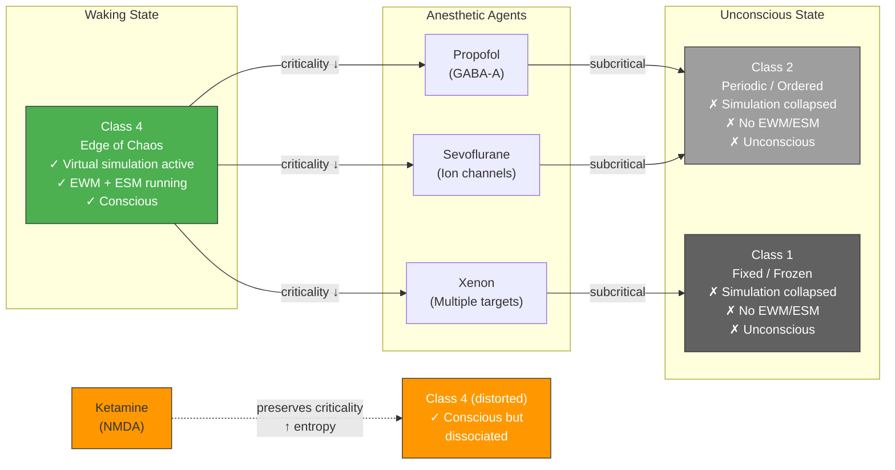

# Anesthesia and Loss of Consciousness

**Anesthetics abolish consciousness by pushing the substrate below the criticality threshold -- from Class 4 (edge of chaos) to Class 2 or Class 1 (ordered/frozen) -- collapsing the virtual simulation regardless of their molecular mechanism.**

General anesthesia is the most reliable, repeatable, and clinically controlled method of abolishing consciousness. Different anesthetic agents act through radically different molecular mechanisms -- propofol targets GABA-A receptors, ketamine blocks NMDA receptors, xenon acts on multiple targets, sevoflurane modulates ion channels. Yet they all (with one telling exception) converge on the same macroscopic outcome: loss of consciousness. The Four-Model Theory explains this convergence through a single principle: all consciousness-abolishing agents push the substrate below the [criticality threshold](../physical-foundations/criticality.md).

## The Class 4 Collapse

Under normal waking conditions, the cortical substrate operates at or near [Class 4 dynamics](../physical-foundations/criticality.md) -- the edge of chaos where universal computation is possible and the [four-model self-simulation](../core-architecture/four-model-theory.md) can run. Anesthetics that abolish consciousness do so by forcing the substrate into **Class 2** (periodic, repetitive dynamics) or **Class 1** (frozen, fixed-state dynamics). In either case, the computational regime can no longer support the complex, self-referential processing that the virtual simulation requires. The [EWM](../core-architecture/four-model-theory.md) and [ESM](../core-architecture/four-model-theory.md) collapse -- not because they are directly targeted, but because their computational medium has been degraded below the threshold of viability.

This is analogous to pulling the power from a running computer: the software does not "decide" to stop -- it ceases because the hardware can no longer sustain the computation.

## Figure

*Multiple anesthetic agents with different molecular mechanisms converge on the same criticality reduction: pushing the substrate from Class 4 to Class 2/1. Ketamine is the exception -- it preserves criticality while distorting input, producing dissociative consciousness rather than abolishing it.*

## The Anesthetic-Criticality Convergence

The empirical evidence for this convergence is extensive. The **Perturbational Complexity Index** (PCI), developed by [Casali et al. (2013)](https://doi.org/10.1126/scitranslmed.3006294) and validated by [Casarotto et al. (2016)](https://doi.org/10.1002/ana.24779), measures neural complexity by perturbing the cortex with transcranial magnetic stimulation and measuring the spatiotemporal complexity of the response. A PCI threshold of 0.31 perfectly discriminates conscious from unconscious states across propofol, midazolam, xenon, and ketamine -- every agent that abolishes consciousness drives PCI below this threshold. The ConCrit framework (Algom & Shriki, 2026) and Hengen and Shew's (2025) meta-analysis of 140 datasets independently reached the same conclusion.

This convergence was predicted by the Four-Model Theory from computational first principles ([Gruber, 2015](https://doi.org/10.5281/zenodo.18669891)): any agent that abolishes consciousness must do so by disrupting criticality, regardless of its molecular target. The prediction preceded the large-scale empirical confirmation.

## The Ketamine Exception

**Ketamine** is the exception that proves the rule. Unlike propofol or sevoflurane, ketamine does not push the substrate subcritical -- EEG entropy *increases* under ketamine, and criticality markers are preserved. Consciousness persists, but on distorted and predominantly internal input, producing the characteristic dissociative experience: the "K-hole" phenomenology of detachment from body and environment, bizarre spatial distortions, and time dilation. The Four-Model Theory predicts this directly: if the substrate remains at criticality, the simulation continues to run. But ketamine disrupts the normal input streams, so the simulation operates on distorted data -- producing distorted but genuine conscious experience, not unconsciousness.

## Distinguishing Vegetative from Covertly Conscious

The criticality framework generates a clinically important distinction. Patients in a **vegetative state** may be genuinely unconscious (subcritical substrate, no simulation) or **covertly conscious** (critical substrate with damaged output pathways -- motor cortex, brainstem circuits intact enough for computation but not for behavioral expression). This is precisely the phenomenon of **cognitive motor dissociation** (CMD), documented by [Owen et al. (2006)](https://doi.org/10.1126/science.1130197), in which patients clinically diagnosed as vegetative demonstrate awareness through brain-imaging paradigms. The theory predicts that criticality measures such as PCI should distinguish truly vegetative from covertly conscious patients -- a prediction with direct clinical implications for end-of-life decisions.

## Key Takeaway

Different anesthetic agents converge on the same mechanism: pushing the substrate below the criticality threshold, collapsing the virtual simulation. The convergence was predicted from computational first principles and confirmed by empirical complexity measures across 140 datasets. Ketamine, which preserves criticality, preserves consciousness -- the exception that confirms the rule.

## See Also

- [The Criticality Requirement](../physical-foundations/criticality.md)
- [Two Thresholds for Consciousness](../physical-foundations/two-thresholds.md)
- [Sleep, Dreams, and Criticality](../phenomena/sleep.md)
- [Psychedelic Phenomenology](../phenomena/psychedelics.md)
- [The Four-Model Theory](../core-architecture/four-model-theory.md)
