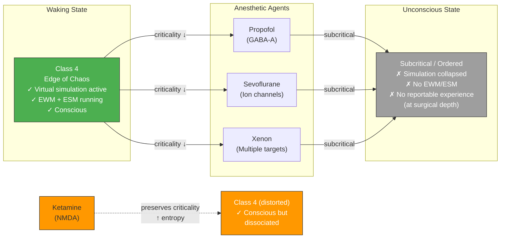

# Anesthesia and Loss of Consciousness

**At surgical depth, anesthetics abolish reportable experience by pushing the substrate out of the Class 4 regime (edge of chaos) into subcritical, ordered dynamics -- collapsing the virtual simulation regardless of their molecular mechanism.**

General anesthesia is the most reliable, repeatable, and clinically controlled method of abolishing consciousness. Different anesthetic agents act through radically different molecular mechanisms -- propofol targets GABA-A receptors, ketamine blocks NMDA receptors, xenon acts on multiple targets, sevoflurane modulates ion channels. Yet they all (with one telling exception) converge on the same macroscopic outcome: loss of consciousness. The Four-Model Theory explains this convergence through a single principle: all consciousness-abolishing agents push the substrate out of the open-ended Class 4 regime, whose neural signature is near-[criticality](../physical-foundations/criticality.md).

## The Class 4 Collapse

Under normal waking conditions, the cortical substrate operates at or near [Class 4 dynamics](../physical-foundations/criticality.md) -- the edge of chaos where universal computation is possible and the [four-model self-simulation](../core-architecture/four-model-theory.md) can run. Anesthetics that abolish consciousness do so by forcing the substrate **subcritical** -- toward the ordered side of the edge of chaos, where dynamics settle into repetitive or fixed patterns. There the computational regime can no longer support the complex, self-referential processing that the virtual simulation requires. The [EWM](../core-architecture/four-model-theory.md) and [ESM](../core-architecture/four-model-theory.md) collapse -- not because they are directly targeted, but because their computational medium has been degraded below the threshold of viability.

This is analogous to pulling the power from a running computer: the software does not "decide" to stop -- it ceases because the hardware can no longer sustain the computation.

## Figure

```mermaid
graph LR
    subgraph "Waking State"
        C4W["Class 4\nEdge of Chaos\n✓ Virtual simulation active\n✓ EWM + ESM running\n✓ Conscious"]
    end

    subgraph "Anesthetic Agents"
        PROP["Propofol\n(GABA-A)"]
        SEVO["Sevoflurane\n(Ion channels)"]
        XEN["Xenon\n(Multiple targets)"]
    end

    subgraph "Unconscious State"
        C2["Subcritical / Ordered\n✗ Simulation collapsed\n✗ No EWM/ESM\n✗ No reportable experience\n(at surgical depth)"]
    end

    C4W -->|"criticality ↓"| PROP
    C4W -->|"criticality ↓"| SEVO
    C4W -->|"criticality ↓"| XEN

    PROP -->|"subcritical"| C2
    SEVO -->|"subcritical"| C2
    XEN -->|"subcritical"| C2

    KET["Ketamine\n(NMDA)"] -.->|"preserves criticality\n↑ entropy"| C4K["Class 4 (distorted)\n✓ Conscious but\ndissociated"]

    style C4W fill:#4CAF50,stroke:#333,color:#fff
    style C2 fill:#9E9E9E,stroke:#333,color:#fff
    style C4K fill:#FF9800,stroke:#333,color:#fff
    style KET fill:#FF9800,stroke:#333
```

*Multiple anesthetic agents with different molecular mechanisms converge on the same criticality reduction: pushing the substrate out of the Class 4 regime into subcritical dynamics. Ketamine is the exception -- it preserves near-critical dynamics while distorting input, producing dissociative consciousness rather than abolishing it.*

## The Anesthetic-Criticality Convergence

The empirical evidence for this convergence is extensive. The **Perturbational Complexity Index** (PCI), developed by [Casali et al. (2013)](https://doi.org/10.1126/scitranslmed.3006294) and validated by [Casarotto et al. (2016)](https://doi.org/10.1002/ana.24779), measures neural complexity by perturbing the cortex with transcranial magnetic stimulation and measuring the spatiotemporal complexity of the response. A PCI threshold of about 0.31 reliably discriminates conscious from unconscious states, with high accuracy, across propofol, midazolam, xenon, and ketamine. PCI is a clinical proxy for consciousness level, not itself a criticality measure; the theory predicts it will co-vary with the criticality signatures. The ConCrit framework (Algom & Shriki, 2026) extends the near-criticality setpoint into an explicit criticality-consciousness account, and Hengen and Shew's (2025) meta-analysis of ~140 datasets consolidates the premise the argument rests on -- that cortex operates near criticality as a setpoint of brain function -- without testing the anesthetic claim itself.

The Four-Model Theory derived this convergence from computational first principles ([Gruber, 2015](https://www.amazon.com/Emergenz-Bewusstseins-German-Matthias-Gruber/dp/1326652079)): any agent that abolishes consciousness must do so by disrupting the Class 4 regime, regardless of its molecular target. The PCI work predates that publication, so it is consistent with the theory rather than a prediction later confirmed; the post-2015 criticality syntheses carry the stronger evidential weight.

## What "Abolished" Means

The claim is about **surgical depth**. At surgical depth propofol produces absence of reportable experience. Dream reports after propofol anaesthesia are nonetheless common, and whether those dreams occur during maintenance or at emergence is unresolved ([Sikka, Hu, & Heifets, 2026](https://doi.org/10.1016/j.bja.2026.05.002)). Under deep propofol *sedation*, participants woken repeatedly gave experience reports on 24 of 52 awakenings, and perturbational and Lempel-Ziv complexity did not differ between awakenings with and without reported experience ([Bajwa et al., 2025](https://doi.org/10.1038/s41598-025-12695-z)).

## The Ketamine Exception

**Ketamine** is the informative exception. Unlike propofol or sevoflurane, ketamine does not push the substrate subcritical -- EEG entropy *increases* under ketamine, and near-critical dynamics are preserved ([Maschke et al., 2024](https://doi.org/10.1038/s42003-024-06613-8)). Consciousness persists, but on distorted and predominantly internal input, producing the characteristic dissociative experience: the "K-hole" phenomenology of detachment from body and environment, bizarre spatial distortions, and time dilation. The Four-Model Theory accounts for this: the substrate stays in the Class 4 regime, so the simulation can keep running. But ketamine disrupts the normal input streams, so the simulation operates on distorted data -- producing distorted but genuine conscious experience, not unconsciousness.

## Distinguishing Vegetative from Covertly Conscious

The criticality framework generates a clinically important distinction. Patients in a **vegetative state** may be genuinely unconscious (subcritical substrate, no simulation) or **covertly conscious** (critical substrate with damaged output pathways -- motor cortex, brainstem circuits intact enough for computation but not for behavioral expression). This is precisely the phenomenon of **cognitive motor dissociation** (CMD), documented by [Owen et al. (2006)](https://doi.org/10.1126/science.1130197), in which patients clinically diagnosed as vegetative demonstrate awareness through brain-imaging paradigms. The theory predicts that criticality measures, together with clinical proxies such as PCI, should distinguish truly vegetative from covertly conscious patients -- a prediction with direct clinical implications for end-of-life decisions.

## Key Takeaway

Different anesthetic agents converge on the same mechanism: pushing the substrate out of the Class 4 regime into subcritical dynamics, collapsing the virtual simulation and abolishing reportable experience at surgical depth. The convergence follows from computational first principles and is consistent with complexity measures and the wider criticality literature. Under ketamine, which preserves near-critical dynamics, consciousness persists.

## See Also

- [Criticality: Signature, Not Requirement](../physical-foundations/criticality.md)
- [Two Thresholds for Consciousness](../physical-foundations/two-thresholds.md)
- [Sleep, Dreams, and Criticality](../phenomena/sleep.md)
- [Psychedelic Phenomenology](../phenomena/psychedelics.md)
- [The Four-Model Theory](../core-architecture/four-model-theory.md)
