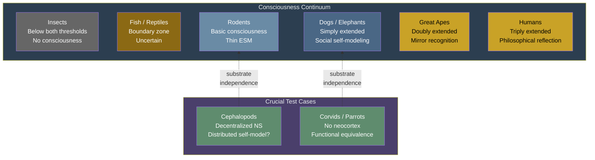

# Animal Consciousness

**Consciousness exists on a continuum determined by the depth of self-modeling -- mammals possess all four models at varying depths, placing different species at different positions on the consciousness gradient.**

The Four-Model Theory rejects the binary question "Is animal X conscious?" in favor of a graduated framework: *how deep* is the self-modeling? The theory's commitments -- consciousness as a continuum, [substrate independence](../philosophical/process-physicalism.md), and the [criticality threshold](../physical-foundations/criticality.md) -- predict a gradient of animal consciousness that maps onto neural complexity without drawing an arbitrary line between "conscious" and "not."

## The Graduated Framework

The theory identifies [graduated levels](../mechanisms/graduated-consciousness.md) of consciousness based on the depth of recursive self-modeling:

- **Basic consciousness**: Minimal self-simulation. An [EWM](../core-architecture/explicit-world-model.md) generates a perceptual world; a rudimentary [ESM](../core-architecture/explicit-self-model.md) provides a thin sense of subjectivity. The organism experiences but has minimal self-awareness.
- **Simply extended**: First-order self-observation. The organism is aware that it experiences.
- **Doubly extended**: Metacognition. The organism models itself modeling.
- **Triply extended**: Philosophical self-reflection. Rare, possibly unique to humans (and the prerequisite for studying consciousness itself).

Different species occupy different positions along this continuum, and individual organisms may fluctuate between levels depending on arousal, attention, and state.

## Mammals

Mammals implement the four-model architecture in graduated form. Even simple cortices (rodents) support basic consciousness: a rudimentary simulation sufficient for phenomenal experience but thin in self-awareness. The six-layer neocortical architecture provides the computational substrate, with cortical complexity roughly tracking the depth of self-modeling available.

**Evidence for graduated mammalian consciousness:**

- **Pain and affect.** Mammals show behavioral, physiological, and neural responses to noxious stimuli that parallel human pain experience. The [ISM](../core-architecture/implicit-self-model.md) processes interoceptive signals; the [ESM](../core-architecture/explicit-self-model.md) generates the conscious experience of suffering.
- **REM sleep.** All mammals exhibit REM sleep, the state the theory identifies as degraded simulation mode. If REM involves virtual-model activity (dreaming), this implies the four-model architecture is a conserved mammalian feature.
- **Play behavior.** Social play requires maintaining simultaneous models of self and other -- a minimal form of the world/self distinction that the two axes of the four-model framework describe.

## Crucial Test Cases

**Corvids and parrots** present a critical challenge. These birds demonstrate tool manufacture, mirror self-recognition, social deception, and future planning -- cognitive capacities traditionally associated with consciousness -- yet possess no neocortex. Their pallium is organized in nuclear clusters rather than six-layer cortex (Gunturkun & Bugnyar, 2016).

The Four-Model Theory predicts these animals *are* conscious: they have evolved functionally equivalent self-simulation architectures on a different substrate. The six-layer mammalian cortex is an evolutionary implementation of the four-model architecture, not a requirement for it. Corvids demonstrate that the same functional architecture -- world models and self-models at both implicit and explicit levels -- can be realized in a fundamentally different neural organization.

**Cephalopods** extend this logic further. Octopuses have largely decentralized nervous systems -- two-thirds of their neurons are in the arms rather than the brain. The theory predicts that cephalopod consciousness, if present, would have unusual features: a self-model (ESM) that may be distributed across a partially autonomous nervous system, producing a form of embodiment radically different from the centralized mammalian pattern.

Both cases test [substrate independence](../philosophical/process-physicalism.md) directly. If consciousness depends on function (four models at criticality) rather than material (mammalian cortex), these animals should be conscious despite their non-mammalian substrates.

## The Boundary Problem

Where on the continuum does consciousness begin? The theory provides a principled answer through the [two thresholds](../physical-foundations/two-thresholds.md):

1. **Computational threshold**: The substrate must operate at or near [criticality](../physical-foundations/criticality.md) (Class 4 dynamics).
2. **Architectural threshold**: The system must implement the four-model architecture (world and self, at both implicit and explicit levels).

Both are necessary; neither is sufficient alone. A system below the criticality threshold cannot sustain the virtual simulation regardless of architecture. A system at criticality but without self-modeling is a complex dynamical system, not a conscious one.

In practice, this means the boundary is not a sharp line but a zone: organisms with substrates near the criticality threshold and rudimentary self-modeling capacity occupy a transitional region. Insects likely fall below both thresholds; mammals are above both; the interesting boundary cases are fish, amphibians, and reptiles -- organisms with simpler cortical structures that may or may not support the minimal four-model architecture.

## Figure

*Animal consciousness as a gradient of self-modeling depth. Corvids and cephalopods are crucial test cases for substrate independence -- different neural organization, equivalent functional capacity.*

## Key Takeaway

Animal consciousness is a continuum determined by the depth of self-modeling, not a binary property. The four-model architecture exists in graduated form across mammals, with corvids and cephalopods providing crucial tests of substrate independence. The two thresholds (criticality + architecture) provide a principled answer to the boundary problem without drawing an arbitrary line.

## See Also

- [Graduated Levels of Consciousness](../mechanisms/graduated-consciousness.md)
- [Two Thresholds for Consciousness](../physical-foundations/two-thresholds.md)
- [The Criticality Requirement](../physical-foundations/criticality.md)
- [Explicit Self Model (ESM)](../core-architecture/explicit-self-model.md)
- [Substrate Independence](../philosophical/process-physicalism.md)
