# Anosognosia

**Anosognosia is a local decrease in implicit-explicit permeability: the ISM registers the deficit, but the transfer to the ESM is blocked for that domain -- the substrate knows what the conscious self does not.**

Patients with anosognosia -- typically following right-hemisphere stroke -- are unaware of their own deficits. A patient paralyzed on the left side sincerely denies any impairment. Confronted with evidence (the limb will not move), the patient confabulates: "I just don't feel like moving it right now." This is not denial in the psychological sense -- the patient genuinely does not experience the deficit. The Four-Model Theory explains why: the conscious simulation does not include it.

## The Mechanism: Local Permeability Block

The [implicit-explicit boundary](../mechanisms/implicit-explicit-boundary.md) is not a uniform gate but a spatially and functionally variable filter. In anosognosia, this boundary suffers a **local decrease in permeability** for a specific domain:

- The [ISM](../core-architecture/implicit-self-model.md) registers the deficit. At the substrate level, the system "knows" the limb is paralyzed -- proprioceptive signals are absent or abnormal, motor commands produce no feedback.
- The [ESM](../core-architecture/explicit-self-model.md) does not receive this information. The transfer from implicit to explicit is blocked for the affected domain.
- The patient's conscious self-model simply does not include the paralysis. The ESM constructs its narrative from the available (incomplete) input, and the deficit is not part of that narrative.

The rest of the boundary remains intact. The patient is fully conscious, aware of their surroundings, capable of conversation -- the block is domain-specific, not global. This selectivity is key: it is not that consciousness is impaired, but that a specific channel of self-information is blocked.

## The Inverse of Psychedelics

The Four-Model Theory connects anosognosia and [psychedelic phenomenology](../phenomena/psychedelics.md) as opposite extremes of the same [variable permeability](../mechanisms/variable-permeability.md) mechanism:

| | Psychedelics | Anosognosia |
|---|---|---|
| **Direction** | Increase | Decrease |
| **Scope** | Global | Local |
| **Effect** | Implicit processing becomes conscious | Specific self-knowledge blocked from consciousness |
| **Result** | Flood of novel content | Absence of deficit awareness |

This connection is not just a theoretical symmetry -- it generates the theory's most distinctive cross-domain prediction: **sub-ego-dissolution dose psychedelics should alleviate anosognosia** by compensating for the local permeability block with a global permeability increase. The theory predicts this effect would be dose-dependent, temporary, and correlated with EEG complexity increases over the lesioned hemisphere.

No other major consciousness theory generates this specific cross-domain prediction, because no other theory connects psychedelic phenomenology and anosognosia through a single, quantifiable mechanism.

## Confabulation as ESM Default Behavior

The confabulation observed in anosognosia is not a separate pathology -- it is the ESM doing what it always does: constructing the most coherent self-narrative possible from available input. When the ESM lacks information about a deficit, it does not generate a blank -- it generates a narrative that explains the available evidence without the missing information. "I don't feel like moving" is the ESM's best interpretation of a situation where no motor feedback arrives and no deficit-awareness reaches consciousness.

This is the **same confabulation mechanism** seen in:

- **Split-brain patients**: The left hemisphere's ESM invents explanations for right-hemisphere-initiated behavior it cannot observe.
- **Cotard's delusion**: The ESM generates "I am dead" from severely distorted interoceptive input.
- **Ego dissolution**: The ESM generates "I am a chair" when normal self-input is disrupted and sensory input from the chair dominates.

In every case, the ESM is functioning normally -- the abnormality is in the *input*, not the *processing*.

## Anton's Syndrome: The Double Dissociation

**Anton's syndrome** (anosognosia for cortical blindness) provides the precise inverse of blindsight, completing a double dissociation that strongly supports the [real/virtual split](../core-architecture/real-virtual-split.md):

- **Blindsight**: Substrate processes visual information (IWM active); conscious simulation does not include it (EWM lacks visual content). The patient is blind but navigates.
- **Anton's syndrome**: Substrate does not process visual information (no input); conscious simulation generates visual content anyway (EWM runs on stored IWM data). The patient "sees" but walks into walls.

Together, blindsight and Anton's syndrome demonstrate that substrate processing and conscious simulation are dissociable in both directions -- among the most direct neurological evidence for the two-level architecture.

## Figure

```mermaid
graph TD
    subgraph Normal["Normal State"]
        N_ISM["ISM<br/>Body schema:<br/>all domains intact"]
        N_ISM -->|"full<br/>permeability"| N_ESM["ESM<br/>Knows: body works,<br/>limbs move"]
    end

    subgraph Anosognosia["Anosognosia"]
        A_ISM["ISM<br/>Body schema:<br/>LEFT ARM PARALYZED"]
        A_ISM -->|"normal domains<br/>pass through"| A_ESM["ESM<br/>Knows: body works<br/>Doesn't know: left arm paralyzed"]
        A_ISM x--x|"LOCAL BLOCK<br/>deficit domain"| A_ESM
    end

    subgraph Psychedelic["Psychedelic (inverse)"]
        P_ISM["ISM<br/>All self-knowledge"]
        P_ISM ==>|"GLOBAL INCREASE<br/>all domains flood through"| P_ESM["ESM<br/>Aware of normally<br/>implicit processes"]
    end

    style Normal fill:#2c3e50,color:#ecf0f1
    style Anosognosia fill:#8b0000,color:#fff
    style Psychedelic fill:#7d6608,color:#ecf0f1
    style N_ISM fill:#4a6785,color:#fff
    style N_ESM fill:#c9a227,color:#000
    style A_ISM fill:#4a6785,color:#fff
    style A_ESM fill:#c9a227,color:#000
    style P_ISM fill:#4a6785,color:#fff
    style P_ESM fill:#c9a227,color:#000
```

*Anosognosia as local permeability decrease (middle), contrasted with normal state (left) and psychedelic global increase (right). The ISM contains the deficit information in all cases -- the difference is whether it reaches the ESM.*

## Key Takeaway

Anosognosia is a local block in the implicit-explicit boundary: the substrate knows what the conscious self does not. It is the exact inverse of the psychedelic mechanism (local decrease vs. global increase in permeability), and this symmetry generates a unique cross-domain prediction -- psychedelics should alleviate anosognosia. The confabulation observed is normal ESM behavior operating on incomplete input.

## See Also

- [Variable Permeability](../mechanisms/variable-permeability.md)
- [The Implicit-Explicit Boundary](../mechanisms/implicit-explicit-boundary.md)
- [Implicit Self Model (ISM)](../core-architecture/implicit-self-model.md)
- [Explicit Self Model (ESM)](../core-architecture/explicit-self-model.md)
- [Psychedelic Phenomenology](../phenomena/psychedelics.md)
- [Split-Brain Phenomena](../phenomena/split-brain.md)
