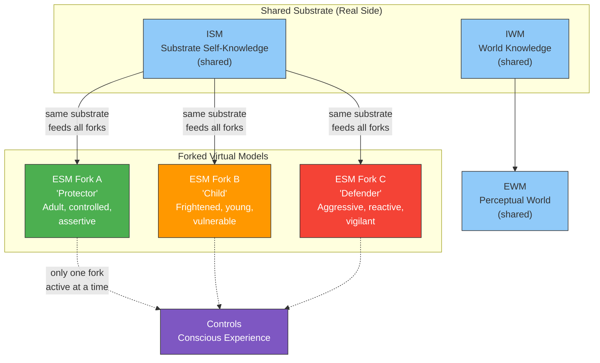

# Dissociative Identity Disorder (DID)

**DID represents virtual model forking: a single substrate running multiple distinct ESM configurations -- each alter is a different self-model on the same hardware.**

Dissociative identity disorder involves the presence of two or more distinct identity states (alters) that recurrently take control of behavior, each with its own self-narrative, emotional profile, behavioral patterns, and sometimes even distinct physiological responses. Most theories treat DID as a disorder of *integration* -- a failure to unify experience. The Four-Model Theory offers a more specific and more testable account: DID is **virtual model forking**, a direct consequence of the software-like properties of the [virtual side](../core-architecture/real-virtual-split.md) of the architecture.

## Virtual Forking

The [real/virtual split](../core-architecture/real-virtual-split.md) at the heart of the Four-Model Theory gives the explicit models software-like properties: they are generated, transient, reconfigurable -- and critically, **forkable**. Just as a running program can be forked into multiple instances that share the same hardware but maintain distinct state, the ESM can be forked into multiple configurations that share the same neural substrate but maintain distinct self-models.

Each **alter** in DID is a distinct configuration of the **Explicit Self Model** -- a different set of parameters for the self-simulation. One alter may model itself as a protective adult, another as a frightened child, another as an aggressive defender. Each configuration has its own self-narrative, its own emotional profile, its own behavioral repertoire. But all run on the same [IWM](../core-architecture/four-model-theory.md) (world knowledge), the same [ISM](../core-architecture/four-model-theory.md) (accumulated self-knowledge at the substrate level), and the same [EWM](../core-architecture/four-model-theory.md) (perceptual world). The fork occurs specifically at the self-model level.

This is not a metaphor. The theory makes a literal claim: the same neural substrate generates multiple distinct self-simulations that alternate in controlling the conscious experience. The substrate does not split -- it runs different software configurations sequentially (and in some accounts, partially in parallel).

## Figure

*DID as virtual model forking. The substrate (IWM, ISM) is shared across all alters. Each alter is a distinct ESM configuration -- a different self-simulation running on the same hardware. Only one fork controls conscious experience at a time.*

## The Prediction: DMN Concentration

The forking account generates a specific, testable prediction: **alter switching should produce neural reconfiguration concentrated in ESM-related networks** -- specifically the default mode network (DMN: medial prefrontal cortex, posterior cingulate cortex, angular gyrus, lateral temporal cortex) -- rather than diffusely distributed across the brain. If each alter is a distinct ESM configuration, then the differences between alters should be localized to self-model networks, not spread across the entire cortex.

Existing DID neuroimaging studies (Reinders et al., 2003, 2008; Schlumpf et al., 2014) have demonstrated alter-specific activation differences, but have not tested whether those differences are specifically concentrated in self-model networks versus diffusely distributed. The Four-Model Theory makes this spatial prediction explicit and falsifiable: whole-brain classification of alter identity should *not* significantly outperform DMN-only classification.

## Distinguishing DID from Role-Playing

A further prediction: the ESM-network patterns during genuine alter switching should be qualitatively distinguishable from patterns produced by role-playing or method acting in matched controls. Actors adopt different behavioral profiles voluntarily, but their ESM does not fork -- they maintain a single self-model that *pretends* to be different. The neural signature of genuine forking (distinct ESM configurations) versus performance (single ESM modeling different roles) should be detectable.

## Key Takeaway

DID is virtual model forking: multiple distinct ESM configurations running on a single substrate, each constituting a different self-simulation with its own narrative, affect, and behavior. The theory predicts that alter-specific neural differences are concentrated in self-model (DMN) networks, not diffusely distributed.

## See Also

- [Ego Dissolution](../phenomena/ego-dissolution.md)
- [The Real/Virtual Split](../core-architecture/real-virtual-split.md)
- [The Four-Model Theory](../core-architecture/four-model-theory.md)
- [Self-Referential Closure](../core-architecture/self-referential-closure.md)
- [Psychedelic Phenomenology](../phenomena/psychedelics.md)
