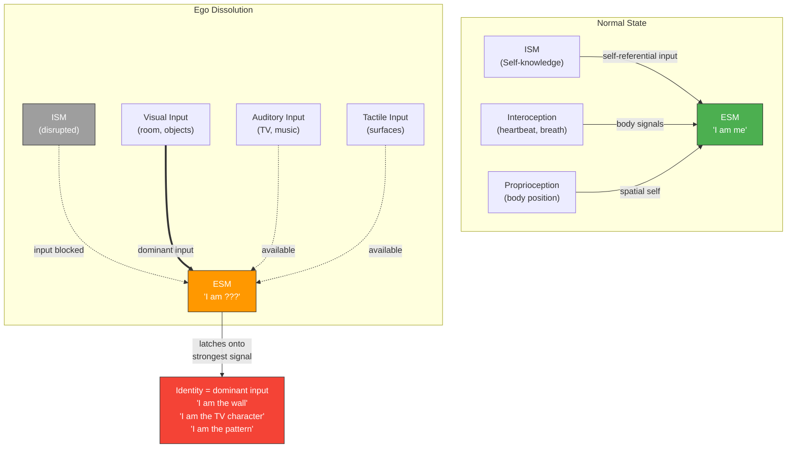

# Ego Dissolution

**During ego dissolution, the ESM is not abolished -- it is deprived of normal self-referential input and latches onto whatever sensory input dominates, making identity content predictable and controllable.**

Ego dissolution -- the experience of losing one's sense of self, of boundaries dissolving between self and world -- is one of the most dramatic effects of high-dose psychedelics. Most accounts describe this as the self *disappearing*. The Four-Model Theory offers a more precise and more testable account: the **Explicit Self Model** (ESM) does not cease to operate. It continues running but loses its normal input, redirecting onto whatever dominates the available input stream.

## The Redirectable ESM

The [ESM](../core-architecture/four-model-theory.md) is the brain's continuous generation of a unified self-narrative -- the sense of being a subject, having a perspective, occupying a body. Like any computational model, it requires input to operate on. Under normal conditions, the ESM receives a rich stream of self-referential signals: interoceptive data (heartbeat, breathing, gut feelings), proprioceptive feedback (body position, muscle tension), and the ongoing output of the [ISM](../core-architecture/four-model-theory.md) (accumulated self-knowledge, personality, autobiographical continuity).

High-dose psychedelics disrupt this self-referential input stream. The ESM does not shut down -- it has no off switch. Instead, it does what any running model does when deprived of its expected input: it latches onto the strongest available signal. If the dominant input is visual, the self-experience merges with the visual scene. If it is auditory, identity fuses with the sound. If it is tactile, the subject "becomes" the surface they are touching.

## Salvia Divinorum: The Decisive Case

**Salvia divinorum** (Salvinorin A) provides the most dramatic confirmation of this mechanism. Salvia users reliably report experiences of *becoming* objects or entities in their immediate environment: becoming a piece of furniture, becoming a wall, becoming a character from a television show playing in the room, becoming a geometric pattern on the carpet. These reports are not metaphorical -- subjects describe literal identity replacement, experiencing themselves *as* the object.

The Four-Model Theory predicts exactly this. The ESM, deprived of normal self-input by salvia's potent kappa-opioid agonism, latches onto the dominant sensory input -- visual input from the room, auditory input from media, proprioceptive input from contact surfaces. The identity experience tracks the dominant input in a dose-dependent, input-dependent, and therefore *predictable* manner.

## Figure

*In normal operation, the ESM receives self-referential input from the ISM and body signals. During ego dissolution, self-input is disrupted and the ESM redirects onto the dominant sensory channel, producing identity experiences that track environmental input.*

## Controllability: The Distinctive Prediction

This mechanism generates the theory's most distinctive empirical prediction: **ego dissolution content is controllable**. If the ESM latches onto whatever input dominates, then controlling the sensory environment during dissolution should control what the subject "becomes." Vary the dominant modality -- visual, auditory, tactile -- and the identity content should follow systematically. This prediction is unique to the Four-Model Theory; no competing framework (IIT, GNW, HOT, AST) has a mechanism for specifying *what* a subject becomes during ego dissolution, only *that* the self-model weakens. Predictive processing (REBUS) explains that the self dissolves but not what replaces it.

## Cotard's Delusion: The Clinical Parallel

The redirectable ESM also explains **Cotard's delusion**, where patients believe they are dead or do not exist. The same mechanism operates through a different cause: neurological damage or psychiatric disorder severely distorts interoceptive input to the ESM. Deprived of normal embodied signals, the ESM constructs the best model it can from the distorted input -- and "I am dead" is the ESM's interpretation of the absence of normal body signals. Same mechanism as salvia's "I am a chair," different input disruption.

## Key Takeaway

Ego dissolution is not the disappearance of the self-model but its redirection. The ESM continues running and latches onto whatever input dominates when self-referential signals are disrupted -- making the content of dissolution experiences predictable, controllable, and experimentally testable.

## See Also

- [Psychedelic Phenomenology](../phenomena/psychedelics.md)
- [Dissociative Identity Disorder](../phenomena/did.md)
- [The Four-Model Theory](../core-architecture/four-model-theory.md)
- [Self-Referential Closure](../core-architecture/self-referential-closure.md)
- [The Real/Virtual Split](../core-architecture/real-virtual-split.md)
