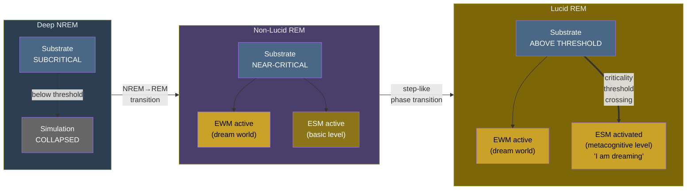

# Lucid Dreaming

**Lucid dreaming occurs when the substrate reaches sufficient criticality during REM sleep for the ESM to activate fully, producing the self-aware experience of knowing one is dreaming.**

In a lucid dream, the dreamer becomes aware *within* the dream that they are dreaming. This is a direct demonstration of the [ESM](../core-architecture/explicit-self-model.md)'s software-like quality: the self-model "toggles on" more fully during an ongoing simulation, gaining metacognitive access without disrupting the dream world generated by the [EWM](../core-architecture/explicit-world-model.md). The Four-Model Theory accounts for lucid dreaming as a **criticality threshold crossing** -- a phase transition, not a gradual awakening.

## Dreams as Degraded Simulation

During ordinary (non-lucid) dreaming, the simulation runs in degraded mode. The substrate operates near the [criticality threshold](../physical-foundations/criticality.md) -- sufficient for consciousness but with external sensory input substantially attenuated by thalamic gating.

The [EWM](../core-architecture/explicit-world-model.md) continues to generate a world, but without sensory constraint, it draws on the [IWM](../core-architecture/implicit-world-model.md)'s stored knowledge, producing dreams' characteristic features: familiar places, impossible physics, narrative incoherence. The [ESM](../core-architecture/explicit-self-model.md) continues to generate a self -- "you" experience dreams as happening to you -- but with reduced metacognitive depth. The dreaming self accepts impossible events without question because the ESM is operating at a lower [graduated level](../mechanisms/graduated-consciousness.md): basic consciousness without full self-reflective capacity.

## The Threshold Crossing

Lucid dream onset corresponds to a moment when the substrate's criticality increases sufficiently for the ESM to activate at a higher graduated level. The transition produces the characteristic "I am dreaming" insight -- a sudden metacognitive leap in which the self-model gains awareness of its own simulation status.

The theory predicts this transition shows the signature of a **phase transition** rather than a gradual ramp:

- **Critical slowing** in EEG complexity measures just before lucid onset, as the system approaches the threshold.
- **Abrupt jump** in criticality markers at the moment of lucid onset -- a step-like increase, not a gradual climb.
- **Spatial origination** in ESM-related cortical regions (medial prefrontal cortex, posterior cingulate cortex) before spreading to other areas.

This prediction is testable using the established lucid-dreamer eye-signaling paradigm (LaBerge, 1985) with concurrent high-density EEG, measuring Lempel-Ziv complexity, neuronal avalanche exponents, and long-range temporal correlations around the verified moment of lucid onset.

## The NREM/REM Cycle

The [criticality](../physical-foundations/criticality.md) framework explains the broader sleep architecture. The 90-minute ultradian cycle corresponds to the substrate oscillating around the critical point:

- **Deep NREM**: The substrate is subcritical. The virtual simulation collapses. No consciousness. "Lights off."
- **NREM-to-REM transition**: The substrate re-approaches the criticality threshold. Criticality is restored, and the simulation restarts -- but on internal input rather than sensory input.
- **REM sleep**: The substrate operates near-critical, sufficient for dream consciousness. The EWM generates a world; the ESM generates a self. But the ESM operates at a lower graduated level than in waking.
- **Lucid dreaming**: The substrate exceeds the threshold sufficiently for the ESM to reach a higher graduated level -- simply extended or doubly extended consciousness within the dream.

Sleep onset itself is a bifurcation: not a gradual dimming of consciousness but a relatively abrupt collapse of the virtual simulation as the substrate drops below criticality. Pre-sleep imagery -- the hypnagogic progression from phosphenes through geometric patterns to complex scenes -- mirrors the psychedelic [permeability hierarchy](../mechanisms/variable-permeability.md), reflecting the gradual loosening of the [implicit-explicit boundary](../mechanisms/implicit-explicit-boundary.md) during the approach to sleep onset.

## Distinguishing Power

Other theories generate related but distinct predictions for lucid dreaming:

- **IIT** predicts increased Phi in the posterior hot zone -- a different spatial prediction from the ESM-network origination the Four-Model Theory predicts.
- **GNW** predicts prefrontal ignition, which overlaps with the medial prefrontal cortex prediction but without the criticality-threshold framing.
- **Predictive processing** predicts increased precision on self-model predictions -- compatible but does not predict a step-like criticality transition.

The combination of step-like transition *plus* ESM-network spatial origination *plus* criticality markers is unique to the Four-Model Theory.

## Figure

## Key Takeaway

Lucid dreaming is a criticality threshold crossing during REM sleep: the substrate reaches sufficient criticality for the ESM to activate at a higher graduated level, producing the metacognitive insight "I am dreaming." The theory predicts this transition shows phase-transition dynamics (critical slowing, abrupt jump) originating in ESM-related cortical regions -- a testable prediction that distinguishes it from IIT, GNW, and predictive processing accounts.

## See Also

- [The Criticality Requirement](../physical-foundations/criticality.md)
- [Explicit Self Model (ESM)](../core-architecture/explicit-self-model.md)
- [Graduated Levels of Consciousness](../mechanisms/graduated-consciousness.md)
- [Variable Permeability](../mechanisms/variable-permeability.md)
- [Psychedelic Phenomenology](../phenomena/psychedelics.md)
