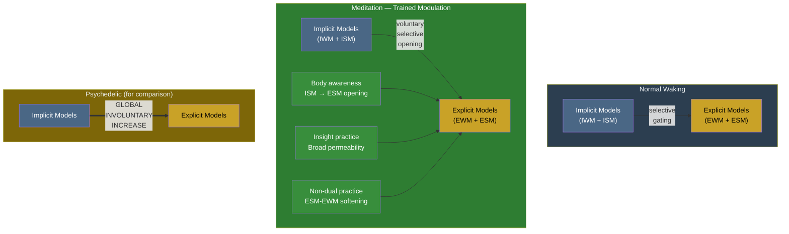

# Meditation

**Meditation is trained modulation of implicit-explicit permeability -- voluntary, selective control over what normally implicit processes reach conscious awareness.**

Long-term contemplative practice produces altered states that share remarkable phenomenological overlap with psychedelic experiences: perception of processing stages, awareness of thought-formation prior to articulation, dissolution of subject-object boundaries, access to normally automatic processes. The Four-Model Theory explains this convergence: both meditation and psychedelics operate on the same mechanism -- the [implicit-explicit boundary](../mechanisms/implicit-explicit-boundary.md) -- but through different pathways. Psychedelics increase [permeability](../mechanisms/variable-permeability.md) globally and involuntarily; meditation increases it selectively and under voluntary control.

## The Mechanism: Trained Permeability Control

The [implicit-explicit boundary](../mechanisms/implicit-explicit-boundary.md) is a dynamically variable filter. In normal waking states, it is selectively permeable -- relevant information passes through based on attentional and contextual gating. Meditation trains the practitioner to modulate this gating with increasing precision.

**What changes through practice:**

- **Selective opening.** Experienced meditators can direct attention to normally implicit processes -- the mechanics of perception, the arising of thoughts, the pre-conscious formation of emotional responses -- making them temporarily accessible to the [ESM](../core-architecture/explicit-self-model.md).
- **Sustained access.** While psychedelic permeability increases are transient (hours), meditative permeability modulation can be sustained and reproduced at will with sufficient training.
- **Domain-specific control.** Advanced practitioners report being able to target specific domains of implicit processing (body awareness, thought formation, attentional mechanics) rather than experiencing the global, undifferentiated flood that characterizes psychedelic states.

The Four-Model Theory does not claim meditation produces the *same* state as psychedelics. The pharmacological mechanism is different, the permeability profile is different (selective vs. global), and the degree of voluntary control is different. What the theory claims is that both operate on the *same boundary* -- which explains why the phenomenological reports converge.

## Contemplative Stages and the Model Architecture

Different meditation traditions describe progressions of contemplative attainment. These map onto the four-model architecture:

**Body-awareness practices** (body scan, mindful movement, yoga) train permeability between the [ISM](../core-architecture/implicit-self-model.md) and [ESM](../core-architecture/explicit-self-model.md) for somatic domains. Normally implicit body-schema information -- proprioceptive calibration, interoceptive signals, muscular tension patterns -- becomes accessible to conscious self-modeling.

**Concentration practices** (samatha, single-pointed focus) train attentional gating -- the mechanism that controls which information passes through the boundary. By narrowing the permeability aperture to a single object, the practitioner gains conscious access to attentional mechanics themselves.

**Insight practices** (vipassana, shikantaza) train broad, non-selective permeability increases -- closer to the psychedelic mode but under voluntary control. Advanced insight practitioners report perceiving the arising and passing of sensory experience at processing-level granularity: individual moments of perception, the construction of unified percepts from sensory fragments, the formation of thoughts before verbal articulation.

**Non-dual practices** modulate the boundary between the [ESM](../core-architecture/explicit-self-model.md) and [EWM](../core-architecture/explicit-world-model.md), attenuating the self/world distinction. The experience of subject-object dissolution reported in non-dual meditation is, in the theory's terms, a softening of the ESM-EWM boundary -- the self-model and world-model partially merge, producing the phenomenology described as "awareness without a center."

## Graduated Consciousness and Meditation

The theory's account of [graduated levels](../mechanisms/graduated-consciousness.md) of consciousness provides a natural framework for contemplative development. Meditation practice trains the ESM to operate at higher recursive depths:

- **Mindfulness** (awareness of experience) = simply extended consciousness, achieved and sustained by training.
- **Meta-awareness** (awareness of awareness) = doubly extended consciousness, requiring the ESM to model itself modeling.
- **Choiceless awareness** (awareness of the process of awareness itself) = triply extended consciousness -- the deepest recursive self-modeling available.

This framework suggests that meditation does not produce *new* kinds of consciousness but trains systematic access to levels that normally occur only briefly and unreliably.

## The Psychedelic-Meditation Convergence

Experienced meditators and psychedelic users sometimes describe remarkably similar phenomenology despite arriving through very different routes:

- Perception of geometric patterns (intermediate visual processing stages leaking through)
- Dissolution of subject-object boundaries (ESM-EWM boundary softening)
- Awareness of thought-formation processes (implicit cognitive operations becoming explicit)
- Emotional intensity and insight (normally implicit self-knowledge reaching the ESM)

The Four-Model Theory predicts this convergence as a necessary consequence: both practices operate on the implicit-explicit boundary. The convergence is not coincidental but structural.

## Figure

## Key Takeaway

Meditation is trained voluntary modulation of the implicit-explicit boundary -- the same mechanism that psychedelics activate globally and involuntarily. Different contemplative traditions target different aspects of the boundary (ISM-ESM for body practices, broad permeability for insight, ESM-EWM for non-dual). The phenomenological convergence between meditation and psychedelics is a structural prediction of the theory, not a coincidence.

## See Also

- [Variable Permeability](../mechanisms/variable-permeability.md)
- [The Implicit-Explicit Boundary](../mechanisms/implicit-explicit-boundary.md)
- [Graduated Levels of Consciousness](../mechanisms/graduated-consciousness.md)
- [Psychedelic Phenomenology](../phenomena/psychedelics.md)
- [Explicit Self Model (ESM)](../core-architecture/explicit-self-model.md)
