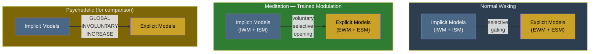

# Meditation

**Meditation is trained modulation of implicit-explicit permeability -- voluntary, selective control over what normally implicit processes reach conscious awareness.**

Long-term contemplative practice produces altered states that share remarkable phenomenological overlap with psychedelic experiences: perception of processing stages, awareness of thought-formation prior to articulation, dissolution of subject-object boundaries, access to normally automatic processes. The Four-Model Theory explains this convergence: both meditation and psychedelics operate on the same mechanism -- the [implicit-explicit boundary](../mechanisms/implicit-explicit-boundary.md) -- but through different pathways. Psychedelics increase [permeability](../mechanisms/variable-permeability.md) globally and involuntarily; meditation increases it selectively and under voluntary control.

## The Mechanism: Trained Permeability Control

The [implicit-explicit boundary](../mechanisms/implicit-explicit-boundary.md) is a dynamically variable filter. In normal waking states, it is selectively permeable -- relevant information passes through based on attentional and contextual gating. Meditation trains the practitioner to modulate this gating with increasing precision.

**What changes through practice:**

- **Selective opening.** Experienced meditators can direct attention to normally implicit processes -- the mechanics of perception, the arising of thoughts, the pre-conscious formation of emotional responses -- making them temporarily accessible to the [ESM](../core-architecture/explicit-self-model.md).
- **Sustained access.** While psychedelic permeability increases are transient (hours), meditative permeability modulation can be sustained and reproduced at will with sufficient training.
- **Domain-specific control.** Advanced practitioners report being able to target specific domains of implicit processing (body awareness, thought formation, attentional mechanics) rather than experiencing the global, undifferentiated flood that characterizes psychedelic states.

The Four-Model Theory does not claim meditation produces the *same* state as psychedelics. The pharmacological mechanism is different, the permeability profile is different (selective vs. global), and the degree of voluntary control is different. What the theory claims is that both operate on the *same boundary* -- which explains why the phenomenological reports converge.

## Graduated Consciousness and Meditation

The theory's [graduated levels](../mechanisms/graduated-consciousness.md) of consciousness are points on a continuum of recursive self-modeling depth, and an individual can move along that continuum with state: waking, dreaming, intoxicated or meditative. Which level a particular contemplative practice trains, and whether training raises the level reached or only the reliability with which it is reached, is an open question.

## The Psychedelic-Meditation Convergence

Experienced meditators and psychedelic users sometimes describe remarkably similar phenomenology despite arriving through very different routes:

- Perception of geometric patterns (intermediate visual processing stages leaking through)
- Dissolution of subject-object boundaries (the ESM losing its normal self-input and modeling whatever dominates the input stream; see [Ego Dissolution](../phenomena/ego-dissolution.md))
- Awareness of thought-formation processes (implicit cognitive operations becoming explicit)
- Emotional intensity and insight (normally implicit self-knowledge reaching the ESM)

The Four-Model Theory predicts this convergence: both practices operate on the implicit-explicit boundary. Consistent with the theory's computational requirement, meditative absorption (jhana) has been reported to shift brain dynamics toward a near-critical regime (Mago et al., 2025, preprint).

## Figure

```mermaid
graph TD
    subgraph Normal["Normal Waking"]
        N_Imp["Implicit Models<br/>(IWM + ISM)"]
        N_Imp -->|"selective<br/>gating"| N_Exp["Explicit Models<br/>(EWM + ESM)"]
    end

    subgraph Meditation["Meditation — Trained Modulation"]
        M_Imp["Implicit Models<br/>(IWM + ISM)"]
        M_Imp -->|"voluntary<br/>selective<br/>opening"| M_Exp["Explicit Models<br/>(EWM + ESM)"]
    end

    subgraph Psychedelic["Psychedelic (for comparison)"]
        P_Imp["Implicit Models"]
        P_Imp ==>|"GLOBAL<br/>INVOLUNTARY<br/>INCREASE"| P_Exp["Explicit Models"]
    end

    style Normal fill:#2c3e50,color:#ecf0f1
    style Meditation fill:#2e7d32,color:#fff
    style Psychedelic fill:#7d6608,color:#ecf0f1
    style N_Imp fill:#4a6785,color:#fff
    style N_Exp fill:#c9a227,color:#000
    style M_Imp fill:#4a6785,color:#fff
    style M_Exp fill:#c9a227,color:#000
    style P_Imp fill:#4a6785,color:#fff
    style P_Exp fill:#c9a227,color:#000
```

## Key Takeaway

Meditation is trained voluntary modulation of the implicit-explicit boundary -- the same mechanism that psychedelics activate globally and involuntarily. The phenomenological convergence between meditation and psychedelics follows from both acting on the same boundary.

## See Also

- [Variable Permeability](../mechanisms/variable-permeability.md)
- [The Implicit-Explicit Boundary](../mechanisms/implicit-explicit-boundary.md)
- [Graduated Levels of Consciousness](../mechanisms/graduated-consciousness.md)
- [Psychedelic Phenomenology](../phenomena/psychedelics.md)
- [Explicit Self Model (ESM)](../core-architecture/explicit-self-model.md)
