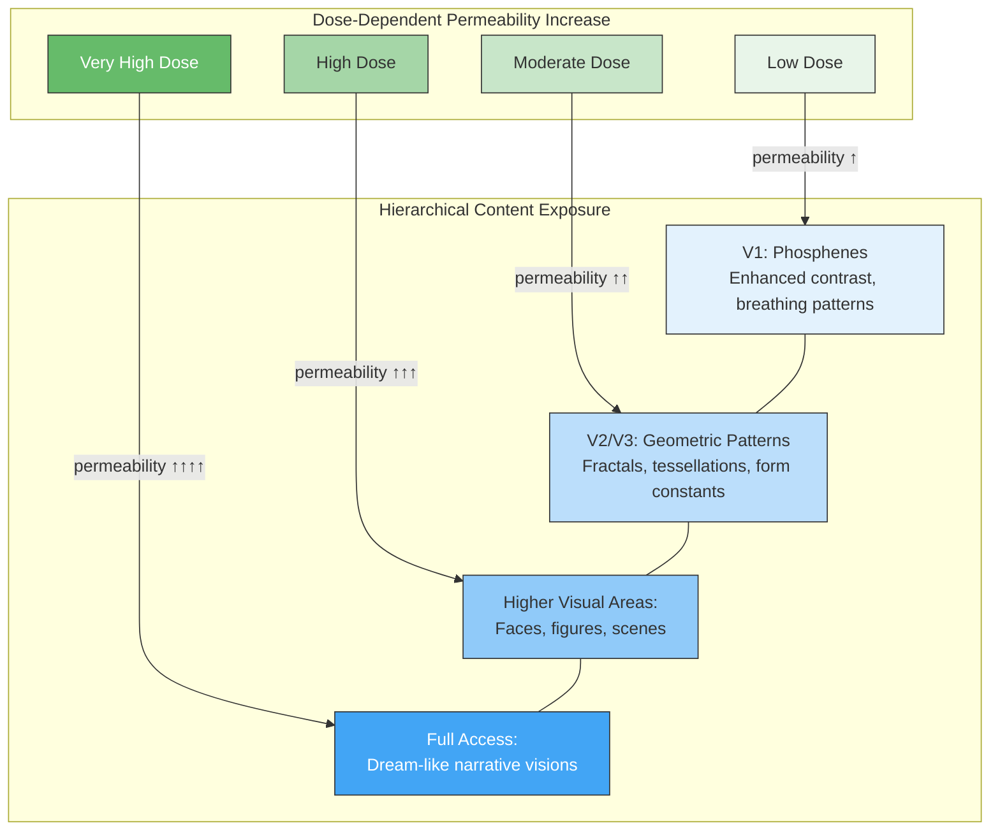

# Psychedelic Phenomenology

**Psychedelics globally increase the permeability of the implicit-explicit boundary, exposing intermediate processing stages in hierarchical order from simple phosphenes to full dream-like scenes.**

Psychedelic substances -- LSD, psilocybin, DMT, mescaline, salvia divinorum -- produce a remarkably consistent phenomenological profile: visual intensification, geometric patterns, synesthesia, altered time perception, emotional amplification, and at higher doses, ego dissolution and radical identity alteration. The Four-Model Theory accounts for this entire profile through a single principle: **variable permeability** of the boundary between [implicit models](../core-architecture/four-model-theory.md) (IWM, ISM) and [explicit models](../core-architecture/four-model-theory.md) (EWM, ESM).

## The Permeability Mechanism

Under normal conditions, the implicit-explicit boundary acts as a selective filter. The vast computational activity of the substrate -- early visual processing, proprioceptive calibration, motor planning -- remains below the threshold of conscious access. Psychedelics weaken this filter globally, allowing intermediate processing stages to leak through to the conscious simulation.

The key insight is that this leakage is not random. It follows the visual processing hierarchy in a predictable, dose-dependent order:

- **Low dose / early onset**: V1-level processing becomes accessible -- simple phosphenes, enhanced contrast, breathing and movement in static patterns.
- **Increasing dose**: V2/V3-level processing becomes accessible -- geometric patterns, fractals, tessellations. These correspond to Kluver's (1966) form constants and are mathematically modeled by Bressloff et al. (2002).
- **Higher dose**: Higher visual area processing becomes accessible -- faces, figures, complex scenes.
- **Very high dose**: Full intermediate processing accessible -- narrative dream-like visions with emotional depth.

This ordered progression is a direct consequence of the permeability gradient: lower-level (earlier, simpler) processing stages become accessible before higher-level (later, more complex) ones, because the permeability increase propagates up the hierarchy.

## Figure

*As dose increases, permeability rises through the processing hierarchy. Each level of the visual system becomes accessible in order, from V1 phosphenes through to full dream-like scenes.*

## REBUS Alignment

The independently developed REBUS (Relaxed Beliefs Under Psychedelics) model of [Carhart-Harris and Friston (2019)](https://doi.org/10.1124/pr.118.017160) arrives at a compatible account through the predictive processing framework: psychedelics relax top-down priors, allowing bottom-up prediction errors to propagate more freely. The Four-Model Theory and REBUS converge on the same phenomenological prediction -- hierarchical content exposure -- but from different theoretical starting points. REBUS explains *that* the hierarchy relaxes; the Four-Model Theory specifies *where* the relaxation occurs in the architecture (the implicit-explicit boundary) and *what* the exposed content represents (intermediate processing stages of the substrate that are normally kept implicit).

## Intensity as Novelty

The characteristic sense of profundity during psychedelic experiences reflects not increased consciousness *level* but increased *novel content*. The permeability increase floods the simulation with information that the substrate has been processing all along but has never included in the conscious model. The conscious self encounters this content for the first time, producing the intense sense of revelation -- even though the substrate has been computing it continuously.

## Key Takeaway

Psychedelics globally increase implicit-explicit permeability, producing a dose-dependent, hierarchically ordered exposure of normally unconscious processing stages -- from V1 phosphenes through geometric patterns to full dream-like visions. The progression is predictable because it follows the visual processing hierarchy.

## See Also

- [Ego Dissolution](../phenomena/ego-dissolution.md)
- [Anesthesia and Loss of Consciousness](../phenomena/anesthesia.md)
- [Sleep, Dreams, and Criticality](../phenomena/sleep.md)
- [The Criticality Requirement](../physical-foundations/criticality.md)
- [The Real/Virtual Split](../core-architecture/real-virtual-split.md)
- [The Four-Model Theory](../core-architecture/four-model-theory.md)
