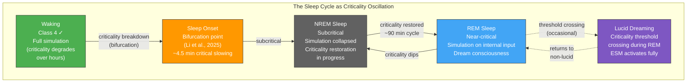

# Sleep, Dreams, and Criticality

**Sleep onset is a bifurcation -- a sharp criticality breakdown, not gradual dimming. The sleep cycle is a criticality oscillation: NREM restores what waking degrades, and REM periodically re-approaches the threshold for conscious simulation.**

Sleep is not a passive shutdown of consciousness. The Four-Model Theory treats the entire sleep cycle as a dynamic interplay between the substrate's criticality state and the viability of the [virtual simulation](../core-architecture/four-model-theory.md). Falling asleep, dreaming, and waking up are all transitions across the [criticality threshold](../physical-foundations/criticality.md) -- and the theory predicts their dynamics with surprising specificity.

## Sleep Onset: Bifurcation, Not Fade

The theory predicts that sleep onset should be a **radical transition** -- a breakdown of [Class 4 dynamics](../physical-foundations/criticality.md) -- rather than a gradual dimming of consciousness. This follows from the nature of criticality itself: a system is either at the edge of chaos or it is not. There is no "halfway critical."

This prediction has been confirmed by [Li et al. (2025)](https://doi.org/10.1073/pnas.2405341122), who demonstrated in over 1,000 participants that falling asleep follows a **predictable bifurcation dynamic** -- a tipping point preceded by critical slowing (increased variance and autocorrelation in neural signals), with the transition detectable approximately 4.5 minutes before conventional sleep onset markers. The signature is characteristic of a dynamical system approaching a phase transition, not a gradual power-down.

## Pre-Sleep Imagery: The Permeability Hierarchy

The pre-sleep period provides independent confirmation of the [psychedelic permeability mechanism](../phenomena/psychedelics.md). As criticality begins to break down during the transition to sleep, the implicit-explicit boundary becomes increasingly permeable in the same hierarchical order observed under psychedelics:

1. **Phosphenes and visual snow** -- V1-level processing leaking through
2. **Geometric patterns** -- V2/V3 tessellations and form constants (hypnagogic geometrics)
3. **Hypnagogic imagery** -- faces, scenes, fragmentary narratives from higher visual areas

This bottom-up progression -- identical to the psychedelic dose-response hierarchy -- confirms that the same permeability mechanism operates in both contexts. The cause is different (criticality degradation vs. pharmacological permeability increase), but the phenomenological sequence is the same because both expose the processing hierarchy in the same order.

## Figure

*The sleep cycle as criticality oscillation. Waking criticality degrades over hours, triggering a bifurcation at sleep onset. NREM restores criticality; REM periodically re-approaches the threshold, producing dream consciousness. Occasional threshold crossings during REM produce lucid dreaming.*

## NREM: Criticality Restoration

The theory assigns NREM sleep a specific computational function: **restoring the criticality** that waking activity progressively degrades. An analog substrate (biological neurons) cannot sustain digital computation (Class 4 dynamics) indefinitely without periodic recalibration. Waking experience drives the system progressively away from optimal criticality; NREM sleep restores it.

This prediction was confirmed by [Bhatt et al. (2024)](https://doi.org/10.1523/JNEUROSCI.0287-24.2024), who demonstrated in continuous 10-14 day recordings that normal waking experience progressively disrupts criticality, and that sleep restores the optimal computational regime. [Meisel et al. (2013)](https://doi.org/10.1523/JNEUROSCI.1282-13.2013) showed fading criticality signatures during sustained human wakefulness. Sleep deprivation, under this account, is not merely tiring -- it is a progressive loss of the computational capacity required for consciousness, explaining why prolonged deprivation eventually produces hallucinations, cognitive collapse, and in extreme cases, death.

## REM: Periodic Re-Approach

During the 90-minute ultradian cycle, the substrate's criticality state oscillates. NREM pushes the system subcritical (no consciousness, no dreaming). As restoration proceeds, the substrate periodically **re-approaches the criticality threshold** -- producing the transition to REM sleep. Once near-critical, the simulation restarts, but with external sensory input substantially attenuated by thalamic gating. The [EWM](../core-architecture/four-model-theory.md) generates a world from stored knowledge (the IWM) rather than current sensation, producing the familiar dream phenomenology: familiar places, impossible physics, narrative incoherence, emotional intensity. The [ESM](../core-architecture/four-model-theory.md) generates a self -- dreams happen to "you" -- but with reduced metacognitive oversight.

**Lucid dreaming** occurs when the substrate crosses the criticality threshold more fully during REM, allowing the ESM to activate with enough depth for metacognitive self-awareness: the "I am dreaming" realization. The theory predicts this as a **step-like criticality increase** -- a phase transition, not a gradual ramp -- originating in ESM-related cortical regions (medial prefrontal cortex, posterior cingulate cortex).

## Key Takeaway

The sleep cycle is a criticality oscillation: waking degrades criticality, sleep onset is a bifurcation (not gradual dimming), NREM restores critical dynamics, and REM periodically re-approaches the threshold for conscious simulation. Pre-sleep imagery follows the same hierarchical permeability pattern as psychedelics, confirming a shared mechanism.

## See Also

- [The Criticality Requirement](../physical-foundations/criticality.md)
- [Anesthesia and Loss of Consciousness](../phenomena/anesthesia.md)
- [Psychedelic Phenomenology](../phenomena/psychedelics.md)
- [Two Thresholds for Consciousness](../physical-foundations/two-thresholds.md)
- [The Four-Model Theory](../core-architecture/four-model-theory.md)
