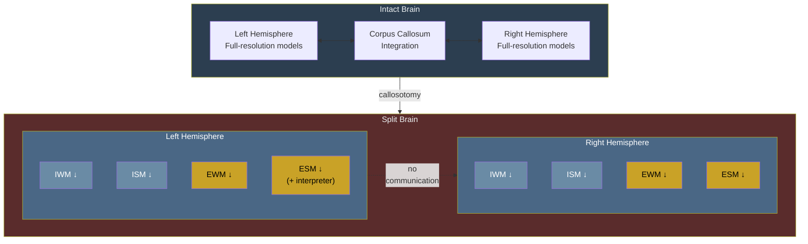

# Split-Brain Phenomena

**Callosotomy produces bilateral degradation rather than clean hemispheric specialization -- "unified consciousness, split perception" -- explained by the holographic storage of the implicit models.**

Split-brain surgery (callosotomy) severs the corpus callosum, the largest fiber bundle connecting the two hemispheres. The traditional account, originating with Sperry and Gazzaniga's pioneering work (1962, 1965), proposed "two minds in one brain" -- each hemisphere sustaining independent and qualitatively different consciousness. The Four-Model Theory offers a more precise and empirically better-supported account based on [holographic storage](../mechanisms/holographic-storage.md).

## The Holographic Prediction

Because the implicit models ([IWM](../core-architecture/implicit-world-model.md) and [ISM](../core-architecture/implicit-self-model.md)) store information in a distributed, holographic manner, severing the corpus callosum does not cleanly divide the models into left and right halves. Instead, it produces **two degraded but functionally complete copies**. Each hemisphere retains a degraded version of all four models -- IWM, ISM, [EWM](../core-architecture/explicit-world-model.md), and [ESM](../core-architecture/explicit-self-model.md) -- complete enough to sustain consciousness but lacking the resolution and scope of the intact system.

This is the holographic analogy in action: cut a hologram in half, and each piece shows the complete image at reduced resolution, not half the image at full resolution.

## What [Pinto et al. (2017)](https://doi.org/10.1093/brain/awx220) Found

The holographic prediction aligns with modern split-brain research, particularly [Pinto et al. (2017)](https://doi.org/10.1093/brain/aww358), whose findings challenged the classical "two minds" narrative. Split-brain patients demonstrated:

- **Unified consciousness.** Patients maintained a single sense of self and a unified experiential field, not two competing consciousnesses.
- **Split perception.** Lateralized visual input was processed independently -- information presented to one visual field was not available to the other hemisphere's motor or verbal systems.
- **Graded deficits.** Rather than perfectly hemispheric specialization, patients showed degraded performance across domains in both hemispheres, consistent with bilateral degradation rather than binary splitting.

The Four-Model Theory accounts for this naturally: the holographic architecture predicts exactly this pattern -- unified consciousness (both hemispheres sustain a complete four-model architecture) with split perception (the severed callosum prevents perceptual integration between hemispheres) and graded degradation (each hemisphere's models are lower-resolution copies of the intact whole).

## The Left Hemisphere Interpreter

[Gazzaniga's (2000)](https://doi.org/10.1093/brain/123.7.1293) observation that the left hemisphere confabulates explanations for behavior initiated by the right hemisphere finds a natural home in the Four-Model Theory. The left hemisphere's [ESM](../core-architecture/explicit-self-model.md), cut off from information about the right hemisphere's motivations by the severed callosum, constructs the best narrative it can from incomplete input.

This is the **same confabulation mechanism** the theory identifies in [anosognosia](../phenomena/anosognosia.md), [Cotard's delusion](../phenomena/did.md), and [ego dissolution](../phenomena/ego-dissolution.md) on psychedelics: an ESM generating a self-narrative from whatever information is available. The left hemisphere interpreter is not a unique phenomenon -- it is the ESM doing exactly what it always does, just with incomplete input due to callosal disconnection.

## Callosotomy vs. Acute Silencing

The Wada test (intracarotid sodium amobarbital) temporarily anesthetizes one hemisphere, and might appear to challenge the holographic account: if each hemisphere retains a complete copy, why does Wada produce significant cognitive deficits?

The distinction is between **chronic disconnection** and **acute silencing**:

- **Callosotomy** permanently severs connections. After months of neural reorganization, each hemisphere independently maintains its own four-model architecture.
- **Wada** silences one hemisphere for minutes. No time for reorganization, and the remaining hemisphere has never operated independently. Moreover, Wada *destroys* half the computational substrate rather than merely disconnecting it.

Crucially, consciousness *is* preserved during Wada (Wada himself noted that actual loss of consciousness was never seen), while specific cognitive functions degrade -- precisely the graded degradation the theory predicts. Right hemisphere injection frequently produces transient [anosognosia](../phenomena/anosognosia.md) for hemiplegia, exactly the permeability-block mechanism the theory invokes for clinical anosognosia.

## Figure

*Split-brain as bilateral degradation. Each hemisphere retains all four models at reduced resolution (indicated by arrows). The left hemisphere's ESM includes the "interpreter" function -- confabulating explanations for behavior it cannot observe.*

*Coronal section of the brain showing the bilateral structure that callosotomy divides. The corpus callosum (the white fiber band connecting the two hemispheres at the top) is the structure severed in split-brain surgery. Note the symmetry: each hemisphere contains its own cortical gray matter, white matter pathways, basal ganglia, and thalamus — the physical substrate for the bilateral degradation the theory predicts.*

## Key Takeaway

Split-brain phenomena confirm the holographic storage principle: callosotomy produces two degraded-but-complete copies of the four-model architecture, not two clean halves. The "unified consciousness, split perception" finding ([Pinto et al., 2017](https://doi.org/10.1093/brain/awx220)) is precisely what holographic storage predicts. The left hemisphere interpreter is the same ESM confabulation mechanism seen in anosognosia and ego dissolution, applied to callosal disconnection.

## See Also

- [Holographic Storage](../mechanisms/holographic-storage.md)
- [The Real/Virtual Split](../core-architecture/real-virtual-split.md)
- [Anosognosia](../phenomena/anosognosia.md)
- [Ego Dissolution](../phenomena/ego-dissolution.md)
- [The Four-Model Theory](../core-architecture/four-model-theory.md)
