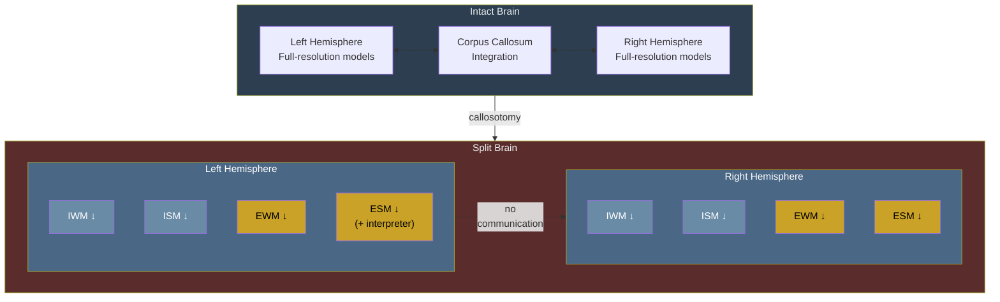

# Split-Brain Phenomena

**Callosotomy produces bilateral degradation rather than clean hemispheric specialization -- two degraded but functionally complete simulations -- explained by the holographic storage of the implicit models.**

Split-brain surgery (callosotomy) severs the corpus callosum, the largest fiber bundle connecting the two hemispheres. The traditional account, originating with Sperry and Gazzaniga's pioneering work (1962, 1965), proposed "two minds in one brain" -- each hemisphere sustaining independent and qualitatively different consciousness. The Four-Model Theory keeps the two independent simulations but not the clean division of labor, and grounds the account in [holographic storage](../mechanisms/holographic-storage.md).

## The Holographic Prediction

Because the implicit models ([IWM](../core-architecture/implicit-world-model.md) and [ISM](../core-architecture/implicit-self-model.md)) store information in a distributed, holographic manner, severing the corpus callosum does not cleanly divide the models into left and right halves. Instead, it degrades the implicit knowledge base in each hemisphere, leaving **two degraded but functionally complete copies**. Each hemisphere then generates its own independent simulation from its degraded implicit models. The explicit models -- [EWM](../core-architecture/explicit-world-model.md) and [ESM](../core-architecture/explicit-self-model.md) -- are not themselves "split", because they are processes, not stored structures; they are regenerated independently from the reduced substrate on each side, complete enough to sustain consciousness but lacking the resolution and scope of the intact system.

This is the holographic analogy in action: cut a hologram in half, and each piece shows the complete image at reduced resolution, not half the image at full resolution.

## What [Pinto et al. (2017)](https://doi.org/10.1093/brain/aww358) Found

Modern split-brain research, particularly [Pinto et al. (2017)](https://doi.org/10.1093/brain/aww358), challenged the classical picture of two cleanly specialized minds. Split-brain patients demonstrated:

- **Unified responding.** Patients could respond to stimuli in either visual field, not only with the hand or mode controlled by the receiving hemisphere.
- **Split perception.** Lateralized visual input was not integrated across the hemispheres -- patients could not compare stimuli presented to the two visual fields.
- **Graded deficits.** Rather than perfectly hemispheric specialization, patients showed degraded performance across domains in both hemispheres, consistent with bilateral degradation rather than binary splitting.

Pinto et al. read their data as showing that callosotomy divides perception without creating two independent conscious perceivers. The Four-Model Theory reinterprets the same data, against the authors' own conclusion, as two degraded but functionally complete simulations: each hemisphere regenerates its own explicit models from lower-resolution implicit copies of the intact whole (graded degradation, responding from either side), while the severed callosum prevents perceptual integration between them (split perception). The observable finding is consistent with distributed storage models generally; the holographic storage mechanism is the theory's distinctive explanation.

## The Left Hemisphere Interpreter

[Gazzaniga's (2000)](https://doi.org/10.1093/brain/123.7.1293) observation that the left hemisphere confabulates explanations for behavior initiated by the right hemisphere finds a natural home in the Four-Model Theory. The left hemisphere's [ESM](../core-architecture/explicit-self-model.md), cut off from information about the right hemisphere's motivations by the severed callosum, constructs the best narrative it can from incomplete input.

This is the **same confabulation mechanism** the theory identifies in [anosognosia](../phenomena/anosognosia.md), [Cotard's delusion](../phenomena/ego-dissolution.md), and [ego dissolution](../phenomena/ego-dissolution.md) on psychedelics: an ESM generating a self-narrative from whatever information is available. The left hemisphere interpreter is not a unique phenomenon -- it is the ESM doing exactly what it always does, just with incomplete input due to callosal disconnection.

## Callosotomy vs. Acute Silencing

The Wada test (intracarotid sodium amobarbital) temporarily anesthetizes one hemisphere, and might appear to challenge the holographic account: if each hemisphere retains a complete copy, why does Wada produce significant cognitive deficits?

The Four-Model Theory paper does not address this case. One possible answer, offered here as an open conjecture, separates **chronic disconnection** from **acute silencing**: callosotomy severs connections permanently and leaves both hemispheres running, while Wada takes one hemisphere offline for minutes, so the remaining hemisphere has to work without half of the substrate rather than merely without its partner.

What Wada does to consciousness is documented. Recalling his early carotid injections, Wada reported that a few patients complained of a mild drunken feeling, but "actual loss of consciousness was never seen" ([Wada, 1997](https://doi.org/10.1006/brcg.1997.0880); method: [Wada & Rasmussen, 1960](https://doi.org/10.3171/jns.1960.17.2.0266)). The effect is graded and asymmetric: left-sided injection reduces objective and subjective arousal more often than right-sided injection ([Glosser et al., 1999](https://doi.org/10.1212/wnl.52.8.1583)), and EEG measures associated with consciousness change bilaterally, in the non-injected hemisphere too ([Halder et al., 2021](https://doi.org/10.1016/j.neuroimage.2020.117566)). After right-hemisphere anesthesia, none of eight patients recalled their hemiplegia, while all recalled their deficits after left-hemisphere anesthesia ([Gilmore et al., 1992](https://doi.org/10.1212/wnl.42.4.925)). The theory reads this as transient [anosognosia](../phenomena/anosognosia.md) for hemiplegia, the permeability-block mechanism it invokes for clinical anosognosia.

## Figure

```mermaid
graph TD
    subgraph Before["Intact Brain"]
        L1["Left Hemisphere<br/>Full-resolution models"]
        CC1["Corpus Callosum<br/>Integration"]
        R1["Right Hemisphere<br/>Full-resolution models"]
        L1 <--> CC1 <--> R1
    end

    Before -->|"callosotomy"| After

    subgraph After["Split Brain"]
        direction LR
        subgraph Left["Left Hemisphere"]
            L_IWM["IWM ↓"]
            L_ISM["ISM ↓"]
            L_EWM["EWM ↓"]
            L_ESM["ESM ↓<br/>(+ interpreter)"]
        end
        subgraph Right["Right Hemisphere"]
            R_IWM["IWM ↓"]
            R_ISM["ISM ↓"]
            R_EWM["EWM ↓"]
            R_ESM["ESM ↓"]
        end
    end

    Left -.->|"no<br/>communication"| Right

    style Before fill:#2c3e50,color:#ecf0f1
    style After fill:#5a2c2c,color:#ecf0f1
    style Left fill:#4a6785,color:#fff
    style Right fill:#4a6785,color:#fff
    style L_IWM fill:#6a8ba5,color:#fff
    style L_ISM fill:#6a8ba5,color:#fff
    style L_EWM fill:#c9a227,color:#000
    style L_ESM fill:#c9a227,color:#000
    style R_IWM fill:#6a8ba5,color:#fff
    style R_ISM fill:#6a8ba5,color:#fff
    style R_EWM fill:#c9a227,color:#000
    style R_ESM fill:#c9a227,color:#000
```

*Split-brain as bilateral degradation. Each hemisphere retains degraded implicit models and regenerates its own explicit models from them, all at reduced resolution (indicated by arrows). The left hemisphere's ESM includes the "interpreter" function -- confabulating explanations for behavior it cannot observe.*

*Coronal section of the brain showing the bilateral structure that callosotomy divides. The corpus callosum (the white fiber band connecting the two hemispheres at the top) is the structure severed in split-brain surgery. Note the symmetry: each hemisphere contains its own cortical gray matter, white matter pathways, basal ganglia, and thalamus — the physical substrate for the bilateral degradation the theory predicts.*

## Key Takeaway

Split-brain phenomena are consistent with the holographic storage principle: callosotomy leaves two degraded-but-complete implicit copies, each generating its own simulation, not two clean halves. The theory reads the "divided perception, unified responding" finding ([Pinto et al., 2017](https://doi.org/10.1093/brain/aww358)) as two degraded simulations -- a reinterpretation that is the theory's, not the authors'. The left hemisphere interpreter is the same ESM confabulation mechanism seen in anosognosia and ego dissolution, applied to callosal disconnection.

## See Also

- [Holographic Storage](../mechanisms/holographic-storage.md)
- [The Real/Virtual Split](../core-architecture/real-virtual-split.md)
- [Anosognosia](../phenomena/anosognosia.md)
- [Ego Dissolution](../phenomena/ego-dissolution.md)
- [The Four-Model Theory](../core-architecture/four-model-theory.md)
