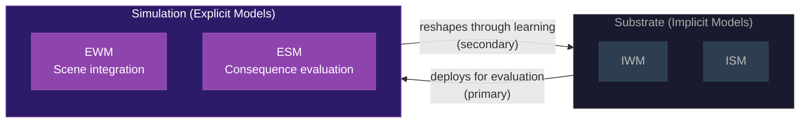

# Consciousness as Process, Not Agent

**Consciousness is not an entity that causes things -- it is a process performed by the substrate, and its functional role is explained by the dual evaluation architecture without requiring independent causal power.**

A persistent source of confusion in consciousness studies is the treatment of consciousness as an "it" -- an agent that either does or does not cause things. This framing generates false dilemmas: either consciousness *causes* behavior (which seems to require mysterious downward causation) or it does not (which makes it epiphenomenal and apparently pointless). The Four-Model Theory dissolves this dilemma by rejecting its premise.

## The Clock Pointer Analogy

Consciousness is not a thing; it is a process *performed* by the substrate. Asking whether consciousness "causes" anything is a category error -- analogous to asking whether the pointer of a clock meeting the numerals causes the clock to work.

The energy source drives the gears, which drive the pointer. Nowhere does the virtual interaction between pointer and numeral cause anything mechanical. Yet without that interaction the clock cannot be said to function -- or malfunction. The pointer does not push the gears, but the clock is not a clock without the display. Remove it, and the mechanism still runs, but it no longer serves its purpose.

Consciousness occupies the same structural position. The [implicit models](../core-architecture/two-axes.md) generate the virtual simulation for concrete adaptive reasons. The [EWM](../core-architecture/two-axes.md) integrates multimodal sensory data into a unified scene. The [ESM](../core-architecture/two-axes.md) provides a self-model against which consequences can be evaluated. [Qualia](../hard-problem/virtual-qualia.md), as constitutive elements of that simulation, lack independent causal power over the substrate -- but the substrate cannot perform its function without them.

## The Dual Evaluation Architecture

The relationship between substrate and simulation is not epiphenomenal accompaniment. It is best understood as a **dual evaluation architecture** with two-way traffic.

**Primary direction:** The implicit system actively *deploys* the virtual simulation as its evaluation mechanism. It presents decisions, actions, and their consequences to the simulation so that it can assess outcomes, run scenarios, and register hedonic valence. This is the substrate's mechanism for consequence-observation -- the very thing natural selection shaped the architecture to do.

**Secondary direction:** The explicit models evaluate independently, albeit with significantly less computational bandwidth. The conscious simulation operates at approximately 20 Hz with a ~500 ms processing delay, while the substrate processes at vastly higher throughput. Over time, these conscious evaluations -- the explicit system's independent assessments of situations, actions, and outcomes -- feed back to reshape the implicit models through learning.

The result is continuous feedback: the implicit system uses the explicit as an evaluation tool (primary), and the explicit system contributes its own assessments back (secondary), shaping the substrate that generates it.

## Not Epiphenomenalism

This makes the theory's position distinct from classical **epiphenomenalism**, in which consciousness is a causally inert by-product with no functional role. In the Four-Model Theory, the virtual models are in continuous feedback with the implicit models: the simulation's outputs feed back to update implicit processing, shaping future behavior. The virtual simulation has a genuine functional role -- consequence-observation and future-oriented adaptation -- without requiring independent causal power.

## Figure

*The dual evaluation architecture. The substrate deploys the simulation for consequence-evaluation (primary direction, left to right). The simulation's assessments feed back to reshape the substrate through learning (secondary direction, right to left). Two-way traffic, not epiphenomenal accompaniment.*

## Key Takeaway

Consciousness is a process, not an agent. It does not "cause" behavior any more than a clock's display causes the gears to turn -- but the clock is not a clock without its display, and the brain's adaptive architecture is not adaptive without the simulation it runs.

## See Also

- [Process Physicalism](process-physicalism.md)
- [Virtual Qualia](../hard-problem/virtual-qualia.md)
- [The Real/Virtual Split](../core-architecture/real-virtual-split.md)
- [Self-Referential Closure](../core-architecture/self-referential-closure.md)
- [Not Illusionism, Not Deflationary](not-illusionism.md)
