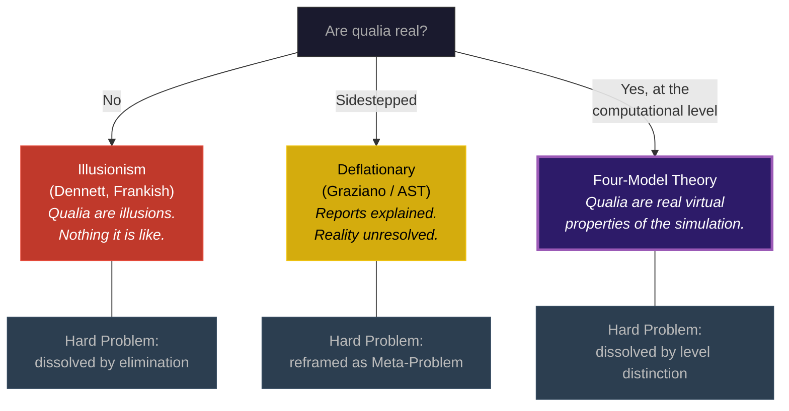

# Not Illusionism, Not Deflationary

**The Four-Model Theory holds that qualia are real at the computational level -- neither illusions to be explained away nor deflationary reports to be reinterpreted, but genuine phenomenal properties of the virtual simulation.**

The theory's treatment of qualia invites superficial comparison with two prominent positions: illusionism (Dennett, Frankish) and deflationary accounts (Graziano). The comparison is instructive precisely because the differences are fundamental.

## Illusionism: Qualia as Illusion

**Illusionism**, as articulated by Dennett (1991) and developed by [Frankish (2016)](https://doi.org/10.1093/jcs/jcs16301), holds that qualia as traditionally conceived are illusions. There is nothing it is like to see red -- our strong sense that there *is* something it is like is itself a misrepresentation generated by the cognitive system. Phenomenal consciousness is an illusion; what exists is a set of cognitive representations that *seem* to have phenomenal character but do not.

The Four-Model Theory rejects this. Within the [EWM/ESM](../core-architecture/two-axes.md), experience has genuine phenomenal character. [Qualia](../hard-problem/virtual-qualia.md) are not illusions -- they are constitutive properties of the computational level. "Redness" is the ESM's mode of registering a particular class of EWM content, and that registration is real within the simulation. The illusionist says there is nothing it is like; the Four-Model Theory says there *is* something it is like, and it is a property of the virtual level.

## Deflationary Accounts: Explaining the Report

**Deflationary accounts**, most prominently Graziano's Attention Schema Theory (AST), explain why organisms *report* having phenomenal experience. The brain constructs a simplified model of its own attention (the attention schema), and this schema, being a simplified model, represents attention as having a mysterious phenomenal quality. The explanation is elegant, but it addresses the Meta-Problem (why we *think* there is a hard problem) without settling whether phenomenality itself has been addressed.

The Four-Model Theory goes further. The phenomenal character is not an artifact of misreporting or simplified self-modeling. It is *constitutive* of the virtual level. The ESM does not merely *report* having experience -- it *has* experience, because experience is what self-referential computation at [criticality](../physical-foundations/criticality.md) *is* when encountered from inside the loop. Graziano explains the report; the Four-Model Theory explains the reality behind the report.

## What Is Illusory

The three positions agree on more than their proponents might admit. All three reject the idea that phenomenal character is a property of the physical substrate -- no one claims that neurons are literally red. The disagreement is about what follows.

The illusionist concludes: *therefore qualia do not exist*. There is nothing it is like; the seeming is the illusion.

The deflationist concludes: *therefore the report of phenomenality is a modeling artifact*. The question of whether phenomenality itself exists is sidestepped.

The Four-Model Theory concludes: *what is illusory is the assumption that phenomenal character must be a substrate-level property*. Qualia are real -- but they are real at the computational level, not the substrate level. Seeking them among neurons is the [category error](../hard-problem/category-error.md). The Hard Problem rests on a level confusion, not on an illusion or a reporting artifact.

This is a precise three-way split. Illusionism eliminates qualia. The deflationary approach explains reports of qualia without committing on their reality. The Four-Model Theory preserves qualia as genuine properties of a specific physical level -- the [virtual side](../core-architecture/real-virtual-split.md) of the computation.

## Why the Distinction Matters

The practical consequences are significant. If qualia are illusions, there is no principled reason to worry about the phenomenal experience of artificial systems -- there is nothing to worry *about*. If qualia are reporting artifacts, AI welfare remains ambiguous. If qualia are real properties of the right kind of computation, then any system implementing the [four-model architecture](../core-architecture/four-model-theory.md) at criticality would genuinely experience, and [AI welfare](../ai-consciousness/ai-diagnostic.md) becomes a concrete engineering question rather than a philosophical puzzle.

## Figure

*Three positions on qualia. Illusionism (left) denies their existence. Deflationary accounts (center) explain the reports without committing on reality. The Four-Model Theory (right, highlighted) affirms qualia as real properties of the computational level -- genuine, physical, but virtual.*

## Key Takeaway

The Four-Model Theory is neither illusionist nor deflationary. Qualia are real -- genuinely experiential, not illusions, not mere reporting artifacts -- but they are properties of the virtual simulation, not the physical substrate. What is illusory is the assumption that phenomenal character must be found among neurons.

## See Also

- [Virtual Qualia](../hard-problem/virtual-qualia.md)
- [Hard Problem Dissolution](../hard-problem/dissolution.md)
- [The Category Error](../hard-problem/category-error.md)
- [Process Physicalism](process-physicalism.md)
- [The Meta-Problem Dissolved](../hard-problem/meta-problem.md)
