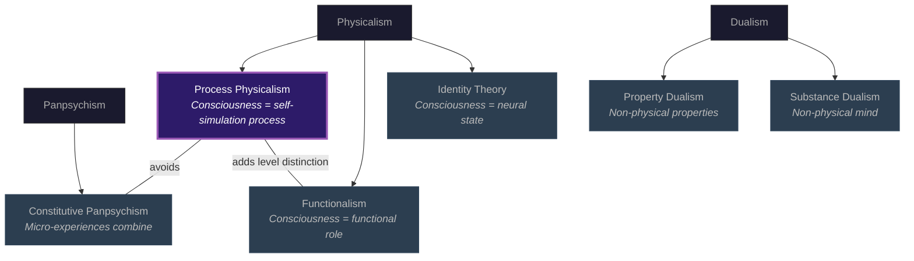

# Process Physicalism

**The Four-Model Theory is physicalist: both substrate and simulation are physical processes, with consciousness constituted by the process of self-simulation rather than identical to any particular neural state.**

Consciousness theories must take a stance on what consciousness *is* made of. Dualism posits non-physical substance. Panpsychism posits fundamental experiential properties. Identity theory equates consciousness with specific neural states. Functionalism identifies it with functional roles. The Four-Model Theory charts a different course: **process physicalism**, in which consciousness is constituted by a specific physical process -- ongoing self-simulation across [four nested models](../core-architecture/four-model-theory.md) operating at [criticality](../physical-foundations/criticality.md).

## What Makes It Physicalist

There is no non-physical substance in the theory. No fundamental experiential property. No panpsychist micro-experience. Both the substrate (the [implicit models](../core-architecture/two-axes.md) stored in synaptic weights and connectivity patterns) and the simulation (the [explicit models](../core-architecture/two-axes.md) generated as dynamic computational processes) are physical. [Qualia](../hard-problem/virtual-qualia.md) are higher-order physical patterns -- specifically, patterns of activity within the simulation that constitute the ESM's self-perception within the EWM.

Everything the theory invokes is physical. What it adds is a *level distinction*: the substrate level and the computational level have different properties, but both are physical. A spreadsheet is physical -- it runs on physical hardware, consumes physical energy, and produces physically measurable outputs -- yet no transistor "contains a sum." The sum is a property of the computational level. Qualia work the same way.

## What Makes It Process

The crucial word is *process*. Consciousness is not identical to any particular neural state (as type-identity theory would have it). It is constituted by the ongoing activity of self-simulation. The same conscious state could, in principle, be realized by different physical substrates -- what matters is the [functional architecture](../core-architecture/four-model-theory.md) (four models at criticality), not the specific material. This is why the theory entails [substrate independence](substrate-independence.md).

Process physicalism avoids two familiar difficulties. Type-identity theory struggles with multiple realization: if consciousness *is* a specific neural state, how can corvids with no neocortex be conscious? Traditional functionalism struggles with the Hard Problem: if consciousness is "just" a functional role, why does it feel like anything? The Four-Model Theory resolves both by adding the [real/virtual split](../core-architecture/real-virtual-split.md) to standard functionalism. Qualia are not just functional roles but virtual properties of the simulation -- real *as virtual properties*, genuinely experiential but not properties of the substrate.

## Positioning Among Rivals

The diagram below shows where process physicalism sits relative to other positions in the philosophy of mind.

## Figure

*Process physicalism (highlighted) extends functionalism by adding a level distinction -- the real/virtual split -- that allows it to address phenomenality. Unlike identity theory, it permits multiple realization. Unlike panpsychism, it requires no micro-experiences and faces no Combination Problem.*

## Key Takeaway

Process physicalism holds that consciousness is constituted by a physical process -- self-simulation -- not identical to any neural state, not a functional role alone, and not dependent on non-physical substance. The real/virtual level distinction is what separates it from traditional functionalism and allows it to address the Hard Problem.

## See Also

- [Two-Level Ontology](../hard-problem/two-level-ontology.md)
- [Substrate Independence](substrate-independence.md)
- [Virtual Qualia](../hard-problem/virtual-qualia.md)
- [Weak Emergence](weak-emergence.md)
- [The Real/Virtual Split](../core-architecture/real-virtual-split.md)
