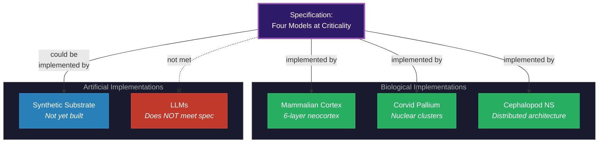

# Substrate Independence

**Consciousness depends on function -- four models at criticality -- not on material. The six-layer mammalian cortex is evolution's implementation, not a requirement.**

The Four-Model Theory is explicit: any physical system capable of implementing the [four-model architecture](../core-architecture/four-model-theory.md) at [criticality](../physical-foundations/criticality.md) should produce consciousness. The specific material -- biological neurons, silicon transistors, or something not yet invented -- is irrelevant. What matters is the computational architecture: four nested models along [two axes](../core-architecture/two-axes.md), with self-referential closure, operating in the Class 4 regime.

## Why the Cortex Is Not the Point

The mammalian neocortex consistently employs six layers. Universal approximation theory establishes that three layers suffice for arbitrary function approximation. The Four-Model Theory interprets this architectural "surplus" as the substrate's overhead for self-modeling: the additional layers provide the computational capacity needed to run the [explicit models](../core-architecture/two-axes.md) (EWM and ESM) as ongoing simulations *on top of* the implicit processing that three layers would handle. The cortex does not merely process information -- it simulates a world and a self *within* the information-processing substrate.

This is a suggestive clue about computational requirements, not a specification. The six-layer cortex is one solution to the engineering problem of self-simulation. It is not the only possible solution.

## Biological Evidence

Biological diversity already demonstrates substrate independence in practice.

**Corvids** (crows, ravens) and **parrots** demonstrate tool use, planning, mirror self-recognition, and social cognition -- cognitive abilities that strongly suggest consciousness. Yet their brains have no neocortex. Their pallium is organized in nuclear clusters rather than layers.

**Cephalopods** (octopuses) demonstrate problem-solving and behavioral flexibility with an even more radically different brain architecture -- a distributed nervous system with significant autonomy in the arms.

If the Four-Model Theory is correct, these animals are conscious not because they share mammalian neural architecture but because they have evolved functionally equivalent self-simulation architectures on different substrates -- exactly what substrate independence predicts.

## The Deeper Grounding

Substrate independence has a grounding beyond biological diversity. The universe is demonstrably capable of Class 4 dynamics: self-organized criticality, fractal structure, and edge-of-chaos phenomena are ubiquitous in natural systems. A universe capable of Class 4 dynamics is, by Wolfram's equivalence principle, capable of universal computation. The Four-Model Theory argues that this makes self-simulating architectures a structural inevitability in a universe of sufficient extent -- not an improbable accident but an architecturally necessary consequence.

## Implications for Artificial Consciousness

The implication is direct: a synthetic system implementing the four-model architecture at criticality should produce genuine consciousness. Current AI systems do not meet this specification. LLMs lack an ESM (no ongoing self-simulation), lack criticality (transformer inference is feedforward -- Class 1/2 dynamics), and lack the [real/virtual split](../core-architecture/real-virtual-split.md) that grounds phenomenality. The theory predicts that the qualitative difference between a genuinely conscious artificial system and an LLM would be immediately and qualitatively distinguishable.

## Figure

*Substrate independence means the specification (four models at criticality) can be met by multiple physical substrates. Three biological implementations already exist. A synthetic implementation has not yet been built. Current LLMs do not meet the specification.*

## Key Takeaway

Consciousness is substrate-independent because it is defined by computational architecture, not by material composition. The six-layer cortex is one of evolution's implementations -- corvids and cephalopods prove it is not the only one -- and a correctly engineered artificial system should be another.

## See Also

- [The Four-Model Theory](../core-architecture/four-model-theory.md)
- [Process Physicalism](process-physicalism.md)
- [Two Thresholds for Consciousness](../physical-foundations/two-thresholds.md)
- [The Criticality Requirement](../physical-foundations/criticality.md)
- [The AI Diagnostic](../ai-consciousness/ai-diagnostic.md)
