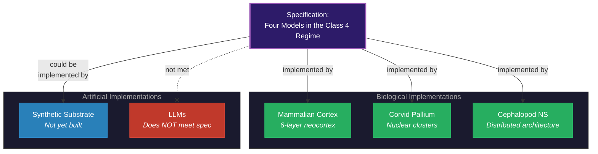

# Substrate Independence

**Consciousness depends on function -- four models in the Class 4 regime -- not on material. The six-layer mammalian cortex is evolution's implementation, not a requirement.**

The Four-Model Theory is explicit: any physical system capable of implementing the [four-model architecture](../core-architecture/four-model-theory.md) in the [Class 4 regime](../physical-foundations/criticality.md) should produce consciousness. The specific material -- biological neurons, silicon transistors, or something not yet invented -- is irrelevant. What matters is the computational architecture: four nested models along [two axes](../core-architecture/two-axes.md), with self-referential closure, operating in the Class 4 regime.

## Why the Cortex Is Not the Point

> **Wiki extension.** The six-layer argument in this section is not a claim of the published paper (Gruber, 2026, [10.5281/zenodo.18669891](https://doi.org/10.5281/zenodo.18669891)); it extends the theory and has not been through the paper's review and citation checks.

The mammalian neocortex consistently employs six layers. Universal approximation theory establishes that three layers suffice for arbitrary function approximation. The Four-Model Theory interprets this architectural "surplus" as the substrate's overhead for self-modeling: the additional layers provide the computational capacity needed to run the [explicit models](../core-architecture/two-axes.md) (EWM and ESM) as ongoing simulations *on top of* the implicit processing that three layers would handle. The cortex does not merely process information -- it simulates a world and a self *within* the information-processing substrate.

This is a suggestive clue about computational requirements, not a specification. The six-layer cortex is one solution to the engineering problem of self-simulation. It is not the only possible solution.

## Biological Evidence

Biological diversity already demonstrates substrate independence in practice.

**Corvids** (crows, ravens) and **parrots** demonstrate tool use, planning, mirror self-recognition, and social cognition -- cognitive abilities that strongly suggest consciousness. Yet their brains have no neocortex. Their pallium is organized in nuclear clusters rather than layers.

**Cephalopods** (octopuses) demonstrate problem-solving and behavioral flexibility with an even more radically different brain architecture -- a distributed nervous system with significant autonomy in the arms.

If the Four-Model Theory is correct, these animals are conscious not because they share mammalian neural architecture but because they have evolved functionally equivalent self-simulation architectures on different substrates -- exactly what substrate independence predicts.

## The Deeper Grounding

Substrate independence has a grounding beyond biological diversity. The universe is demonstrably capable of Class 4 dynamics: self-organized criticality, fractal structure, and edge-of-chaos phenomena are ubiquitous in natural systems. A universe capable of Class 4 dynamics is, by Wolfram's equivalence principle, capable of universal computation. One might conjecture that a Class 4-capable universe of sufficient scale makes self-simulating architectures statistically likely rather than merely possible. This is speculation, not a supporting part of the theory, and in any case consciousness would arise only in the subset of architectures that autonomously deploy that capacity for self-modeling -- capability alone, as in any heteronomous universal system such as a laptop, does not suffice.

## Implications for Artificial Consciousness

The implication is direct: a synthetic system implementing the four-model architecture in the Class 4 regime should produce genuine consciousness. Current AI systems do not meet this specification. A base LLM lacks persistent implicit models, lacks an ongoing self-simulation (its autoregressive loop closes over the emitted text, not over a self-model), and lacks the [real/virtual split](../core-architecture/real-virtual-split.md) that grounds phenomenality. Post-trained models do carry a reportable representation of their own point of view inside a globally available workspace ([Gurnee et al., 2026](https://arxiv.org/abs/2607.15495)); what they lack is closure over it, persistence, and the Class 4 regime. Scaffolding -- agent loops, persistent memory, self-monitoring -- is architectural mimicry, not self-referential closure. The difference the theory asserts is architectural rather than impressionistic: closure, persistence, and computational regime are properties measurable on the system itself.

## Figure

```mermaid
graph TB
    SPEC["Specification:<br/>Four Models in the Class 4 Regime"]

    subgraph BIO["Biological Implementations"]
        MAM["Mammalian Cortex<br/><i>6-layer neocortex</i>"]
        COR["Corvid Pallium<br/><i>Nuclear clusters</i>"]
        CEPH["Cephalopod NS<br/><i>Distributed architecture</i>"]
    end

    subgraph ART["Artificial Implementations"]
        SYN["Synthetic Substrate<br/><i>Not yet built</i>"]
        LLM["LLMs<br/><i>Does NOT meet spec</i>"]
    end

    SPEC -->|"implemented by"| MAM
    SPEC -->|"implemented by"| COR
    SPEC -->|"implemented by"| CEPH
    SPEC -->|"could be<br/>implemented by"| SYN
    SPEC -.-x|"not met"| LLM

    style SPEC fill:#2d1b69,stroke:#9b59b6,color:#fff,stroke-width:3px
    style BIO fill:#1a1a2e,stroke:#333,color:#aaa
    style ART fill:#1a1a2e,stroke:#333,color:#aaa
    style MAM fill:#27ae60,stroke:#2ecc71,color:#fff
    style COR fill:#27ae60,stroke:#2ecc71,color:#fff
    style CEPH fill:#27ae60,stroke:#2ecc71,color:#fff
    style SYN fill:#2980b9,stroke:#3498db,color:#fff
    style LLM fill:#c0392b,stroke:#e74c3c,color:#fff
```

*Substrate independence means the specification (four models in the Class 4 regime) can be met by multiple physical substrates. On the theory, three biological implementations already exist. A synthetic implementation has not yet been built. Current LLMs do not meet the specification.*

## Key Takeaway

Consciousness is substrate-independent because it is defined by computational architecture, not by material composition. The six-layer cortex is one of evolution's implementations -- corvids and cephalopods strongly suggest it is not the only one -- and a correctly engineered artificial system should be another.

## See Also

- [The Four-Model Theory](../core-architecture/four-model-theory.md)
- [Process Physicalism](process-physicalism.md)
- [Two Thresholds for Consciousness](../physical-foundations/two-thresholds.md)
- [Criticality: Signature, Not Requirement](../physical-foundations/criticality.md)
- [The AI Diagnostic](../ai-consciousness/ai-diagnostic.md)
