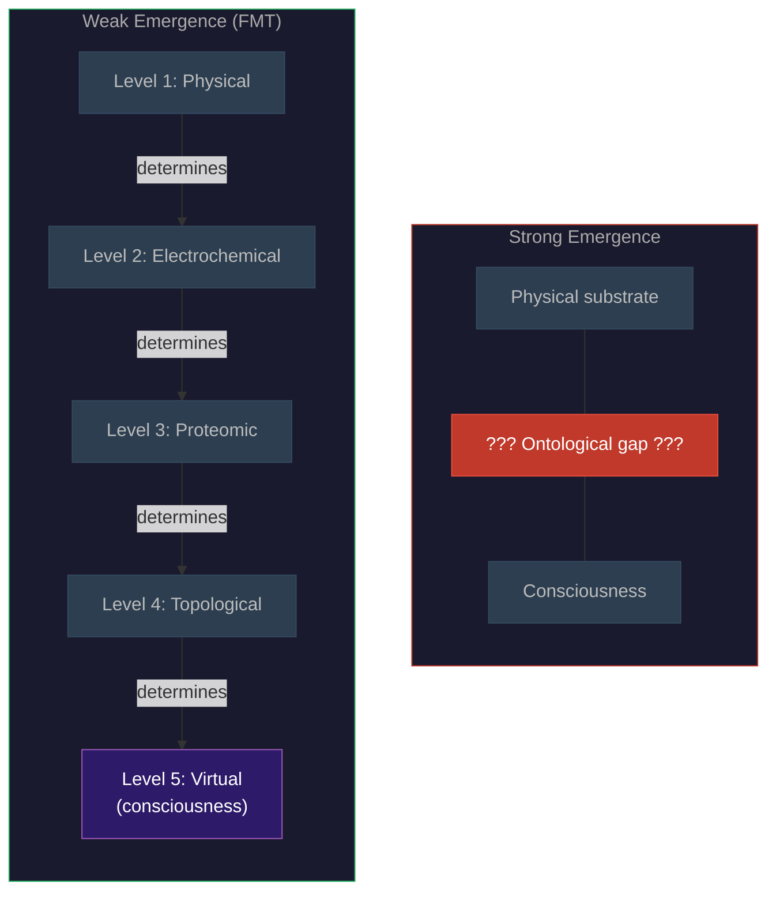

# Weak Emergence

**Consciousness emerges weakly from the substrate -- no strong emergence, no ontological gap, no "something extra" that could not in principle be predicted from the underlying physics.**

The Four-Model Theory takes an explicit position on emergence: consciousness is **weakly emergent**. It is deducible in principle from a complete description of the substrate, even if it is practically irreducible due to the complexity of the system. There is no magical threshold, no point at which a new ontological category appears that escapes physical law.

## Weak vs. Strong Emergence

**Weak emergence** means that higher-level properties arise from lower-level interactions and are, in principle, derivable from those interactions -- even if the derivation is computationally intractable in practice. A weather pattern is weakly emergent from atmospheric thermodynamics. Given a sufficiently detailed description of temperature, pressure, humidity, and airflow at every point, the weather pattern follows. No extra ingredient is needed.

**Strong emergence** means that higher-level properties are *not* derivable from lower-level properties, even in principle. Something genuinely new appears -- a new law, a new force, a new ontological category -- that cannot be predicted from the physics below. Many consciousness theories implicitly or explicitly invoke strong emergence, treating phenomenal experience as something that physical descriptions cannot, even in principle, account for.

The Four-Model Theory rejects strong emergence. Each level of the [five-system hierarchy](../physical-foundations/five-system-hierarchy.md) -- physical, electrochemical, proteomic, topological, virtual -- is fully determined by the level below. The virtual level (where consciousness exists) is generated by and supervenes on the topological level (where implicit models are stored), which supervenes on the proteomic level, and so on down to basic physics. No level introduces properties that escape determination by its lower level.

## Why This Matters

The emergence question is not academic. It has direct consequences for two of the most stubborn problems in consciousness studies.

**The Combination Problem.** Panpsychist theories (including constitutive panpsychism and IIT under certain interpretations) posit that micro-experiences at the fundamental level combine to produce macro-experience. But how? How do the putative micro-experiences of individual particles or information states *combine* into the unified experience of seeing a sunset? This is the Combination Problem, and it remains unresolved.

Weak emergence dissolves it. There are no micro-experiences to combine. Consciousness does not arise from aggregating tiny experiential units. It arises from the computational properties of a system running a self-simulation at [criticality](../physical-foundations/criticality.md) -- the way a weather pattern arises from thermodynamic properties, not from aggregating tiny weather-units.

**The mysteriousness of strong emergence.** If consciousness is strongly emergent, it requires a special emergence law that physics cannot account for. This is either genuinely mysterious (an unresolved gap in our understanding of nature) or incoherent (as Kim, 1993, argued -- causal closure of the physical leaves no room for irreducible mental causation). Either way, strong emergence is explanatorily unsatisfying.

Weak emergence avoids both horns. Consciousness is fully physical, fully determined by lower levels, and requires no special laws. The apparent mystery is a [category error](../hard-problem/category-error.md) -- seeking phenomenal properties at the substrate level, where they are the wrong kind of property to find.

## The Weather Analogy

Consciousness arises from the computational properties of a self-simulating system at criticality, just as a hurricane arises from the thermodynamic properties of an atmosphere. No meteorologist posits a "hurricane force" beyond temperature, pressure, and fluid dynamics. No extra ingredient is needed to get from air molecules to a hurricane -- just the right organization. Similarly, no extra ingredient is needed to get from neurons to consciousness -- just the right computational architecture operating at the right dynamical regime.

The practical irreducibility is real: one cannot easily predict hurricane trajectories from individual air molecule interactions. But this is an epistemological limitation, not an ontological gap. The hurricane is *nothing but* organized air molecules. Consciousness is *nothing but* organized substrate activity -- specifically, self-simulation at criticality.

## Figure

*Strong emergence (left) posits an ontological gap between substrate and consciousness -- something unexplained bridges the two. Weak emergence in the Four-Model Theory (right) traces a continuous chain of determination through five levels. Each level is fully determined by the one below. No gap, no extra ingredient.*

## Key Takeaway

Weak emergence means consciousness requires no special laws, no ontological gaps, and no combination of micro-experiences. Each level of the brain's hierarchy is fully determined by the level below, making consciousness physically grounded while remaining practically irreducible -- complex, but not mysterious.

## See Also

- [The Five-System Hierarchy](../physical-foundations/five-system-hierarchy.md)
- [Process Physicalism](process-physicalism.md)
- [The Category Error](../hard-problem/category-error.md)
- [Virtual Qualia](../hard-problem/virtual-qualia.md)
- [The Criticality Requirement](../physical-foundations/criticality.md)
