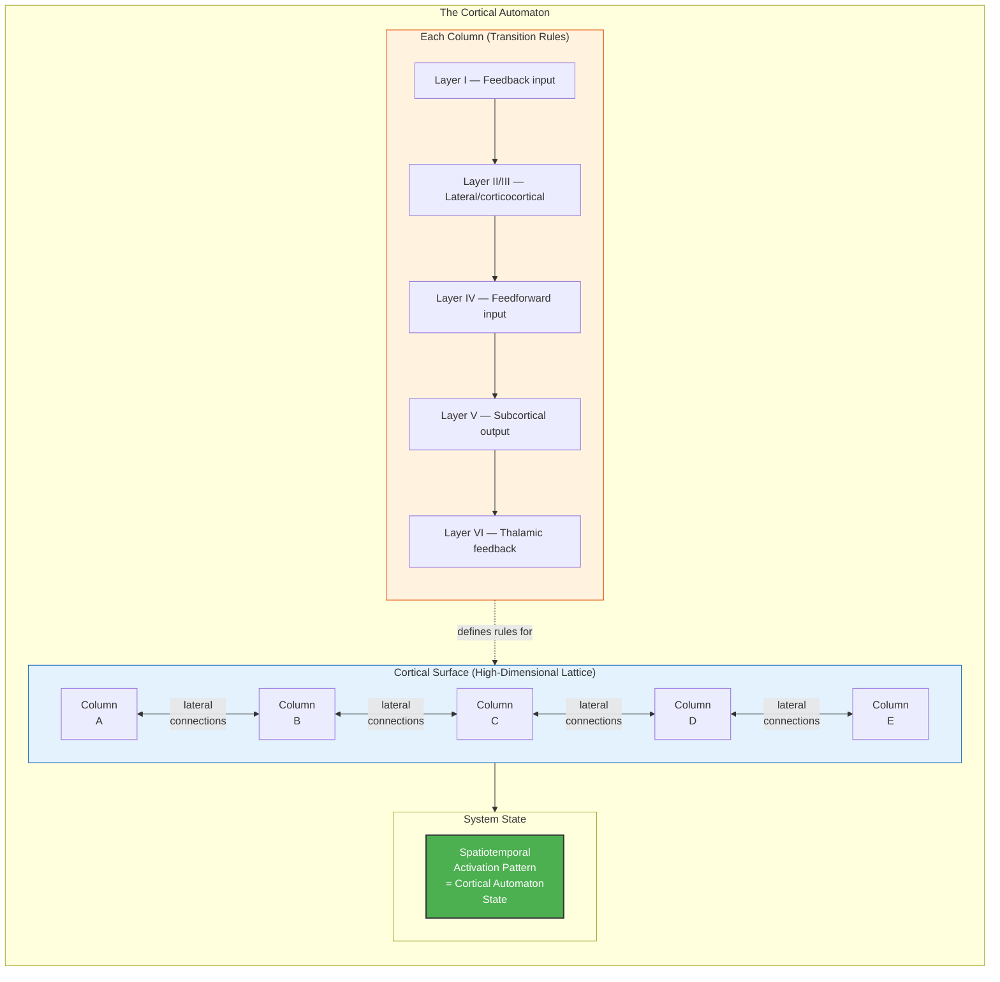

# The Cortical Automaton

**The instantaneous pattern of neural firing across the cortex constitutes a literal cellular automaton operating in a many-thousand-dimensional space.**

The [criticality requirement](../physical-foundations/criticality.md) has a concrete physical interpretation in the biological brain. The spatiotemporal activation state of billions of cortical neurons forms a discrete dynamical system -- a cellular automaton -- where each cortical column functions as a cell, the six-layer architecture and lateral connectivity define the transition rules, and the state evolves at each timestep according to local rules applied across a high-dimensional lattice ([Gruber, 2015](https://doi.org/10.5281/zenodo.19064950)). This is not a metaphor. It is a literal description of the cortex as a computational system whose dynamics fall within Wolfram's classification.

## Columns as Cells, Layers as Rules

A classical cellular automaton consists of cells arranged on a grid, each updating its state based on the states of its neighbors according to fixed rules. The cortex implements this architecture at a biological scale. The approximately 150,000 cortical columns of the human neocortex serve as the cells. Each column is a vertical unit spanning six cytoarchitectonic layers, containing roughly 60,000-100,000 neurons organized into functional microcircuits.

The transition rules -- what determines how each column's state changes from one timestep to the next -- are defined by two factors: the **six-layer internal architecture** of each column (how signals flow vertically through layers I-VI, with characteristic input/output patterns at each layer) and the **lateral connectivity** between columns (horizontal connections within and between cortical areas). Unlike the simple binary rules of elementary cellular automata, the cortical automaton's rules operate in a space of many thousand dimensions, reflecting the vast number of state variables each column maintains.

## Figure

*Cortical columns serve as cells in the automaton; the six-layer architecture and lateral connectivity define the transition rules. The instantaneous spatiotemporal activation pattern is the automaton's state.*

*Cortical homunculus — the somatosensory and motor cortex mapping (Penfield). Each strip of cortex dedicates processing resources proportional to the body part's sensory or motor precision, not its physical size. This is the cortical automaton's functional specialization made visible: the same six-layer columnar architecture, applied across the cortical surface, but with locally adapted transition rules that reflect different functional demands.*

*The six cytoarchitectonic layers of the neocortex (Schicht 1-6). These layers define the transition rules of the cortical automaton: Layer IV receives feedforward thalamic input, Layers II/III handle lateral corticocortical integration, Layer V projects to subcortical structures, and Layer VI provides thalamic feedback. Every cortical column implements this same basic architecture.*

*Brodmann areas — the cytoarchitectonic map of the cerebral cortex. While all cortical columns share the same six-layer architecture, the relative thickness of layers and the density of cell types varies systematically across areas. These variations define different "rule sets" in the cortical automaton, specialized for visual processing (areas 17-19), motor control (area 4), language (areas 44-45), and other functions.*

## Not Consciousness Itself

A critical distinction: the cortical automaton is *not* consciousness. It is the computational medium -- the hardware clock cycle, the substrate dynamics. Consciousness arises from the interplay between the automaton's dynamics and the models stored in the substrate: the [IWM, ISM, EWM, and ESM](../core-architecture/four-models.md). Without the automaton's Class 4 dynamics, the models cannot generate a coherent simulation. Without the models, the automaton produces complex dynamics but no self-referential experience. The cortical automaton is to consciousness what a CPU's clock-driven state transitions are to a running program: necessary infrastructure, not the program itself.

## Observable Traces

This framing yields a concrete observational claim. In a dark, quiet environment with eyes closed, after retinal afterimages have faded, the faint flickering patterns visible against the dark field are not retinal noise but V1-level manifestations of the cortical automaton's ongoing activity. These are the lowest layer of the [implicit-explicit boundary](../mechanisms/implicit-explicit-boundary.md) becoming momentarily accessible. The progression from simple phosphenes to geometric patterns to hypnagogic imagery during sleep onset represents progressively higher cortical areas being recruited into the observable dynamics -- consistent with the hierarchical permeability account that explains [psychedelic phenomenology](../phenomena/psychedelic-phenomenology.md).

## Key Takeaway

The cortex is a literal cellular automaton: cortical columns as cells, six-layer architecture as rules, operating in many-thousand-dimensional space. It provides the computational medium for consciousness but is not consciousness itself.

## See Also

- [The Criticality Requirement](../physical-foundations/criticality.md)
- [The Five-System Hierarchy](../physical-foundations/five-system-hierarchy.md)
- [Two Thresholds for Consciousness](../physical-foundations/two-thresholds.md)
- [The Four Models](../core-architecture/four-models.md)
- [The Implicit-Explicit Boundary](../mechanisms/implicit-explicit-boundary.md)
