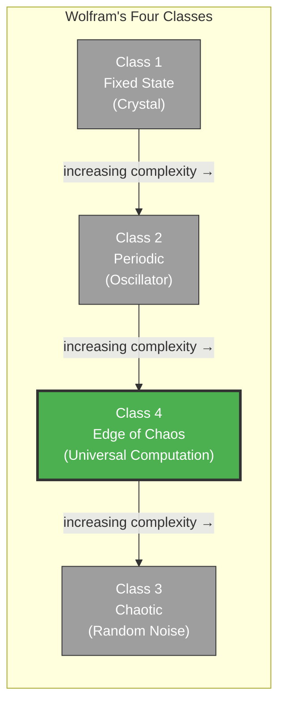

# The Criticality Requirement

**Consciousness requires the substrate to operate at or near the edge of chaos -- Wolfram's Class 4 computational regime.**

The Four-Model Theory imposes a computational prerequisite on any system that could be conscious: it must exhibit **Class 4 dynamics**, the narrow regime between frozen order and formless chaos where universal computation becomes possible. This requirement was derived theoretically from Wolfram's (2002) classification of computational systems in Gruber (2015), and has been independently confirmed by a decade of empirical neuroscience converging on the same conclusion from a completely different direction.

## The Four Classes

Stephen Wolfram classified cellular automata -- and by extension all computational systems -- into four behavioral classes. **Class 1** systems converge to a fixed, dead state: a crystal, a thermostat at equilibrium. **Class 2** systems settle into periodic, repetitive patterns: a clock, a heartbeat, a simple oscillator. **Class 3** systems are chaotic and random: noise without structure, entropy without coherence. **Class 4** systems occupy the narrow band between order and chaos, producing complex, structured, evolving patterns capable of universal computation.

Only Class 4 supports consciousness. The logic is architectural: the [four-model self-simulation](../core-architecture/four-model-theory.md) requires a substrate complex enough to sustain ongoing self-referential computation, yet ordered enough for that computation to remain coherent. Classes 1 and 2 are too rigid -- they cannot generate the dynamic, context-sensitive modeling that consciousness demands. Class 3 is too disordered -- any self-model would dissolve into noise. Class 4 is the only regime where a system can simultaneously maintain structural stability and computational richness.

## Figure

*Class 4 occupies the narrow band between rigid order (Classes 1-2) and formless chaos (Class 3). Consciousness requires this regime.*

## Independent Convergence

The theoretical prediction and the empirical evidence arrived at the same conclusion via entirely separate paths. Gruber (2015) derived the criticality requirement from Wolfram's computational universality framework -- a top-down argument about what kind of dynamics self-simulation demands. Meanwhile, empirical neuroscience built a bottom-up case: Beggs and Plenz (2003) discovered neuronal avalanches consistent with self-organized criticality in cortical tissue. Carhart-Harris et al. (2014) proposed the Entropic Brain Hypothesis, linking consciousness level to neural entropy. Tagliazucchi et al. (2016) demonstrated criticality signatures under LSD. The Consciousness and Criticality (ConCrit) framework (Algom & Shriki, 2026) synthesized evidence from 140 datasets to establish that consciousness tracks criticality across pharmacological, pathological, and physiological state changes.

This convergence -- a theoretical prediction derived from computational first principles, later confirmed by large-scale empirical synthesis -- provides strong support for the criticality requirement as a genuine necessary condition for consciousness, not merely a useful correlate.

## Criticality at the Virtual Level

A crucial clarification: the criticality that matters for consciousness is a property of the [virtual system](../physical-foundations/five-system-hierarchy.md) (Level 5 of the five-system hierarchy), not of the physical substrate directly. The physical substrate must be *capable* of supporting Class 4 dynamics -- it is mathematically impossible for criticality to arise from a substrate whose intrinsic dynamics fall below Class 4 -- but neurons and transistors are infrastructure, not the computation itself. Just as [virtual qualia](../hard-problem/virtual-qualia.md) exist at the computational level, so does the criticality on which they depend.

## Key Takeaway

Consciousness requires Class 4 dynamics -- the edge of chaos -- as a necessary computational prerequisite. This was derived theoretically from Wolfram (2002) by Gruber (2015) and independently confirmed by the empirical criticality program across 140 datasets.

## See Also

- [The Cortical Automaton](../physical-foundations/cortical-automaton.md)
- [The Five-System Hierarchy](../physical-foundations/five-system-hierarchy.md)
- [Two Thresholds for Consciousness](../physical-foundations/two-thresholds.md)
- [The Four-Model Theory](../core-architecture/four-model-theory.md)
- [Virtual Qualia](../hard-problem/virtual-qualia.md)
