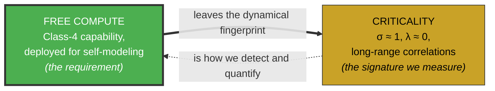

# The Criticality Requirement

**The requirement for consciousness is *free compute* — Class-4 (universal-computation) capability actually turned on the system itself for open-ended self-modeling. Criticality, the edge of chaos, is the dynamical signature this leaves behind and the quantity we measure — not the requirement itself.**

It is easy to read the Four-Model Theory as demanding that a conscious substrate "sit at criticality," as though proximity to a phase transition were the fundamental condition. That inverts the logic. What consciousness requires is *free computational capacity actually being spent on self-referential modeling*: a substrate rich enough to support **universal (Class 4) computation**, and a system that deploys that richness — autonomously and open-endedly — to model its own world and itself. Criticality is how a substrate exhibiting that behavior shows up when you measure its dynamics. It is the symptom, not the disease.

## Why free compute, not criticality per se

[Gruber (2015)](https://doi.org/10.5281/zenodo.18669891) derived the requirement from Wolfram's (2002) classification of computational systems. Only **Class 4** — the narrow regime between frozen order and formless chaos — supports the universal computation that open-ended self-simulation demands. But Class-4 *capability* is not the same as *using* it. A Turing-complete laptop idling at a login screen has universal-computation capability and is not conscious: nothing drives it to model itself. The theory therefore states the condition as a trichotomy (paper, Section 3.7.3):

1. **Capability** — the substrate can, in principle, perform universal computation (Class 4).
2. **Free instantiation** — that capability is actually deployed, autonomously and continuously, for open-ended self-modeling rather than a fixed task.
3. **Evolutionary forcing** — in biological cases, selection pressure is what drives a substrate to spend its free compute on self-modeling in the first place.

"Free compute" is shorthand for the first two together: universal-computation capacity, actually spent on the recursive self-simulation. This is the quantity the theory cares about; criticality is the fingerprint it leaves.

## Criticality is the signature we measure

Why, then, is criticality everywhere in the empirical story? Because a substrate running open-ended computation on itself, at the boundary between order and chaos, leaves characteristic marks: **self-organized criticality** in neuronal avalanches (branching ratio σ ≈ 1), long-range temporal correlations, and edge-of-chaos dynamics (Lyapunov exponent λ ≈ 0). These are *interchangeable instruments* certifying the same underlying capability band at different levels of description — and, importantly, they need not co-occur numerically (Kanders, Lorimer & Stoop, 2017). A model system can sit at σ = 1 without being at the edge of chaos in the λ sense. That dissociation is exactly why the requirement must be stated as *universal-computation capability in use*, not as proximity to any single criticality statistic.

## Independent convergence

The theoretical prediction and the empirical evidence arrived at the same place from opposite directions. [Gruber (2015)](https://doi.org/10.5281/zenodo.18669891) reasoned top-down from what self-simulation demands; empirical neuroscience built a bottom-up case. [Beggs and Plenz (2003)](https://doi.org/10.1523/JNEUROSCI.23-35-11167.2003) discovered neuronal avalanches consistent with self-organized criticality in cortical tissue; [Carhart-Harris et al. (2014)](https://doi.org/10.3389/fnhum.2014.00020) linked conscious level to neural entropy in the Entropic Brain Hypothesis; [Tagliazucchi et al. (2016)](https://doi.org/10.1016/j.cub.2016.08.014) found criticality signatures under LSD; and later syntheses across many datasets tied conscious state to criticality across pharmacological, pathological, and physiological changes. That both routes converge is strong support — provided the convergent quantity is read correctly: the brain is measured *at criticality* because that is what a substrate spending free compute on self-modeling looks like.

## Figure

```mermaid
graph LR
    FC["FREE COMPUTE<br/>Class-4 capability,<br/>deployed for self-modeling<br/><i>(the requirement)</i>"]
    SIG["CRITICALITY<br/>σ ≈ 1, λ ≈ 0,<br/>long-range correlations<br/><i>(the signature we measure)</i>"]
    FC ==>|"leaves the dynamical fingerprint"| SIG
    SIG -.->|"is how we detect and quantify"| FC

    style FC fill:#4CAF50,stroke:#333,stroke-width:3px,color:#fff
    style SIG fill:#c9a227,stroke:#333,color:#000
```

*Free compute — universal-computation capability actually spent on self-referential modeling — is the requirement. Criticality (σ ≈ 1, edge of chaos) is the dynamical signature it leaves and the quantity experiments measure, not a separate condition.*

## Wolfram's four classes (background)

Stephen Wolfram classified computational systems into four behavioral classes. **Class 1** converges to a fixed, dead state (a crystal, a thermostat at equilibrium). **Class 2** settles into periodic repetition (a clock, a simple oscillator). **Class 3** is chaotic and random (noise without structure). **Class 4** occupies the narrow band between order and chaos, producing complex, evolving patterns capable of universal computation. Classes 1–2 are too rigid to sustain context-sensitive self-modeling; Class 3 is too disordered for a self-model to persist; only Class 4 can host the free compute consciousness requires. (See [Wolfram's Four Classes](../physical-foundations/wolfram-classes.md).)

## Key Takeaway

Consciousness requires *free compute* — universal-computation (Class 4) capability actually deployed for open-ended self-modeling. Criticality is not a second requirement bolted on; it is the observable dynamical signature of free compute at work, and the quantity a decade of neuroscience has independently measured.

## See Also

- [Wolfram's Four Classes](../physical-foundations/wolfram-classes.md)
- [The Cortical Automaton](../physical-foundations/cortical-automaton.md)
- [The Five-System Hierarchy](../physical-foundations/five-system-hierarchy.md)
- [Two Thresholds for Consciousness](../physical-foundations/two-thresholds.md)
- [The Four-Model Theory](../core-architecture/four-model-theory.md)
- [Virtual Qualia](../hard-problem/virtual-qualia.md)
