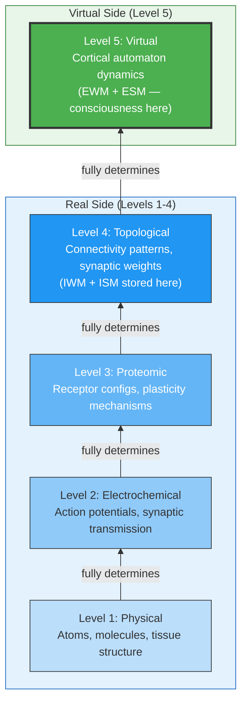

# The Five-System Hierarchy

**The brain instantiates five hierarchically nested systems, each fully physical, each emergent from the one below, with consciousness existing at the topmost level.**

The [criticality requirement](../physical-foundations/criticality.md) and the [real/virtual split](../core-architecture/real-virtual-split.md) gain precision when situated within a broader ontological framework. The brain is not a single system but five systems stacked on top of each other, each level fully determined by the level below it, each exhibiting properties that are not usefully described in terms of lower levels ([Gruber, 2015](https://doi.org/10.5281/zenodo.19064950)). This hierarchy makes the theory's central claim precise: consciousness is a Level 5 phenomenon, and seeking experiential properties at Levels 1 through 4 is the [category error](../hard-problem/category-error.md) at the root of the Hard Problem.

## The Five Levels

**Level 1 -- Physical.** The atoms, molecules, and macroscopic structures of neural tissue, governed by physics and chemistry. Carbon, hydrogen, oxygen, phospholipid bilayers, protein complexes. No one expects to find consciousness here, yet this is where substance dualists implicitly look when they declare the physical insufficient.

**Level 2 -- Electrochemical.** Ion gradients, action potentials, synaptic transmission events. The language of neuroscience textbooks. Emergent from Level 1 -- an action potential is fully determined by ion channel physics -- but describing it in terms of individual atomic movements would be explanatorily vacuous.

**Level 3 -- Proteomic.** Receptor configurations, neurotransmitter synthesis pathways, protein expression patterns. This level modulates neural signaling on slower timescales (minutes to days) and includes synaptic plasticity mechanisms. The biochemical infrastructure that makes learning physically possible.

**Level 4 -- Topological.** The connectivity architecture: the pattern of synaptic connections, their strengths, and their organization into circuits, columns, and areas. This is the level at which the implicit models ([IWM](../core-architecture/implicit-world-model.md), [ISM](../core-architecture/implicit-self-model.md)) are stored. Changes at this level constitute learning. A memory is a topological change -- a reconfiguration of connection strengths -- not an electrochemical event.

**Level 5 -- Virtual.** The dynamic pattern that constitutes the [cortical automaton](../physical-foundations/cortical-automaton.md) and, through it, the explicit models ([EWM](../core-architecture/explicit-world-model.md), [ESM](../core-architecture/explicit-self-model.md)). This is the level at which consciousness exists. Qualia, unity, selfhood -- all are constitutive properties of Level 5 computation.

## Figure

*Five nested systems, each fully physical, each emergent from the level below. The implicit models (IWM, ISM) reside at Level 4. The explicit models (EWM, ESM) and consciousness exist at Level 5. Seeking experiential properties at Levels 1-4 is the category error.*

*Medial sagittal section of the brain (Sobotta, 1908). All five system levels are physically present in this single view: Level 1 (tissue structure), Level 2 (the electrochemical networks running through brainstem, thalamus, and cortex), Level 3 (proteomic modulation at every synapse), Level 4 (the connectivity architecture visible as white matter tracts, corpus callosum, and cortical layers), and Level 5 (the virtual dynamics emerging from all of it). The hierarchy is ontological, not anatomical — but this image shows the physical substrate from which all five levels arise.*

## No Strong Emergence, No Ontological Gap

Each level is fully physical and fully determined by the level below. There is no strong emergence, no ontological gap between levels. The hierarchy describes a *level* distinction, not a *substance* distinction. The virtual system (Level 5) is as physical as the electrochemical system (Level 2) -- it is simply the level at which experiential properties are constituted. This is [weak emergence](../philosophical/weak-emergence.md): genuine novelty of description without ontological discontinuity.

The analogy is precise: describing a memory in terms of ion channel kinetics is possible in principle but explanatorily vacuous. Describing consciousness in terms of neuronal firing patterns is the same kind of category mistake -- correct at one level of description, meaningless at the level where the phenomenon actually exists. The five-system hierarchy makes this intuition rigorous.

## Key Takeaway

The brain operates as five nested systems from atoms to virtual computation. Consciousness exists at Level 5. Looking for it at Levels 1-4 is a category error -- not because those levels are non-physical, but because experiential properties are constituted at the computational level, not the substrate level.

## See Also

- [The Category Error](../hard-problem/category-error.md)
- [Two-Level Ontology](../hard-problem/two-level-ontology.md)
- [The Criticality Requirement](../physical-foundations/criticality.md)
- [The Cortical Automaton](../physical-foundations/cortical-automaton.md)
- [The Real/Virtual Split](../core-architecture/real-virtual-split.md)
