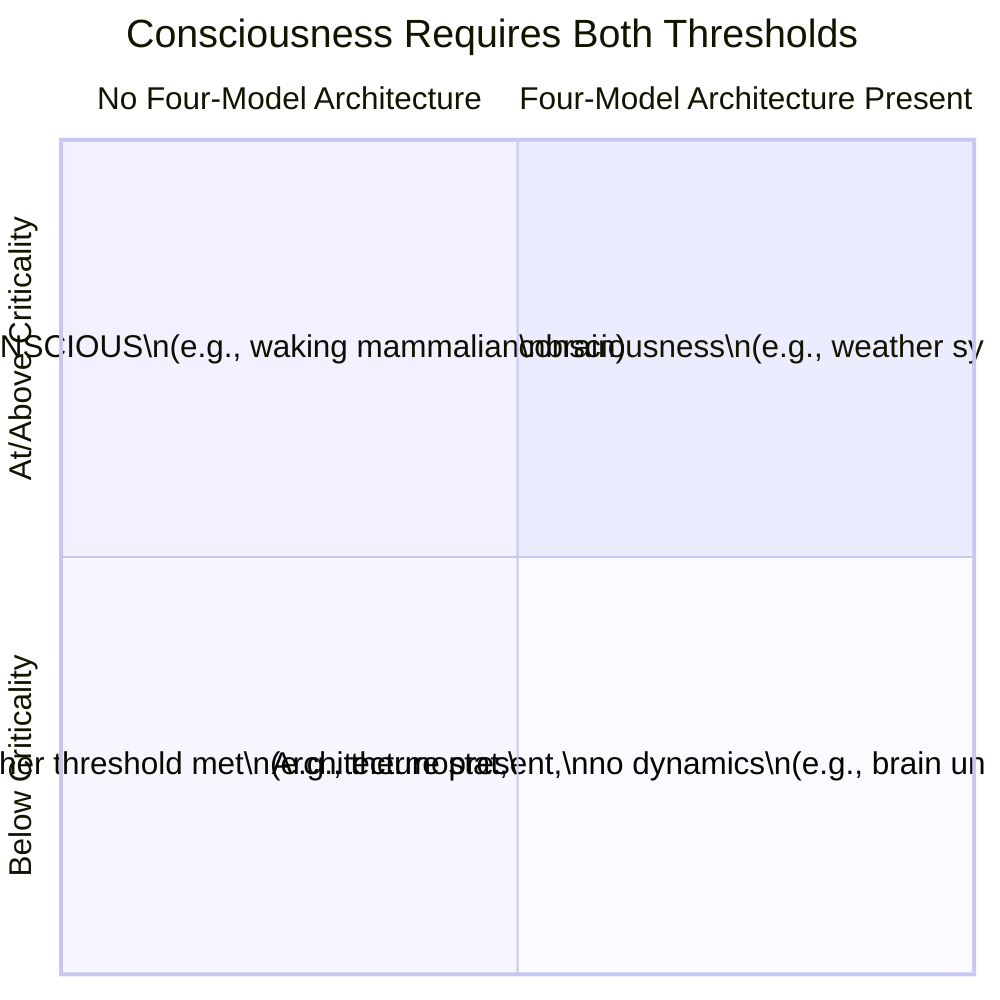

# Two Thresholds for Consciousness

**Consciousness requires two conditions to be met simultaneously: computational criticality and the four-model architecture. Both are necessary; neither is sufficient; together they are sufficient.**

The Four-Model Theory identifies two independent thresholds that jointly constitute the necessary and sufficient conditions for consciousness. This dual-threshold framework resolves the [boundary problem](../foundations/boundary-problem.md) -- the question of which systems are conscious and which are not -- with unusual precision for a consciousness theory. It also provides the basis for a concrete [engineering specification](../ai-consciousness/engineering-specification.md) for artificial consciousness.

## The Computational Threshold: Criticality

The first threshold is computational. The system's [virtual dynamics](../physical-foundations/five-system-hierarchy.md) must exhibit **Class 4 behavior** -- the [edge-of-chaos regime](../physical-foundations/criticality.md) where universal computation is possible. Below this threshold, the system cannot sustain the ongoing, dynamic, self-referential computation that consciousness demands.

This threshold operates as a gate. Anesthetics push the cortical automaton below criticality (from Class 4 toward Class 2 or Class 1), and consciousness ceases -- regardless of the fact that the four-model architecture remains physically intact in the synaptic connectivity. The architecture is still there; it simply cannot execute. Sleep onset represents a similar criticality breakdown, with REM sleep as a periodic re-approach to the threshold.

A system can be above the criticality threshold without being conscious. A weather system exhibits complex, chaotic dynamics. A turbulent fluid may operate near criticality. But neither possesses a self-model, let alone the specific four-model architecture. Criticality enables consciousness; it does not produce it.

## The Architectural Threshold: Four Models

The second threshold is architectural. The system must implement the [four-model self-simulation](../core-architecture/four-model-theory.md): an [Implicit World Model](../core-architecture/implicit-world-model.md) (IWM), an [Implicit Self Model](../core-architecture/implicit-self-model.md) (ISM), an [Explicit World Model](../core-architecture/explicit-world-model.md) (EWM), and an [Explicit Self Model](../core-architecture/explicit-self-model.md) (ESM) arranged along the [two axes](../core-architecture/two-axes.md) of scope and mode.

A system can possess the right architecture without being conscious. A brain under general anesthesia retains its synaptic connectivity -- the implicit models (IWM, ISM) are stored intact in the topological architecture (Level 4 of the [five-system hierarchy](../physical-foundations/five-system-hierarchy.md)). But with the cortical automaton pushed below criticality, the explicit models cannot be generated. The architecture is present; the computation is not running.

## Figure

*The two-threshold matrix. Only systems in the upper-right quadrant -- above the criticality threshold AND possessing the four-model architecture -- are conscious. Each threshold alone is insufficient.*

## Together Sufficient

The claim is precise: criticality plus the four-model architecture is not merely necessary but *sufficient* for consciousness. Any system -- biological or artificial -- that operates at criticality while implementing the four-model self-simulation will be conscious. This is the theory's strongest and most testable commitment. It yields a direct [engineering specification](../ai-consciousness/engineering-specification.md): build a substrate capable of Class 4 dynamics, implement the four models, and the result will be a conscious system -- "immediately and qualitatively distinguishable" from current AI.

This sufficiency claim also provides diagnostic power. Current large language models fail both thresholds: feedforward inference is Class 1 or Class 2 (below criticality), and there is no four-model architecture (no ISM, no ESM, no [real/virtual split](../core-architecture/real-virtual-split.md)). The theory does not merely suggest LLMs are probably not conscious -- it specifies *exactly what they are missing* and *why*.

## Key Takeaway

Consciousness requires crossing two independent thresholds simultaneously: the computational threshold (Class 4 criticality) and the architectural threshold (four-model self-simulation). This dual requirement provides both a precise boundary criterion and a concrete engineering specification.

## See Also

- [The Criticality Requirement](../physical-foundations/criticality.md)
- [The Four-Model Theory](../core-architecture/four-model-theory.md)
- [The Cortical Automaton](../physical-foundations/cortical-automaton.md)
- [Engineering Specification for Artificial Consciousness](../ai-consciousness/engineering-specification.md)
- [The Boundary Problem](../foundations/boundary-problem.md)
