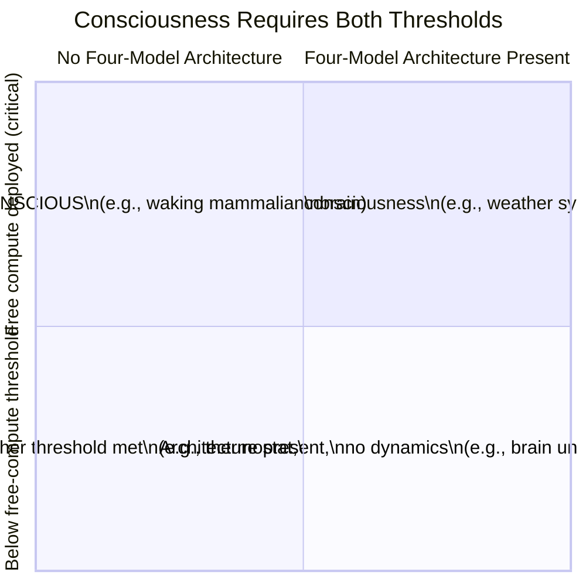

# Two Thresholds for Consciousness

**Consciousness requires two conditions to be met simultaneously: *free compute* — Class-4 (universal-computation) capability actually deployed for self-modeling — and the four-model architecture. Both are necessary; neither is sufficient; together they are sufficient.**

The Four-Model Theory identifies two independent thresholds that jointly constitute the necessary and sufficient conditions for consciousness. This dual-threshold framework resolves the [boundary problem](../foundations/eight-requirements.md) -- the question of which systems are conscious and which are not -- with unusual precision for a consciousness theory. It also provides the basis for a concrete [engineering specification](../ai-consciousness/engineering-specification.md) for artificial consciousness.

## The Computational Threshold: Free Compute

The first threshold is computational. The substrate must have **free compute** — the capacity for **Class 4** (universal) computation, actually spent on ongoing self-referential modeling rather than merely available. [Criticality](../physical-foundations/criticality.md), the edge of chaos, is the dynamical *signature* by which we detect that this threshold has been crossed, not a separate condition. Below the threshold, the system cannot sustain the dynamic, self-referential computation that consciousness demands — and its dynamics fall out of the critical regime.

This threshold operates as a gate. Propofol pushes the cortical automaton subcritical, and at surgical depth reportable experience is absent -- even though the four-model architecture remains physically intact in the synaptic connectivity. The architecture is still there; it simply cannot execute. (The gate is not a clean switch at every depth: dream reports after propofol anaesthesia are common, and participants repeatedly woken from deep propofol sedation gave experience reports on 24 of 52 awakenings.) Sleep onset represents a similar criticality breakdown, with REM sleep as a periodic re-approach to the threshold.

A system can meet the computational threshold without being conscious. A weather system exhibits complex, near-critical dynamics; a turbulent fluid may sit close to a phase transition. But neither spends its computation modeling itself, and neither possesses the four-model architecture. Free compute enables consciousness; it does not produce it — without the architecture, the computation has nothing to be conscious *with*.

## The Architectural Threshold: Four Models

The second threshold is architectural. The system must implement the [four-model self-simulation](../core-architecture/four-model-theory.md): an [Implicit World Model](../core-architecture/implicit-world-model.md) (IWM), an [Implicit Self Model](../core-architecture/implicit-self-model.md) (ISM), an [Explicit World Model](../core-architecture/explicit-world-model.md) (EWM), and an [Explicit Self Model](../core-architecture/explicit-self-model.md) (ESM) arranged along the [two axes](../core-architecture/two-axes.md) of scope and mode.

A system can possess the right architecture without being conscious. A brain under general anesthesia at surgical depth retains its synaptic connectivity -- the implicit models (IWM, ISM) are stored intact in the topological architecture (Level 4 of the [five-system hierarchy](../physical-foundations/five-system-hierarchy.md)). But with the cortical automaton pushed out of the Class 4 regime, the explicit models cannot be generated. The architecture is present; the computation is not running.

## Figure

```mermaid
quadrantChart
    title Consciousness Requires Both Thresholds
    x-axis "No Four-Model Architecture" --> "Four-Model Architecture Present"
    y-axis "Below free-compute threshold" --> "Free compute deployed (critical)"
    quadrant-1 "Complex dynamics,\nno consciousness\n(e.g., weather systems,\nturbulent fluids)"
    quadrant-2 "CONSCIOUS\n(e.g., waking mammalian\nbrain)"
    quadrant-3 "Neither threshold met\n(e.g., thermostat,\ncrystal)"
    quadrant-4 "Architecture present,\nno dynamics\n(e.g., brain under\nanesthesia)"
```

*The two-threshold matrix. Only systems in the upper-right quadrant -- in the Class 4 regime AND possessing the four-model architecture -- are conscious. Each threshold alone is insufficient.*

## Together Sufficient

The claim is precise: the Class 4 regime plus the four-model architecture is not merely necessary but *sufficient* for consciousness. Any system -- biological or artificial -- that implements the four-model self-simulation in the Class 4 regime should be conscious. This is the theory's strongest commitment. It yields a direct [engineering specification](../ai-consciousness/engineering-specification.md): build a substrate capable of Class 4 dynamics, implement the four models with self-referential closure, and the result should be a conscious system. Building one is an implication of the theory, not yet a test of it -- the engineering does not exist.

This sufficiency claim also provides diagnostic power. A base large language model lacks persistent implicit models, lacks an ongoing self-simulation (its autoregressive loop closes over the emitted text, not over a self-model), and lacks the [real/virtual split](../core-architecture/real-virtual-split.md). Post-trained models do carry a reportable representation of their own point of view inside a globally available workspace ([Gurnee et al., 2026](https://arxiv.org/abs/2607.15495)); what they lack is closure over it, persistence, and the Class 4 regime. The theory does not merely suggest LLMs are probably not conscious -- it specifies *exactly what they are missing* and *why*.

## Key Takeaway

Consciousness requires crossing two independent thresholds simultaneously: the computational threshold (free compute — deployed Class-4 capability, of which criticality is the measurable signature) and the architectural threshold (four-model self-simulation). This dual requirement provides both a precise boundary criterion and a concrete engineering specification.

## See Also

- [Criticality: Signature, Not Requirement](../physical-foundations/criticality.md)
- [The Four-Model Theory](../core-architecture/four-model-theory.md)
- [The Cortical Automaton](../physical-foundations/cortical-automaton.md)
- [Engineering Specification for Artificial Consciousness](../ai-consciousness/engineering-specification.md)
- [The Boundary Problem](../foundations/eight-requirements.md)
