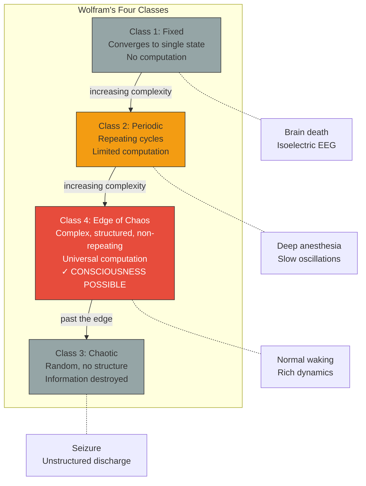

# Wolfram's Four Classes

**Computational systems fall into four classes of increasing complexity; only Class 4 — the edge of chaos — supports the dynamics required for consciousness.**

In 2002, Stephen Wolfram published a classification of cellular automata that extends to computational systems generally. This classification, applied to the question of consciousness in [Gruber (2015)](https://doi.org/10.5281/zenodo.19064950), provides the theoretical foundation for the Four-Model Theory's **criticality requirement**: the substrate must operate at or near the edge of chaos to support conscious self-simulation.

## The Four Classes

Wolfram ([2002](https://www.wolframscience.com/nks/)) classified cellular automata — and by extension all computational systems — into four behavioral classes:

**Class 1: Fixed State.** The system converges to a single, unchanging configuration regardless of initial conditions. Like a ball rolling to the bottom of a bowl, every starting point leads to the same dead end. Class 1 systems are computationally trivial — they cannot store, process, or transmit information in any meaningful way. A brain in this regime would be a brain that has ceased all dynamic activity.

**Class 2: Periodic.** The system settles into repeating patterns — cycles that loop indefinitely without variation. More complex than Class 1 (the patterns can be intricate), but still fundamentally predictable and computationally limited. A brain operating at Class 2 would produce repetitive, stereotyped activity — no novelty, no adaptation, no self-modeling. This corresponds to the neural dynamics observed under deep anesthesia or in deep NREM sleep: slow, rhythmic oscillations with minimal informational complexity.

**Class 3: Chaotic.** The system produces apparently random behavior with no discernible structure. While mathematically complex, Class 3 dynamics are *too* disordered to sustain coherent computation. Information is generated constantly but immediately destroyed by the chaos. A brain at Class 3 would produce neural activity with maximal entropy but zero coherence — noise without signal. Seizure activity, where correlated neural firing breaks down into unstructured discharge, approximates this regime.

**Class 4: Edge of Chaos.** The system produces complex, structured, non-repeating patterns that are neither ordered nor random. This is the regime capable of **universal computation** — of supporting any computable process, including the self-referential simulation that consciousness requires. Class 4 dynamics balance order (enough structure to sustain coherent patterns) with disorder (enough flexibility for those patterns to evolve, adapt, and self-reference). The normal waking brain operates in this regime.

## Why Only Class 4

The Four-Model Theory requires a substrate capable of running a continuous, self-referential simulation across four nested models. This demands:

- **Information storage**: Maintaining the implicit models (IWM, ISM) requires stable but modifiable patterns — impossible in Class 1 (no patterns) or Class 3 (patterns instantly destroyed).
- **Dynamic generation**: Generating the explicit models (EWM, ESM) in real time requires ongoing, novel computation — impossible in Class 2 (only repetitive patterns).
- **Self-reference**: The ESM must model the system modeling itself, creating a closed loop. This recursive structure requires computational universality — a property exclusive to Class 4.
- **Binding**: Distributed features must be integrated into unified experience, requiring maximal correlation length — a hallmark of critical dynamics at the Class 3/4 boundary.

The criticality requirement was derived *theoretically* from these computational needs in [Gruber (2015)](https://doi.org/10.5281/zenodo.19064950), using Wolfram's framework. Independently, empirical neuroscience converged on the same conclusion: neuronal avalanches consistent with criticality ([Beggs & Plenz, 2003](https://doi.org/10.1523/JNEUROSCI.23-35-11167.2003)), the Entropic Brain Hypothesis ([Carhart-Harris et al., 2014](https://doi.org/10.3389/fnhum.2014.00020)), and meta-analyses of 140 datasets ([Hengen & Shew, 2025](https://doi.org/10.1016/j.tins.2024.11.007)) all confirm that consciousness tracks criticality across pharmacological, pathological, and physiological state changes.

## Consciousness States Mapped to Classes

| Wolfram Class | Brain State | Consciousness | Example |
|---|---|---|---|
| Class 1 | Isoelectric | Absent | Brain death |
| Class 2 | Periodic oscillations | Absent | Deep NREM, deep anesthesia (propofol) |
| Class 3 | Chaotic discharge | Disrupted | Seizure |
| **Class 4** | **Complex, structured** | **Present** | **Normal waking, REM, psychedelic states** |

## Figure

*Wolfram's four classes arranged by complexity. Class 4 (edge of chaos) occupies the narrow regime between too-ordered (Classes 1-2) and too-disordered (Class 3). Only Class 4 supports the universal computation required for consciousness. Brain states map onto these classes: normal waking operates at Class 4; anesthesia pushes toward Class 2; seizures push toward Class 3.*

## Key Takeaway

Consciousness requires a substrate operating at the edge of chaos — Wolfram's Class 4. Too little complexity (Classes 1-2) cannot sustain self-simulation; too much (Class 3) destroys the coherence that simulation requires. This is both a theoretical prediction ([Gruber, 2015](https://doi.org/10.5281/zenodo.19064950)) and an empirically confirmed fact about neural dynamics.

## See Also

- [The Criticality Requirement](criticality.md)
- [The Cortical Automaton](cortical-automaton.md)
- [Two Thresholds for Consciousness](two-thresholds.md)
- [Five-System Hierarchy](five-system-hierarchy.md)
- [Criticality Evidence](../predictions/criticality-evidence.md)

---

Based on: Gruber, M. (2026). The Four-Model Theory of Consciousness. Zenodo. https://doi.org/10.5281/zenodo.19064950
