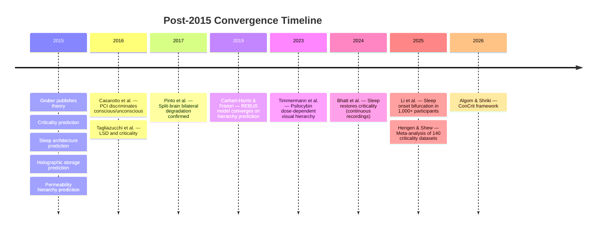

# Confirmed Predictions (Post-2015 Convergence)

**Five claims derived from the Four-Model Theory's axioms, established in 2015, have been independently confirmed by empirical work published between 2016 and 2025.**

The strongest form of theoretical validation is convergent confirmation: a prediction made on principled grounds, before the relevant data existed, subsequently confirmed by researchers with no connection to the theory. The Four-Model Theory has accumulated five such confirmations across three distinct domains -- anesthesia, sleep, and split-brain neuroscience. These are presented not as novel predictions but as converging evidence that the theory's core commitments yield correct empirical expectations.

## Anesthetic Convergence on Criticality Disruption

The theory predicts that all agents abolishing consciousness do so by pushing the substrate below the [criticality threshold](../physical-foundations/criticality.md), regardless of receptor mechanism ([Gruber, 2015](https://doi.org/10.5281/zenodo.19064950)). This has been extensively confirmed: the Perturbational Complexity Index (PCI) threshold of 0.31 perfectly discriminates conscious from unconscious states across propofol, midazolam, xenon, and ketamine ([Casali et al., 2013](https://doi.org/10.1126/scitranslmed.3006294); [Casarotto et al., 2016](https://doi.org/10.1002/ana.24779)). Ketamine, which preserves criticality markers, preserves consciousness despite profound pharmacological effects -- precisely as predicted. The [ConCrit framework](https://doi.org/10.48550/arXiv.2504.09926) (Algom & Shriki, 2026) and the criticality meta-analysis by [Hengen and Shew (2025)](https://doi.org/10.1146/annurev-neuro-092223-110603) independently reached the same conclusion from over 140 consolidated datasets.

## Sleep-Dependent Criticality Restoration

The theory predicts that waking experience progressively degrades criticality and that sleep restores optimal computational regime -- derived from the principle that an analog substrate cannot sustain digital computation indefinitely without periodic recalibration. [Bhatt et al. (2024)](https://doi.org/10.1523/JNEUROSCI.0287-24.2024) demonstrated in continuous 10-14 day recordings that normal waking experience progressively disrupts criticality and sleep restores it. [Meisel et al. (2013)](https://doi.org/10.1523/JNEUROSCI.1282-13.2013) showed fading criticality signatures during sustained human wakefulness.

## Sleep Onset as Bifurcation

The prediction that sleep onset should be a radical transition -- a criticality breakdown -- rather than gradual dimming was confirmed by [Li et al. (2025)](https://doi.org/10.1073/pnas.2405341122), who demonstrated in over 1,000 participants that falling asleep follows a predictable bifurcation dynamic. The transition is a tipping point preceded by critical slowing (increased variance and autocorrelation), detectable approximately 4.5 minutes before conventional sleep onset. This is exactly the phase-transition signature the theory predicts from the cellular automaton framework: the cortical automaton does not fade smoothly from Class 4 to Class 2 -- it tips.

## Psychedelic Content Maps the Processing Hierarchy

The prediction that increasing [permeability](../mechanisms/variable-permeability.md) exposes intermediate processing stages in hierarchical order is consistent with the independently developed REBUS model ([Carhart-Harris & Friston, 2019](https://doi.org/10.1124/pr.118.017160)), Kluver's (1966) form constants, [Bressloff et al.'s (2002)](https://doi.org/10.1098/rstb.2002.1139) V1 mathematical models, and dose-dependent visual cortex effects demonstrated with psilocybin ([Timmermann et al., 2023](https://doi.org/10.1038/s41586-023-06204-3)). However, since predictive processing frameworks generate a nearly identical prediction through relaxation of top-down priors, this convergence validates the permeability principle without uniquely distinguishing the Four-Model Theory from REBUS.

## Split-Brain Holographic Degradation

The prediction that callosotomy produces bilateral degradation rather than clean hemispheric specialization was confirmed by [Pinto et al.'s (2017)](https://doi.org/10.1093/brain/aww358) finding of "unified consciousness, split perception" -- each hemisphere retains a degraded but functionally complete conscious agent. This is exactly what [holographic storage](../mechanisms/holographic-storage.md) predicts: if the implicit models store information in a distributed manner where each part contains a degraded version of the whole, then severing the corpus callosum should produce two degraded-but-complete agents, not two specialized half-agents.

## Figure

*Convergence timeline showing predictions derived from the 2015 theory and their subsequent independent confirmations. The pattern spans a decade and involves research groups with no connection to the Four-Model Theory.*

## Key Takeaway

Five predictions derived from the Four-Model Theory's axioms in 2015 have been independently confirmed by subsequent empirical work: anesthetic-criticality convergence, sleep-dependent criticality restoration, sleep onset as bifurcation, psychedelic hierarchy mapping, and split-brain holographic degradation. This pattern of convergent confirmation across multiple domains -- from independent research groups unaware of the theory -- constitutes the strongest form of post-hoc validation a theory can accumulate.

## See Also

- [The Criticality Requirement](../physical-foundations/criticality.md)
- [Psychedelic Phenomenology](../phenomena/psychedelics.md)
- [Sleep, Dreams, and Criticality](../phenomena/sleep.md)
- [Split-Brain Phenomena](../phenomena/split-brain.md)
- [Anesthesia and Loss of Consciousness](../phenomena/anesthesia.md)
- [Prediction 1: Psychedelics Alleviate Anosognosia](prediction-1-anosognosia.md)
