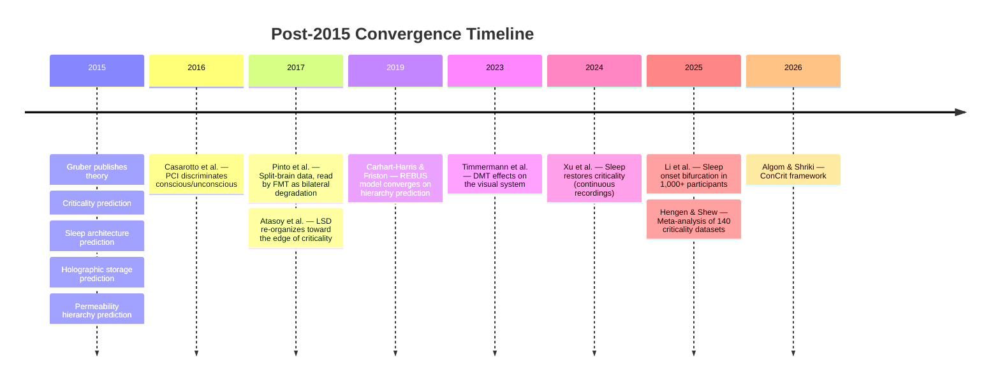

# Empirical Convergence (Post-2015)

**Several claims derived from the Four-Model Theory's axioms, established in 2015, have since received converging independent support from empirical work.**

Convergence of this kind means a claim made on principled grounds, and later work by researchers with no connection to the theory that bears it out. Two caveats govern how it should be read. Some of the work cited below predates the 2015 publication (Casali et al., 2013; Carhart-Harris et al., 2014) and therefore shows *consistency* with the theory's commitments rather than prediction followed by confirmation; the post-publication work (Algom & Shriki, 2026; Hengen & Shew, 2025; Xu et al., 2024; Li et al., 2025; Pinto et al., 2017) carries the stronger evidential weight. And most of the convergence concerns the Class 4 commitment, which FMT shares with other criticality-based frameworks (ConCrit, REBUS, the Entropic Brain Hypothesis). What is distinctive to FMT is the *derivation path* -- the commitment came from Wolfram's computational-universality framework, independently of the empirical criticality program -- rather than the prediction content. The items span anesthesia, sleep, psychedelics, and split-brain neuroscience; they are converging evidence, not novel predictions.

## Anesthetic Convergence on Criticality Disruption

The theory predicts that all agents abolishing consciousness do so by pushing the substrate below the [criticality threshold](../physical-foundations/criticality.md), regardless of receptor mechanism ([Gruber, 2015](https://www.amazon.com/Emergenz-Bewusstseins-German-Matthias-Gruber/dp/1326652079)). The Perturbational Complexity Index (PCI) threshold of 0.31 reliably discriminates conscious from unconscious states with high accuracy across propofol, midazolam, xenon, and ketamine ([Casali et al., 2013](https://doi.org/10.1126/scitranslmed.3006294); [Casarotto et al., 2016](https://doi.org/10.1002/ana.24779)) -- work that predates the theory's publication but is consistent with its Class 4 commitment. Ketamine, which preserves near-critical dynamics, preserves consciousness despite profound pharmacological effects ([Maschke et al., 2024](https://doi.org/10.1038/s42003-024-06613-8)). The ConCrit framework (Algom & Shriki, 2026) reached the same conclusion, and Hengen and Shew's (2025) meta-analysis consolidates ~140 datasets behind the premise the argument rests on -- that cortex operates near criticality as a setpoint of brain function -- rather than testing the anesthetic claim itself.

## Sleep-Dependent Criticality Restoration

The theory predicts that waking experience progressively degrades criticality and that sleep restores optimal computational regime -- derived from the principle that an analog substrate cannot sustain digital computation indefinitely without periodic recalibration. [Xu et al. (2024)](https://doi.org/10.1038/s41593-023-01536-9) demonstrated in continuous 10-14 day recordings that normal waking experience progressively disrupts criticality and sleep restores it. [Meisel et al. (2013)](https://doi.org/10.1523/JNEUROSCI.1282-13.2013) showed fading criticality signatures during sustained human wakefulness.

## Sleep Onset as Bifurcation

The prediction that sleep onset should be a radical transition -- a criticality breakdown -- rather than gradual dimming is supported by Li et al. (2025, *Nature Neuroscience*), who demonstrated in over 1,000 participants that falling asleep follows a predictable bifurcation dynamic. The transition is a tipping point preceded by critical slowing (increased variance and autocorrelation), detectable approximately 4.5 minutes before conventional sleep onset. This is the phase-transition signature the theory predicts from the cellular automaton framework: the cortical automaton does not fade smoothly from Class 4 to Class 2 -- it tips.

## Psychedelic Content Maps the Processing Hierarchy

The prediction that increasing [permeability](../mechanisms/variable-permeability.md) exposes intermediate processing stages in hierarchical order is consistent with the independently developed REBUS model ([Carhart-Harris & Friston, 2019](https://doi.org/10.1124/pr.118.017160)), Kluver's (1966) form constants, [Bressloff et al.'s (2002)](https://doi.org/10.1098/rstb.2002.1139) V1 mathematical models, and visual-system effects demonstrated with DMT ([Timmermann et al., 2023](https://doi.org/10.1073/pnas.2218949120)). However, since predictive processing frameworks generate a nearly identical prediction through relaxation of top-down priors, this convergence validates the permeability principle without uniquely distinguishing the Four-Model Theory from REBUS.

## Split-Brain Holographic Degradation

The prediction that callosotomy produces bilateral degradation rather than clean hemispheric specialization is consistent with [Pinto et al.'s (2017)](https://doi.org/10.1093/brain/aww358) finding of divided perception alongside preserved unified responding. Those authors read their data as showing that callosotomy does *not* create two independent conscious perceivers; the theory reinterprets the same data as two degraded but functionally complete simulations, and that reinterpretation is FMT's, not theirs. It follows from [holographic storage](../mechanisms/holographic-storage.md): if the implicit models store information in a distributed manner where each part contains a degraded version of the whole, then severing the corpus callosum should leave each hemisphere generating its own degraded-but-complete simulation, not two specialized half-agents. The observable pattern is consistent with distributed-storage models generally, so it does not single out FMT; the holographic mechanism offered to explain it is the theory's own contribution.

## Figure

```mermaid
timeline
    title Post-2015 Convergence Timeline
    2015 : Gruber publishes theory
         : Criticality prediction
         : Sleep architecture prediction
         : Holographic storage prediction
         : Permeability hierarchy prediction
    2016 : Casarotto et al. — PCI discriminates conscious/unconscious
    2017 : Pinto et al. — Split-brain data, read by FMT as bilateral degradation
         : Atasoy et al. — LSD re-organizes toward the edge of criticality
    2019 : Carhart-Harris & Friston — REBUS model converges on hierarchy prediction
    2023 : Timmermann et al. — DMT effects on the visual system
    2024 : Xu et al. — Sleep restores criticality (continuous recordings)
    2025 : Li et al. — Sleep onset bifurcation in 1,000+ participants
         : Hengen & Shew — Meta-analysis of 140 criticality datasets
    2026 : Algom & Shriki — ConCrit framework
```

*Convergence timeline showing claims derived from the 2015 theory and the subsequent independent work that supports them. The pattern spans a decade and involves research groups with no connection to the Four-Model Theory.*

## Key Takeaway

Five claims derived from the Four-Model Theory's axioms in 2015 have received converging support from subsequent empirical work: anesthetic-criticality convergence, sleep-dependent criticality restoration, sleep onset as bifurcation, psychedelic hierarchy mapping, and split-brain degradation. Most of this evidence bears on the Class 4 commitment that FMT shares with other criticality-based frameworks; what is distinctive is that FMT derived the commitment from computational first principles before the empirical program consolidated it. The theory's novel predictions remain largely untested.

## See Also

- [Criticality: Signature, Not Requirement](../physical-foundations/criticality.md)
- [Psychedelic Phenomenology](../phenomena/psychedelics.md)
- [Sleep, Dreams, and Criticality](../phenomena/sleep.md)
- [Split-Brain Phenomena](../phenomena/split-brain.md)
- [Anesthesia and Loss of Consciousness](../phenomena/anesthesia.md)
- [Prediction 1: Psychedelics Alleviate Anosognosia](prediction-1-anosognosia.md)
