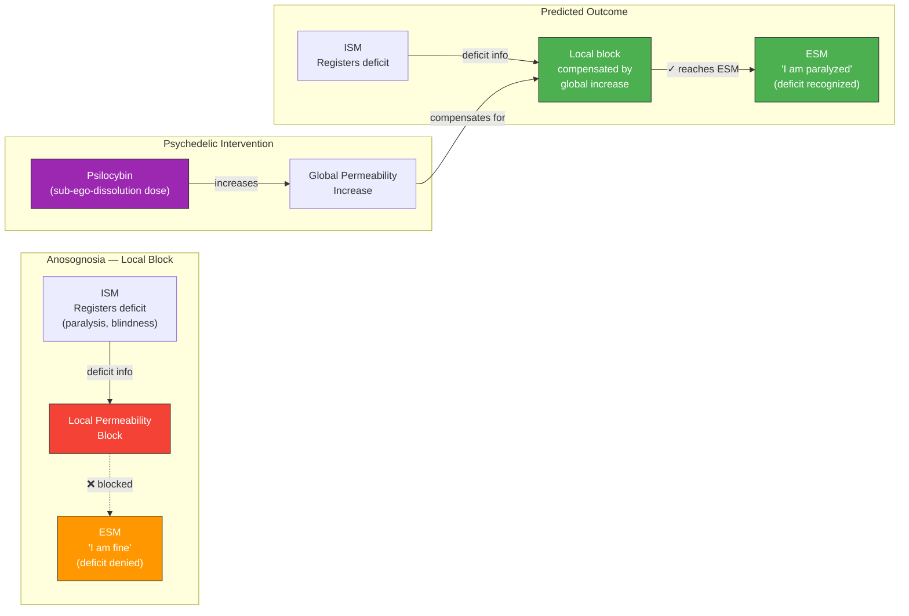

# Prediction 1: Psychedelics Alleviate Anosognosia

**Administration of psychedelic substances at sub-ego-dissolution doses to patients with anosognosia should produce a measurable, dose-dependent, temporary increase in explicit awareness of their deficits.**

This is a cross-domain surprise prediction -- it connects psychopharmacology and clinical neurology through a single principle in a way that no other consciousness framework generates. No competing theory predicts that a psychedelic should help an anosognosia patient recognize their paralysis.

## The Mechanism: Permeability as a Two-Way Street

The prediction rests on the interaction of two phenomena that the Four-Model Theory explains through the same mechanism operating in opposite directions:

**Anosognosia** is a local decrease in [implicit-explicit permeability](../mechanisms/variable-permeability.md). The [ISM](../core-architecture/four-model-theory.md) registers the deficit -- the body schema contains accurate information about the paralysis, the proprioceptive loss, or the visual field cut. But the transfer of this specific information to the [ESM](../core-architecture/four-model-theory.md) is blocked. The patient's substrate knows about the deficit; the patient's conscious self-model does not. The result is the characteristic clinical picture: a hemiplegic patient who sincerely denies being paralyzed, or a cortically blind patient who insists they can see.

**Psychedelics** globally increase permeability, as described in the theory's account of [psychedelic phenomenology](../phenomena/psychedelics.md). They weaken the implicit-explicit boundary across the board, allowing normally unconscious processing stages to reach the conscious simulation.

The prediction follows directly: if anosognosia is a local permeability block, and psychedelics produce a global permeability increase, then the global increase should compensate for the local block -- allowing deficit information to reach the ESM. The patient should, temporarily and dose-dependently, become aware of their condition.

## Figure

*Anosognosia as a local permeability block (left) compensated by global psychedelic-induced permeability increase (center), producing temporary deficit awareness (right). The ISM contains accurate information throughout -- the bottleneck is transfer to the ESM.*

## Testability

The prediction is specific enough for clinical investigation:

- **Measurable outcome**: Improvement in explicit awareness, quantifiable via established anosognosia assessment scales.
- **Dose-dependent**: Higher sub-ego-dissolution doses should produce greater improvement, up to the threshold where ego dissolution itself introduces confounding effects.
- **Temporary**: The effect should dissipate as the psychedelic clears the system, since the local permeability block is structural (lesion-based), not pharmacological.
- **EEG correlate**: Improvement should correlate with EEG complexity increases over the lesioned hemisphere specifically, as the global permeability increase reaches the damaged region.
- **Safety**: Psilocybin clinical trials already have extensive safety data at the relevant dose ranges, making initial case studies feasible within existing regulatory frameworks.

## Falsification Conditions

The prediction specifies clear falsification criteria. If psychedelics increase global neural complexity without improving explicit awareness in anosognosia patients, the variable-permeability model is incomplete -- global permeability increase does not interact with local blocks as predicted. If the effect occurs but is not dose-dependent, the mechanism is different from what the theory proposes.

## Distinguishing Power

IIT, GNW, HOT, predictive processing, and AST are all silent on why a psychedelic should help an anosognosia patient. This is not because they are wrong about other things -- it is because they lack the specific architectural feature (variable permeability of a defined boundary) that generates this cross-domain connection. The prediction is a direct consequence of the theory's architecture, not an ad hoc addition.

## Key Takeaway

Prediction 1 connects two clinically distinct phenomena -- psychedelic experience and anosognostic denial -- through the single principle of variable permeability operating in opposite directions. No other consciousness theory generates this cross-domain prediction, making it a distinctive empirical test of the Four-Model Theory.

## See Also

- [Anosognosia](../phenomena/anosognosia.md)
- [Variable Permeability](../mechanisms/variable-permeability.md)
- [Psychedelic Phenomenology](../phenomena/psychedelics.md)
- [The Implicit-Explicit Boundary](../mechanisms/implicit-explicit-boundary.md)
- [Confirmed Predictions](confirmed.md)
- [Prediction 2: Ego Dissolution Content Is Controllable](prediction-2-ego-dissolution.md)
