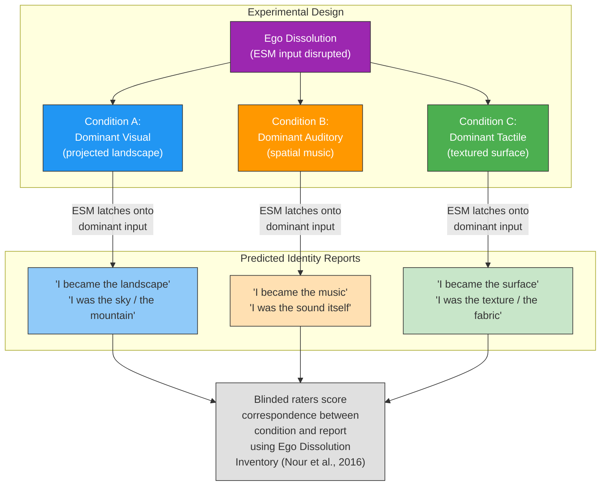

# Prediction 2: Ego Dissolution Content Is Controllable

**During psychedelic ego dissolution, identity content tracks the dominant sensory input -- control the sensory environment, control what the subject "becomes."**

This is arguably the Four-Model Theory's most distinctive empirical prediction. While other theories can explain *that* ego dissolution occurs (self-model weakening, prior relaxation), only the Four-Model Theory predicts *what specific content* replaces the dissolved self -- and that this content is systematically controllable by manipulating the sensory environment.

## The Mechanism: Input-Dependent Identity

The [ESM](../core-architecture/four-model-theory.md) is the brain's continuous generation of a unified self-narrative. Like any computational model, it requires input. Under normal conditions, the ESM receives self-referential signals: interoceptive data (heartbeat, breathing), proprioceptive feedback (body position), and ongoing output from the [ISM](../core-architecture/four-model-theory.md) (accumulated self-knowledge, personality, autobiographical continuity).

During [ego dissolution](../phenomena/ego-dissolution.md), this self-referential input stream is disrupted. The ESM does not shut down -- it has no off switch. It continues running but latches onto whatever input dominates the available stream. This is the [redirectable ESM](../mechanisms/redirectable-esm.md) mechanism: the self-model is not destroyed but redirected.

The prediction follows: if identity content during dissolution tracks the dominant input, then systematically varying the dominant input should systematically vary the identity content. This is not a vague correlation claim -- it predicts a specific, manipulable, experimentally testable relationship.

## Existing Evidence: Salvia Divinorum

Salvia divinorum (Salvinorin A) already provides striking naturalistic evidence. Salvia users reliably report *becoming* objects in their immediate environment: furniture, walls, television characters, geometric patterns on carpets. These reports are not metaphorical -- subjects describe literal identity replacement, experiencing themselves *as* the object.

The Four-Model Theory predicts exactly this pattern. The ESM, deprived of normal self-input by salvia's potent kappa-opioid agonism, latches onto the dominant sensory channel. The identity experience tracks what is visually, auditorily, or tactilely dominant in the environment. What has not been done is the controlled experimental version: deliberately manipulating sensory dominance and measuring the correspondence.

## Figure

*Proposed experimental design: vary the dominant sensory modality during ego dissolution across three conditions and measure correspondence between controlled input and reported identity content using blinded raters.*

## Proposed Test Protocol

The prediction can be tested by varying the dominant sensory modality (visual, auditory, tactile) during ego dissolution and measuring correspondence between controlled input and reported identity content:

1. **Participants** undergo psilocybin-induced ego dissolution under controlled conditions.
2. **Sensory environment** is experimentally manipulated: visual-dominant (projected imagery), auditory-dominant (spatial sound, minimal visual), or tactile-dominant (textured surfaces, eyes closed).
3. **Post-session reports** are scored by blinded raters for correspondence between the controlled dominant modality and reported identity content.
4. **Quantification** via the Ego Dissolution Inventory ([Nour et al., 2016](https://doi.org/10.3389/fnhum.2016.00269)) supplemented with content-specific items.

## Falsification Conditions

If identity content during ego dissolution shows no systematic relationship to the sensory environment -- if subjects report identity transformations uncorrelated with the dominant input -- then the redirectable-ESM mechanism is wrong. Random or internally generated identity content would falsify the input-tracking claim.

## Why No Other Theory Generates This

IIT, GNW, HOT, and AST have no mechanism for specifying *what* a subject will become during ego dissolution. Predictive processing (REBUS) predicts self-model relaxation but not the specific input-tracking pattern -- it explains *that* the self dissolves, not *what replaces it*. Only the Four-Model Theory's architectural claim -- that the ESM is a running model that requires input and redirects when its normal input is disrupted -- generates the specific prediction of controllable identity content.

## Key Takeaway

Ego dissolution content is not random. The ESM latches onto whatever input dominates when self-referential signals are disrupted, making dissolution content predictable and controllable by manipulating the sensory environment. This input-tracking prediction is unique to the Four-Model Theory and testable with existing psychedelic research infrastructure.

## See Also

- [Ego Dissolution](../phenomena/ego-dissolution.md)
- [The Redirectable ESM](../mechanisms/redirectable-esm.md)
- [Psychedelic Phenomenology](../phenomena/psychedelics.md)
- [The Explicit Self Model](../core-architecture/four-model-theory.md)
- [Prediction 1: Psychedelics Alleviate Anosognosia](prediction-1-anosognosia.md)
- [Prediction 3: DID Alter Switches in ESM Networks](prediction-3-did.md)
