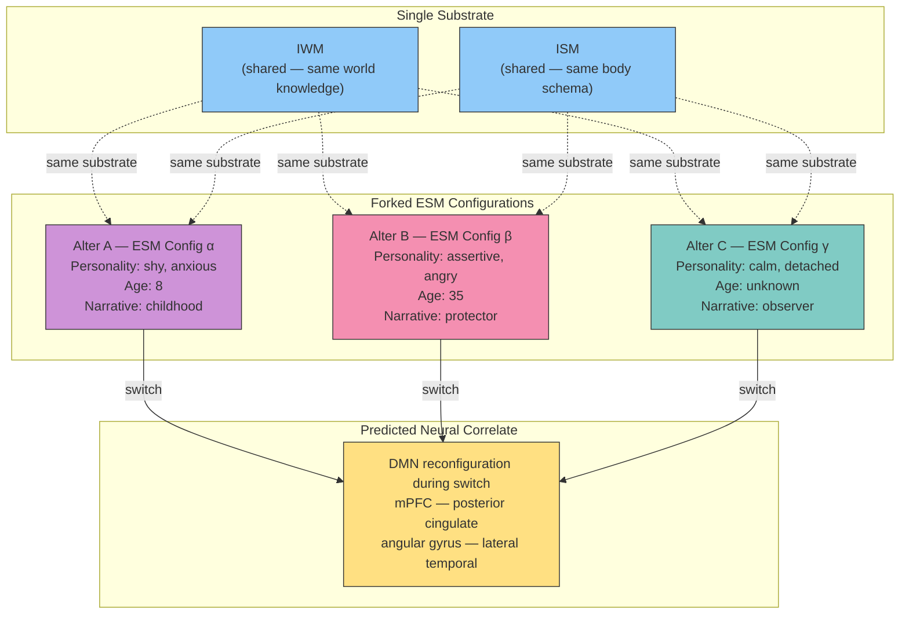

# Prediction 3: DID Alter Switches Concentrated in ESM Networks

**In dissociative identity disorder, alter switching produces neural reconfiguration concentrated in default mode network regions -- alter-specific, reproducible across sessions, and distinguishable from role-playing.**

The Four-Model Theory treats each alter in DID as a distinct [ESM](../core-architecture/four-model-theory.md) configuration running on the same substrate with different parameters. This architectural claim generates a spatial prediction that goes beyond existing DID neuroimaging: the neural differences between alters should be concentrated in self-model networks, not diffusely distributed across the brain.

## The Mechanism: Virtual Model Forking

The theory's [real/virtual split](../core-architecture/real-virtual-split.md) assigns software-like properties to the virtual side of the architecture. The explicit models are forkable, cloneable, and reconfigurable -- properties of computational entities, not biological tissue. DID represents a case where the ESM has been forked: a single substrate runs multiple distinct configurations of the self-model, each with its own parameters, personality traits, emotional patterns, and autobiographical narrative.

Each alter is not a "different brain" or a "different person in the same brain" -- it is a different parameterization of the same self-model architecture. The substrate (IWM, ISM, neural hardware) remains constant. What changes during a switch is the ESM configuration: which parameters are active, which self-narrative is being generated, which personality traits are expressed.

This generates a precise anatomical prediction. If alters differ in ESM configuration, the neural correlates of switching should be concentrated in the networks that implement the ESM -- specifically the **default mode network** (DMN): medial prefrontal cortex, posterior cingulate cortex, angular gyrus, and lateral temporal cortex.

## Figure

*Each alter represents a distinct ESM configuration on the same shared substrate. The IWM and ISM remain constant across alters. Neural differences during switching are predicted to concentrate in DMN regions that implement the ESM.*

## Existing Evidence and the Prediction's Extension

DID neuroimaging has already demonstrated alter-specific activation differences. [Reinders et al. (2003, 2008)](https://doi.org/10.1016/S0925-4927(03)00069-9) showed distinct neural patterns for different alters. [Schlumpf et al. (2014)](https://doi.org/10.1371/journal.pone.0098795) demonstrated alter-specific resting-state connectivity patterns. These findings confirm that alter differences have measurable neural correlates.

What has not been tested is the Four-Model Theory's specific prediction: that these differences are *concentrated* in self-model (DMN) networks rather than diffusely distributed. The prediction goes beyond demonstrating that alters differ neurally -- it specifies *where* they should differ most and *why*.

## Three Testable Claims

The prediction specifies three distinguishable features:

1. **DMN concentration**: Classifier accuracy for alter identity using DMN-only data should match or exceed whole-brain classification. If whole-brain classification significantly outperforms DMN-only classification, the ESM-network localization claim is wrong.

2. **Alter-specific reproducibility**: Each alter should produce a characteristic DMN configuration that is stable across sessions -- the same alter yields the same pattern when re-elicited weeks or months later.

3. **Distinguishable from role-playing**: Matched controls instructed to role-play different personalities should show different neural patterns from genuine DID alter switches, specifically in the DMN. Role-playing engages executive control networks (lateral prefrontal); genuine alter switching reconfigures the self-model itself.

## Distinguishing Power

The prediction's spatial specificity separates it from competing theories:

- **IIT** predicts alter differences in posterior cortex integration (the posterior hot zone) -- a different spatial prediction from DMN concentration.
- **GNW** predicts differences in prefrontal ignition patterns -- overlapping with medial prefrontal but without the self-model framing.
- **Predictive processing** predicts distributed differences in hierarchical prediction error -- not spatially concentrated.
- **Only the Four-Model Theory** predicts DMN concentration specifically, because only it identifies each alter as a distinct ESM configuration and specifies that the ESM maps onto DMN networks.

## Key Takeaway

DID alters are distinct ESM configurations on a shared substrate -- virtual model forking. This architectural claim predicts that alter-specific neural patterns should be concentrated in default mode network regions, reproducible across sessions, and distinguishable from role-playing. The spatial specificity of this prediction separates it from all competing theories.

## See Also

- [Dissociative Identity Disorder](../phenomena/did.md)
- [Virtual Model Forking](../mechanisms/virtual-model-forking.md)
- [The Explicit Self Model](../core-architecture/four-model-theory.md)
- [The Real/Virtual Split](../core-architecture/real-virtual-split.md)
- [Prediction 2: Ego Dissolution Content Is Controllable](prediction-2-ego-dissolution.md)
- [Prediction 4: Lucid Dream Onset Is a Criticality Threshold Crossing](prediction-4-lucid-dreaming.md)
