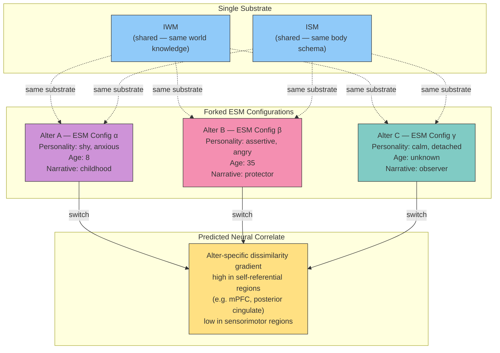

# Prediction 3: DID Alter Switches Show Self-Referential Network Specificity

**In dissociative identity disorder, alter switching produces neural reconfiguration whose representational dissimilarity between alters is greater in self-referential processing regions than in sensorimotor regions -- alter-specific, reproducible across sessions, and distinguishable from role-playing.**

The Four-Model Theory treats each alter in DID as a distinct [ESM](../core-architecture/four-model-theory.md) configuration running on the same substrate with different parameters. This architectural claim generates a prediction that goes beyond existing DID neuroimaging: the neural differences between alters should follow a *gradient*, largest where the self-model is computed and smallest in sensorimotor representations, rather than being uniformly distributed across the brain.

## The Mechanism: Virtual Model Forking

The theory's [real/virtual split](../core-architecture/real-virtual-split.md) assigns software-like properties to the virtual side of the architecture. The explicit models are forkable, cloneable, and reconfigurable -- properties of computational entities, not biological tissue. DID represents a case where the ESM has been forked: a single substrate runs multiple distinct configurations of the self-model, each with its own parameters, personality traits, emotional patterns, and autobiographical narrative.

Each alter is not a "different brain" or a "different person in the same brain" -- it is a different parameterization of the same self-model architecture. The substrate (IWM, ISM, neural hardware) remains constant. What changes during a switch is the ESM configuration: which parameters are active, which self-narrative is being generated, which personality traits are expressed.

This generates a testable prediction. If alters differ in ESM configuration, the neural differences between them should cluster in regions subserving self-referential processing -- self-narrative, autobiographical memory, body ownership; cortical midline and **default mode network** (DMN) structures such as medial prefrontal and posterior cingulate cortex are the empirical candidates -- while sensory and motor representations stay relatively invariant across alters. The prediction is stated in terms of representational dissimilarity (cosine distance between multi-voxel activation vectors), not anatomical localization: the ESM is a distributed, transient process, not a region, so the signature is a gradient of alter-specificity along the self-referential-to-sensorimotor axis rather than activation of a named network.

## Figure

```mermaid
graph TD
    subgraph "Single Substrate"
        IWM["IWM\n(shared — same world knowledge)"]
        ISM["ISM\n(shared — same body schema)"]
    end

    subgraph "Forked ESM Configurations"
        ALTER_A["Alter A — ESM Config α\nPersonality: shy, anxious\nAge: 8\nNarrative: childhood"]
        ALTER_B["Alter B — ESM Config β\nPersonality: assertive, angry\nAge: 35\nNarrative: protector"]
        ALTER_C["Alter C — ESM Config γ\nPersonality: calm, detached\nAge: unknown\nNarrative: observer"]
    end

    IWM -.->|"same substrate"| ALTER_A
    IWM -.->|"same substrate"| ALTER_B
    IWM -.->|"same substrate"| ALTER_C
    ISM -.->|"same substrate"| ALTER_A
    ISM -.->|"same substrate"| ALTER_B
    ISM -.->|"same substrate"| ALTER_C

    subgraph "Predicted Neural Correlate"
        DMN["Alter-specific dissimilarity gradient\nhigh in self-referential regions\n(e.g. mPFC, posterior cingulate)\nlow in sensorimotor regions"]
    end

    ALTER_A -->|"switch"| DMN
    ALTER_B -->|"switch"| DMN
    ALTER_C -->|"switch"| DMN

    style IWM fill:#90CAF9,stroke:#333
    style ISM fill:#90CAF9,stroke:#333
    style ALTER_A fill:#CE93D8,stroke:#333
    style ALTER_B fill:#F48FB1,stroke:#333
    style ALTER_C fill:#80CBC4,stroke:#333
    style DMN fill:#FFE082,stroke:#333
```

*Each alter represents a distinct ESM configuration on the same shared substrate. The IWM and ISM remain constant across alters. Representational differences during switching are predicted to be largest in self-referential regions and smallest in sensorimotor regions.*

## Existing Evidence and the Prediction's Extension

DID neuroimaging has already demonstrated alter-specific activation differences. Reinders et al. (2003; [2006](https://doi.org/10.1016/j.biopsych.2005.12.019)) showed distinct neural patterns for different alters. [Schlumpf et al. (2014)](https://doi.org/10.1371/journal.pone.0098795) demonstrated alter-specific resting-state perfusion patterns. These findings establish that alter differences have measurable neural correlates.

What has not been tested is the Four-Model Theory's specific prediction: that these differences follow a self-referential gradient rather than being uniformly distributed. The prediction goes beyond demonstrating that alters differ neurally -- it specifies *where* they should differ most and *why*.

## Three Testable Claims

The prediction specifies three distinguishable features:

1. **Self-referential gradient**: Representational dissimilarity between alter states should be significantly greater in self-referential regions than in sensorimotor regions (illustratively, cosine distance d ≥ 0.5 versus d < 0.2; the committed claim is the direction and size of the gap, not the absolute values). If dissimilarity is uniform across the two, or if whole-brain classification of alter identity does not significantly outperform sensorimotor-only classification, the prediction fails.

2. **Alter-specific reproducibility**: Each alter should produce a characteristic pattern that is stable across sessions -- the same alter yields the same pattern when re-elicited weeks or months later.

3. **Distinguishable from role-playing**: Matched controls instructed to role-play or method-act different personalities should produce patterns distinguishable from genuine DID alter switches. Role-play is performed by an unchanged self-model; genuine alter switching reconfigures the self-model itself.

## Distinguishing Power

The prediction's spatial specificity separates it from competing theories:

- **IIT** predicts alter differences in posterior cortex integration -- a different spatial prediction from a self-referential gradient.
- **GNW** predicts differences in prefrontal ignition patterns -- overlapping with medial prefrontal but without the self-model framing.
- **Predictive processing** predicts distributed differences in hierarchical prediction error -- not following a self-referential gradient.
- **Only the Four-Model Theory** predicts that representational dissimilarity should follow a self-referential gradient, because only it identifies each alter as a distinct ESM configuration whose differences should concentrate where the self-model is computed.

## Key Takeaway

DID alters are distinct ESM configurations on a shared substrate -- virtual model forking. This architectural claim predicts that alter-specific representational differences should be greatest in self-referential regions and smallest in sensorimotor regions, reproducible across sessions, and distinguishable from role-playing. That gradient separates the prediction from competing theories.

## See Also

- [Dissociative Identity Disorder](../phenomena/did.md)
- [Virtual Model Forking](../mechanisms/virtual-model-forking.md)
- [The Explicit Self Model](../core-architecture/four-model-theory.md)
- [The Real/Virtual Split](../core-architecture/real-virtual-split.md)
- [Prediction 2: Ego Dissolution Content Is Controllable](prediction-2-ego-dissolution.md)
- [Prediction 4: Lucid Dream Onset Is a Criticality Threshold Crossing](prediction-4-lucid-dreaming.md)
