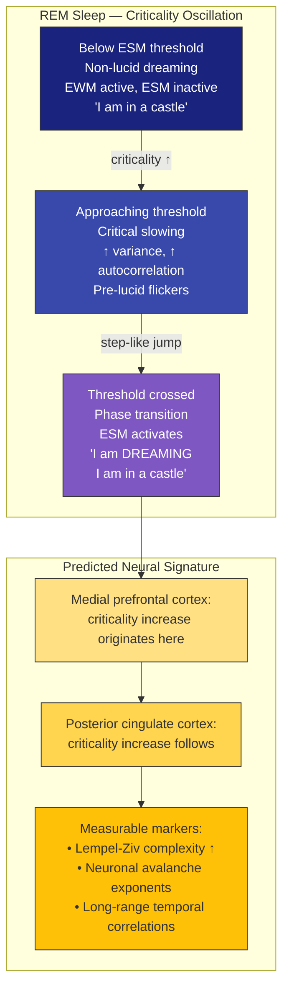

# Prediction 4: Lucid Dream Onset Is a Criticality Threshold Crossing

**The transition from non-lucid to lucid dreaming corresponds to a step-like criticality increase originating in ESM-related cortical regions, showing the signature of a phase transition rather than a gradual ramp.**

Lucid dreaming -- the experience of knowing one is dreaming while still within the dream -- has been a focus of sleep research since LaBerge's (1985) eye-signaling paradigm. The Four-Model Theory provides a precise mechanistic account: lucid dream onset occurs when the substrate crosses the [criticality threshold](../physical-foundations/criticality.md) sufficiently for the [ESM](../core-architecture/four-model-theory.md) to activate, producing the characteristic self-aware "I am dreaming" experience.

## The Mechanism: Criticality and the ESM

The theory's account of [sleep architecture](../phenomena/sleep.md) holds that waking degrades criticality and sleep restores it. During NREM sleep, the substrate undergoes criticality restoration -- a periodic recalibration process. During REM sleep, the substrate periodically re-approaches the criticality threshold as part of the NREM/REM cycle.

In non-lucid dreaming, the substrate has enough criticality to sustain the [EWM](../core-architecture/four-model-theory.md) -- the dreamer experiences a vivid world -- but not enough to sustain the ESM. The dreamer has world-experience without self-awareness: they participate in the dream narrative without recognizing it as a dream.

Lucid dreaming occurs when the substrate reaches sufficient criticality for the ESM to activate on top of the already-running EWM. The dreamer gains self-awareness within the dream: "I am dreaming." This is not a gradual emergence of insight but a threshold crossing -- the ESM either has enough computational support to run or it does not.

## Figure

*Lucid dream onset as a criticality threshold crossing. During REM sleep, criticality oscillates. When it crosses the ESM activation threshold, self-awareness emerges as a step-like transition originating in self-model (DMN) regions.*

## The Phase-Transition Signature

The prediction specifies not just *that* criticality increases at lucid onset but *how* it increases. A phase transition has a characteristic signature:

- **Critical slowing before onset**: Increased variance and autocorrelation in neural signals as the system approaches the tipping point -- analogous to the critical slowing [Li et al. (2025)](https://doi.org/10.1073/pnas.2405341122) demonstrated before sleep onset, but in reverse.
- **Step-like jump at onset**: An abrupt increase in criticality markers, not a gradual ramp. The transition from non-lucid to lucid should be sharp.
- **ESM-region origination**: The criticality increase should originate in medial prefrontal cortex and posterior cingulate cortex (ESM-related regions) before spreading to other cortical areas. Self-awareness comes first; enhanced dream control follows.

## Proposed Test Protocol

The prediction is testable using the established lucid-dreamer eye-signaling paradigm (LaBerge, 1985) combined with concurrent high-density EEG:

1. **Trained lucid dreamers** signal the onset of lucidity with a pre-agreed eye movement pattern during REM sleep.
2. **High-density EEG** records continuously, providing time-series data for criticality analysis.
3. **Criticality markers** -- Lempel-Ziv complexity, neuronal avalanche exponents, long-range temporal correlations -- are computed in a time window around the verified lucid onset signal.
4. **Spatial analysis** determines whether the criticality increase originates in ESM-related regions (mPFC, posterior cingulate) or elsewhere.

## Falsification Conditions

Three findings would falsify the prediction:

- **Gradual ramp**: A gradual increase in criticality markers rather than a step-like transition would indicate that lucidity emerges continuously, not as a threshold crossing.
- **No criticality change**: If criticality markers show no change at verified lucid onset, the criticality-threshold mechanism is wrong.
- **Wrong spatial origin**: If the criticality increase originates in sensory cortices rather than ESM-related regions, the ESM-activation account is incorrect.

## Distinguishing Power

The prediction's combination of three features -- step-like transition, ESM-network origination, and criticality markers -- separates it from competing accounts:

- **IIT** predicts increased integrated information (phi) in the posterior hot zone -- a different spatial prediction and a different type of measurement.
- **GNW** predicts prefrontal ignition, which overlaps with the mPFC prediction but lacks the criticality-threshold framing. GNW would predict broadcasting, not a phase transition.
- **Predictive processing** predicts increased precision on self-model predictions -- compatible with the account but does not predict a step-like criticality transition or specify spatial origination.

Only the Four-Model Theory predicts the full package: a step-like phase transition in criticality markers, originating in ESM-associated cortical regions.

## Key Takeaway

Lucid dream onset is a criticality threshold crossing: the substrate reaches sufficient criticality during REM sleep for the ESM to activate, producing self-awareness within the dream. The transition should show a phase-transition signature -- critical slowing, abrupt jump, ESM-region origination -- testable with existing eye-signaling paradigms and high-density EEG.

## See Also

- [Lucid Dreaming](../phenomena/lucid-dreaming.md)
- [Sleep, Dreams, and Criticality](../phenomena/sleep.md)
- [The Criticality Requirement](../physical-foundations/criticality.md)
- [The Explicit Self Model](../core-architecture/four-model-theory.md)
- [Two Thresholds for Consciousness](../physical-foundations/two-thresholds.md)
- [Confirmed Predictions](confirmed.md)
