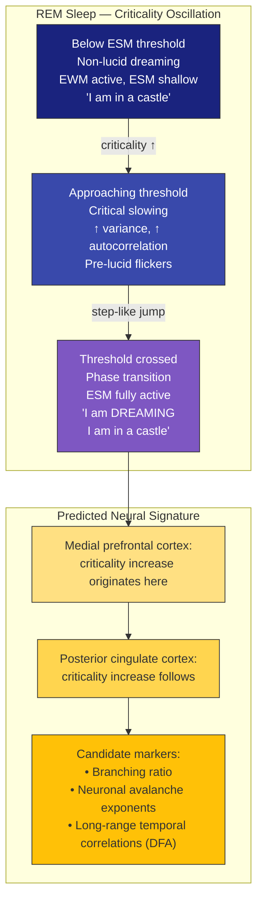

# Prediction 4: Lucid Dream Onset Is a Criticality Threshold Crossing

**The transition from non-lucid to lucid dreaming corresponds to a step-like criticality increase originating in ESM-related cortical regions, showing the signature of a phase transition rather than a gradual ramp.**

Lucid dreaming -- the experience of knowing one is dreaming while still within the dream -- has been a focus of sleep research since LaBerge's (1985) eye-signaling paradigm. The Four-Model Theory provides a mechanistic account: lucid dream onset occurs when the substrate crosses the [criticality threshold](../physical-foundations/criticality.md) sufficiently for the [ESM](../core-architecture/four-model-theory.md) to activate more fully, producing the characteristic self-aware "I am dreaming" experience.

## The Mechanism: Criticality and the ESM

The theory's account of [sleep architecture](../phenomena/sleep.md) holds that waking degrades criticality and sleep restores it. During NREM sleep, the substrate undergoes criticality restoration -- a periodic recalibration process. During REM sleep, the substrate periodically re-approaches the criticality threshold as part of the NREM/REM cycle, without fully reaching waking criticality.

How deeply the ESM is active varies with how fully the substrate occupies the open-ended (Class 4) regime -- indexed, in neural tissue, by its position relative to the critical point. In non-lucid dreaming, the substrate sustains the [EWM](../core-architecture/four-model-theory.md) -- the dreamer experiences a vivid world -- and only a shallow ESM: the dreamer is present in the dream and participates in its narrative without recognizing it as a dream.

Lucid dreaming occurs when the substrate reaches sufficient criticality for the ESM to cross from basic to extended self-awareness on top of the already-running EWM. The dreamer gains self-awareness within the dream: "I am dreaming." This is not a gradual emergence of insight but a threshold crossing.

## Figure

```mermaid
graph TB
    subgraph "REM Sleep — Criticality Oscillation"
        LOW["Below ESM threshold\nNon-lucid dreaming\nEWM active, ESM shallow\n'I am in a castle'"]
        APPROACH["Approaching threshold\nCritical slowing\n↑ variance, ↑ autocorrelation\nPre-lucid flickers"]
        CROSS["Threshold crossed\nPhase transition\nESM fully active\n'I am DREAMING\nI am in a castle'"]
    end

    LOW -->|"criticality ↑"| APPROACH
    APPROACH -->|"step-like jump"| CROSS

    subgraph "Predicted Neural Signature"
        SIG_1["Medial prefrontal cortex:\ncriticality increase originates here"]
        SIG_2["Posterior cingulate cortex:\ncriticality increase follows"]
        SIG_3["Candidate markers:\n• Branching ratio\n• Neuronal avalanche exponents\n• Long-range temporal correlations (DFA)"]
    end

    CROSS --> SIG_1
    SIG_1 --> SIG_2
    SIG_2 --> SIG_3

    style LOW fill:#1A237E,stroke:#333,color:#fff
    style APPROACH fill:#3949AB,stroke:#333,color:#fff
    style CROSS fill:#7E57C2,stroke:#333,color:#fff
    style SIG_1 fill:#FFE082,stroke:#333
    style SIG_2 fill:#FFD54F,stroke:#333
    style SIG_3 fill:#FFC107,stroke:#333
```

*Lucid dream onset as a criticality threshold crossing. During REM sleep, criticality oscillates. When it crosses the ESM activation threshold, self-awareness emerges as a step-like transition originating in self-model (DMN) regions.*

## The Phase-Transition Signature

The prediction specifies not just *that* criticality increases at lucid onset but *how* it increases. A phase transition has a characteristic signature:

- **Critical slowing before onset**: Increased variance and autocorrelation in neural signals as the system approaches the tipping point -- analogous to the critical slowing Li et al. (2025, *Nature Neuroscience*) demonstrated before sleep onset, but in reverse.
- **Step-like jump at onset**: An abrupt increase in criticality markers, not a gradual ramp. The transition from non-lucid to lucid should be sharp.
- **ESM-network origination**: The criticality increase should originate in the ESM's functional network before spreading to other cortical areas. That network is identified with self-referential cortical regions such as medial prefrontal and posterior cingulate cortex through the empirical mapping of self-referential processing, not derived from the theory's architecture.

## Proposed Test Protocol

The prediction is testable using the established lucid-dreamer eye-signaling paradigm (LaBerge, 1985) combined with concurrent high-density EEG:

1. **Trained lucid dreamers** signal the onset of lucidity with a pre-agreed eye movement pattern during REM sleep.
2. **High-density EEG** records continuously, providing time-series data for criticality analysis.
3. **Criticality markers** -- branching ratio, DFA exponent, avalanche statistics, or measures not yet developed -- are computed in a time window around the verified lucid onset signal.
4. **Spatial analysis** determines whether the criticality increase originates in self-referential regions (mPFC, posterior cingulate) or elsewhere.

Which markers are best suited cannot be specified with confidence until reliable real-time tracking of criticality signatures has been established, so the prediction's testability depends on methodological advances in criticality measurement during sleep that are underway but not yet mature. Existing reports of elevated frontal gamma during lucid REM sleep rest on very few lucid dreams and have been questioned as possible ocular artifact; gamma power is in any case a spectral measure, not a criticality measure.

## Falsification Conditions

The prediction fails if:

- **No discontinuity**: Purpose-built criticality measures (branching ratio, DFA exponent, avalanche statistics) show no discontinuity at verified lucid onset -- a gradual ramp rather than a step would indicate that lucidity emerges continuously, not as a threshold crossing.
- **Wrong spatial origin**: The criticality change originates in sensory cortices rather than self-referential regions.

Gradual changes in spectral power do not falsify it, since they track a different property.

## Distinguishing Power

The prediction's combination of three features -- step-like transition, ESM-network origination, and criticality markers -- separates it from competing accounts:

- **IIT** predicts increased integrated information (phi) in the posterior hot zone -- a different spatial prediction and a different type of measurement.
- **GNW** predicts prefrontal ignition, which overlaps with the mPFC prediction but lacks the criticality-threshold framing. GNW would predict broadcasting, not a phase transition.
- **Predictive processing** predicts increased precision on self-model predictions -- compatible with the account but does not predict a step-like criticality transition or specify spatial origination.

Only the Four-Model Theory predicts the full package: a step-like phase transition in criticality markers, originating in ESM-associated cortical regions.

## Key Takeaway

Lucid dream onset is a criticality threshold crossing: the substrate reaches sufficient criticality during REM sleep for the ESM to activate more fully, producing self-awareness within the dream. The transition should show a phase-transition signature -- critical slowing, abrupt jump, origination in self-referential regions -- testable with eye-signaling paradigms and high-density EEG once criticality tracking during sleep matures.

## See Also

- [Lucid Dreaming](../phenomena/lucid-dreaming.md)
- [Sleep, Dreams, and Criticality](../phenomena/sleep.md)
- [Criticality: Signature, Not Requirement](../physical-foundations/criticality.md)
- [The Explicit Self Model](../core-architecture/four-model-theory.md)
- [Two Thresholds for Consciousness](../physical-foundations/two-thresholds.md)
- [Empirical Convergence](confirmed.md)
