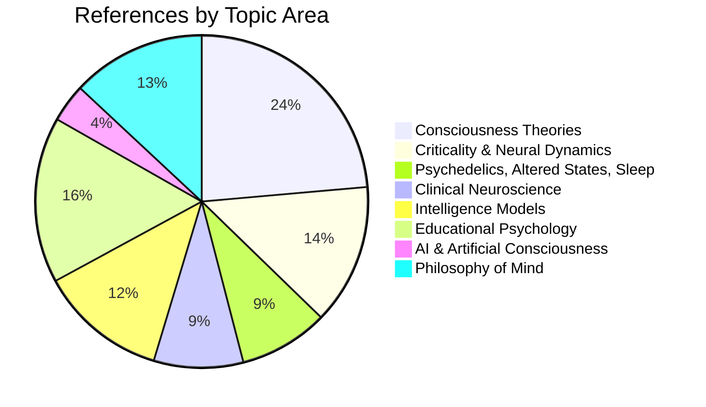

# Bibliography

**Complete reference list spanning both founding papers, organized by topic.**

This bibliography collects all references cited across the Four-Model Theory (FMT) and the Recursive Intelligence Model (RIM). References are grouped by topic rather than alphabetically, making it easier to identify the empirical and theoretical foundations for each aspect of the framework. Where a reference is cited in both papers, it is listed once under the most relevant heading.

## Consciousness Theories

### General Frameworks and Reviews

Baars, B. J. (1988). *A Cognitive Theory of Consciousness*. Cambridge University Press.

Chalmers, D. J. (1995). Facing up to the problem of consciousness. *Journal of Consciousness Studies*, 2(3), 200-219.

Chalmers, D. J. (1996). *The Conscious Mind: In Search of a Fundamental Theory*. Oxford University Press.

Chalmers, D. J. (2016). The combination problem for panpsychism. In G. Bruntrup & L. Jaskolla (Eds.), *Panpsychism: Contemporary Perspectives*. Oxford University Press.

Chalmers, D. J. (2018). The meta-problem of consciousness. *Journal of Consciousness Studies*, 25(9-10), 6-61.

COGITATE Consortium. (2025). An adversarial collaboration to critically evaluate theories of consciousness. *Nature*.

Dennett, D. C. (1991). *Consciousness Explained*. Little, Brown and Company.

Gomez-Marin, A. & Seth, A. K. (2025). A science of consciousness beyond pseudo-science and pseudo-consciousness. *Nature Neuroscience*, 28, 703-706.

IIT-Concerned, Klincewicz, M., Cheng, T., et al. (2025). What makes a theory of consciousness unscientific? *Nature Neuroscience*, 28, 689-693.

Kuhn, T. S. (1962). *The Structure of Scientific Revolutions*. University of Chicago Press.

Melloni, L., et al. (2023). An adversarial collaboration protocol for testing contrasting predictions of global neuronal workspace and integrated information theory. *PLOS ONE*, 18(2), e0268577.

### Integrated Information Theory (IIT)

Aaronson, S. (2014). Why I am not an integrated information theorist. Blog post. *Shtetl-Optimized*.

Albantakis, L., Barbosa, L., et al. (2023). Integrated information theory (IIT) 4.0: Formulating the properties of phenomenal existence in physical terms. *PLOS Computational Biology*, 19(10), e1011465.

Doerig, A., et al. (2019). The unfolding argument: Why IIT and other causal structure theories cannot explain consciousness. *Consciousness and Cognition*, 72, 49-59.

Tononi, G. (2004). An information integration theory of consciousness. *BMC Neuroscience*, 5, 42.

Tononi, G., Albantakis, L., Barbosa, L., et al. (2025). Consciousness or pseudo-consciousness? A clash of two paradigms. *Nature Neuroscience*, 28, 694-702.

### Global Neuronal Workspace (GNW)

Dehaene, S. & Changeux, J. P. (2011). Experimental and theoretical approaches to conscious processing. *Neuron*, 70(2), 200-227.

Dehaene, S., Changeux, J. P., & Naccache, L. (2011). The global neuronal workspace model of conscious access: From neuronal architectures to clinical applications. *Research and Perspectives in Neurosciences*, 18, 55-84.

### Higher-Order Theories (HOT)

Lau, H. & Rosenthal, D. (2011). Empirical support for higher-order theories of conscious awareness. *Trends in Cognitive Sciences*, 15(8), 365-373.

Rosenthal, D. (2005). *Consciousness and Mind*. Oxford University Press.

### Predictive Processing and Free Energy

Bruineberg, J., Dolega, K., Dewhurst, J., & Baltieri, M. (2022). The Emperor's new Markov blankets. *Behavioral and Brain Sciences*, 45, e183.

Carhart-Harris, R. L. & Friston, K. J. (2019). REBUS and the anarchic brain: Toward a unified model of the brain action of psychedelics. *Pharmacological Reviews*, 71(3), 316-344.

Friston, K. (2010). The free-energy principle: A unified brain theory? *Nature Reviews Neuroscience*, 11(2), 127-138.

Seth, A. (2021). *Being You: A New Science of Consciousness*. Dutton.

### Attention Schema Theory (AST)

Graziano, M. S. A. (2013). *Consciousness and the Social Brain*. Oxford University Press.

Graziano, M. S. A. (2024). Illusionism big and small: Some options for explaining consciousness. *eNeuro*, 11(10), ENEURO.0210-24.2024.

### Recurrent Processing Theory (RPT)

Lamme, V. A. F. (2006). Towards a true neural stance on consciousness. *Trends in Cognitive Sciences*, 10(11), 494-501.

Lamme, V. A. F. (2010). How neuroscience will change our view on consciousness. *Cognitive Neuroscience*, 1(3), 204-220.

### Self-Modeling Tradition

Damasio, A. R. (1999). *The Feeling of What Happens: Body and Emotion in the Making of Consciousness*. Harcourt.

Damasio, A. R. (2010). *Self Comes to Mind: Constructing the Conscious Brain*. Pantheon.

Hofstadter, D. (2007). *I Am a Strange Loop*. Basic Books.

Kriegel, U. & Williford, K. (Eds.). (2006). *Self-Representational Approaches to Consciousness*. MIT Press.

Metzinger, T. (2003). *Being No One: The Self-Model Theory of Subjectivity*. MIT Press.

Metzinger, T. (2009). *The Ego Tunnel: The Science of the Mind and the Myth of the Self*. Basic Books.

### Other Consciousness Frameworks

Ellia, F. & Tsuchiya, N. (2025). Beyond accommodation: On the structural turn in computational functionalist theories of consciousness. *Neuroscience of Consciousness*, 2025(1), niaf014.

Fleming, S. M. & Shea, N. (2024). Quality space computations for consciousness. *Trends in Cognitive Sciences*, 28(10), 896-906.

Kirkeby-Hinrup, A., Fink, S. B., & Overgaard, M. (2025). The Multiple Generator Hypothesis. *Neuroscience of Consciousness*, 2025(1), niaf035.

Milinkovic, B. & Aru, J. (2025). Biological computationalism. *Neuroscience & Biobehavioral Reviews*, 181, 106524.

---

## Criticality and Neural Dynamics

### Neuronal Avalanches and Criticality

Algom, I. & Shriki, O. (2026). The concrit framework: Critical brain dynamics as a unifying mechanistic framework for theories of consciousness. *Neuroscience & Biobehavioral Reviews*, 180, 106483.

Beggs, J. M. & Plenz, D. (2003). Neuronal avalanches in neocortical circuits. *Journal of Neuroscience*, 23(35), 11167-11177.

Hengen, K. B. & Shew, W. L. (2025). Is criticality a unified setpoint of brain function? *Neuron*, 113(16), 2582-2598.

Meisel, C., Olbrich, E., Shriki, O., & Achermann, P. (2013). Fading signatures of critical brain dynamics during sustained wakefulness in humans. *Journal of Neuroscience*, 33(44), 17363-17372.

Priesemann, V., et al. (2013). Neuronal avalanches differ from wakefulness to deep sleep -- evidence from intracranial depth recordings in humans. *PLOS Computational Biology*, 9(3), e1002985.

Priesemann, V., et al. (2014). Spike avalanches in vivo suggest a driven, slightly subcritical brain state. *Frontiers in Systems Neuroscience*, 8, 108.

Tagliazucchi, E., et al. (2012). Criticality in large-scale brain fMRI dynamics unveiled by a novel point process analysis. *Frontiers in Physiology*, 3, 15.

### Cellular Automata and Computation

Wolfram, S. (2002). *A New Kind of Science*. Wolfram Media.

Cybenko, G. (1989). Approximation by superpositions of a sigmoidal function. *Mathematics of Control, Signals, and Systems*, 2(4), 303-314.

Hornik, K., Stinchcombe, M., & White, H. (1989). Multilayer feedforward networks are universal approximators. *Neural Networks*, 2(5), 359-366.

### Neural Binding and Oscillations

Engel, A. K. & Singer, W. (2001). Temporal binding and the neural correlates of sensory awareness. *Trends in Cognitive Sciences*, 5(1), 16-25.

Fries, P. (2005). A mechanism for cognitive dynamics: Neuronal communication through neuronal coherence. *Trends in Cognitive Sciences*, 9(10), 474-480.

Fries, P. (2015). Rhythms for cognition: Communication through coherence. *Neuron*, 88(1), 220-235.

Gray, C. M., Konig, P., Engel, A. K., & Singer, W. (1989). Oscillatory responses in cat visual cortex exhibit inter-columnar synchronization which reflects global stimulus properties. *Nature*, 338(6213), 334-337.

Llinás, R. R. & Ribary, U. (1993). Coherent 40-Hz oscillation characterizes dream state in humans. *Proceedings of the National Academy of Sciences*, 90(5), 2078-2081.

Llinás, R. R., Ribary, U., Contreras, D., & Pedroarena, C. (1998). The neuronal basis for consciousness. *Philosophical Transactions of the Royal Society of London B*, 353(1377), 1841-1849.

Rodriguez, E., et al. (1999). Perception's shadow: Long-distance synchronization of human brain activity. *Nature*, 397(6718), 430-433.

Singer, W. & Gray, C. M. (1995). Visual feature integration and the temporal correlation hypothesis. *Annual Review of Neuroscience*, 18, 555-586.

Van Rullen, R. & Koch, C. (2003). Is perception discrete or continuous? *Trends in Cognitive Sciences*, 7(5), 207-213.

### Complexity Measures and Consciousness

Casali, A. G., et al. (2013). A theoretically based index of consciousness independent of sensory processing and behavior. *Science Translational Medicine*, 5(198), 198ra105.

Casarotto, S., et al. (2016). Stratification of unresponsive patients by an independently validated index of brain complexity. *Annals of Neurology*, 80(5), 718-729.

Schartner, M., et al. (2017). Increased spontaneous MEG signal diversity for psychoactive doses of ketamine, LSD and psilocybin. *Scientific Reports*, 7, 46421.

### Neuroanatomy

Brodmann, K. (1909). *Vergleichende Lokalisationslehre der Grosshirnrinde*. Johann Ambrosius Barth.

Guntürkün, O. & Bugnyar, T. (2016). Cognition without cortex. *Trends in Cognitive Sciences*, 20(4), 291-303.

---

## Psychedelics, Altered States, and Sleep

### Psychedelic Neuroscience

Carhart-Harris, R. L., et al. (2012). Neural correlates of the psychedelic state as determined by fMRI studies with psilocybin. *Proceedings of the National Academy of Sciences*, 109(6), 2138-2143.

Carhart-Harris, R. L., et al. (2014). The entropic brain: A theory of conscious states informed by neuroimaging research with psychedelic drugs. *Frontiers in Human Neuroscience*, 8, 20.

Carhart-Harris, R. L., et al. (2016). Neural correlates of the LSD experience revealed by multimodal neuroimaging. *Proceedings of the National Academy of Sciences*, 113(17), 4853-4858.

Corlett, P. R., et al. (2011). Glutamatergic model psychoses: Prediction error, learning, and inference. *Neuropsychopharmacology*, 36(1), 294-315.

Klüver, H. (1966). *Mescal and Mechanisms of Hallucinations*. University of Chicago Press.

Nour, M. M., Evans, L., Nutt, D., & Carhart-Harris, R. L. (2016). Ego-dissolution and psychedelics: Validation of the Ego-Dissolution Inventory (EDI). *Frontiers in Human Neuroscience*, 10, 269.

Tagliazucchi, E., et al. (2016). Increased global functional connectivity correlates with LSD-induced ego dissolution. *Current Biology*, 26(8), 1043-1050.

Timmermann, C., et al. (2019). Neural correlates of the DMT experience assessed with multivariate EEG. *Scientific Reports*, 9, 16324.

Timmermann, C., et al. (2023). Human brain effects of DMT assessed via EEG-fMRI. *Proceedings of the National Academy of Sciences*, 120(13), e2218949120.

### Visual Hallucinations

Bressloff, P. C., Cowan, J. D., Golubitsky, M., Thomas, P. J., & Wiener, M. C. (2002). What geometric visual hallucinations tell us about the visual cortex. *Neural Computation*, 14(3), 473-491.

### Sleep and Dreams

Bhatt, D. K., et al. (2024). Sleep restores an optimal computational regime in cortical networks. *Nature Neuroscience*, 27, 328-338.

LaBerge, S. (1985). *Lucid Dreaming*. Ballantine Books.

Li, J., Ilina, A., Peach, R., Wei, T., Rhodes, E., Jaramillo, V., Violante, I. R., Barahona, M., Dijk, D.-J., & Grossman, N. (2025). Falling asleep follows a predictable bifurcation dynamic. *Nature Neuroscience*, 28(12), 2515-2525.

Nir, Y. & Tononi, G. (2010). Dreaming and the brain: from phenomenology to neurophysiology. *Trends in Cognitive Sciences*, 14(2), 88-100.

### Anesthesia

Alkire, M. T., Haier, R. J., & Fallon, J. H. (2000). Toward a unified theory of narcosis: Brain imaging evidence for a thalamocortical switch as the neurophysiologic basis of anesthetic-induced unconsciousness. *Consciousness and Cognition*, 9(3), 370-386.

Bola, M., et al. (2020). Changes in measures of consciousness during anaesthesia of one hemisphere. *bioRxiv*. [doi:10.1101/2020.10.12.334987](https://doi.org/10.1101/2020.10.12.334987)

Boly, M., et al. (2012). Connectivity changes underlying spectral EEG changes during propofol-induced loss of consciousness. *Journal of Neuroscience*, 32(20), 7082-7090.

---

## Clinical Neuroscience

### Anosognosia

Aldrich, M. S., Alessi, A. G., Beck, R. W., & Gilman, S. (1987). Cortical blindness: Etiology, diagnosis, and prognosis. *Annals of Neurology*, 21(2), 149-158.

Anton, G. (1899). Über die Selbstwahrnehmung der Herderkrankungen des Gehirns durch den Kranken bei Rindenblindheit und Rindentaubheit. *Archiv für Psychiatrie und Nervenkrankheiten*, 32, 86-127.

Gilmore, R. L., Heilman, K. M., Schmidt, R. P., Fennell, E. M., & Quisling, R. (1992). Anosognosia during Wada testing. *Neurology*, 42(4), 925-927.

Lu, L. H., Kohrman, M. H., Bhatt, A., & Towle, V. L. (1997). Anosognosia and confabulation during the Wada test. *Neurology*, 49(5), 1316-1322.

Wada, J. (1949). A new method for the determination of the side of cerebral speech dominance. *Igaku to Seibutsugaku (Medicine and Biology)*, 14, 221-222.

Weiskrantz, L. (1986). *Blindsight: A Case Study and Implications*. Oxford University Press.

### Dissociative Identity Disorder

Reinders, A. A. T. S., et al. (2003). One brain, two selves. *NeuroImage*, 20(4), 2119-2125.

Reinders, A. A. T. S., et al. (2008). Cross-examining dissociative identity disorder: Neuroimaging and etiology on trial. *Neurocase*, 14(1), 44-53.

Schlumpf, Y. R., Reinders, A. A. T. S., Nijenhuis, E. R. S., Luechinger, R., van Osch, M. J. P., & Jäncke, L. (2014). Dissociative part-dependent resting-state activity in dissociative identity disorder: A controlled fMRI perfusion study. *PLOS ONE*, 9(6), e98795.

### Split-Brain and Hemispheric Specialization

Gazzaniga, M. S. (2000). Cerebral specialization and interhemispheric communication: Does the corpus callosum enable the human condition? *Brain*, 123(7), 1293-1326.

Gazzaniga, M. S., Bogen, J. E., & Sperry, R. W. (1962). Some functional effects of sectioning the cerebral commissures in man. *Proceedings of the National Academy of Sciences*, 48(10), 1765-1769.

Pinto, Y., et al. (2017). Split brain: Divided perception but undivided consciousness. *Brain*, 140(5), 1231-1237.

### Disorders of Consciousness

Monti, M. M., et al. (2010). Willful modulation of brain activity in disorders of consciousness. *New England Journal of Medicine*, 362(7), 579-589.

Owen, A. M., et al. (2006). Detecting awareness in the vegetative state. *Science*, 313(5792), 1402.

### Imagery and Perception

Byczynski, G. & D'Angiulli, A. (2025). Vivid imagery of objects primes perception of subliminal spatial information. *Neuroscience of Consciousness*, 2025(1), niaf026. [doi:10.1093/nc/niaf026](https://doi.org/10.1093/nc/niaf026)

---

## Intelligence Models

### Classical Intelligence Theory

Cattell, R. B. (1971). *Abilities: Their structure, growth, and action*. Houghton Mifflin.

Cronbach, L. J. (1949). *Essentials of psychological testing*. Harper.

Gardner, H. (1983). *Frames of mind: The theory of multiple intelligences*. Basic Books.

McGrew, K. S. (2009). CHC theory and the human cognitive abilities project: Standing on the shoulders of the giants of psychometric intelligence research. *Intelligence*, 37(1), 1-10.

Schneider, W. J. & McGrew, K. S. (2018). The Cattell-Horn-Carroll theory of cognitive abilities. In D. P. Flanagan & E. M. McDonough (Eds.), *Contemporary intellectual assessment* (4th ed., pp. 73-163). Guilford Press.

Canivez, G. L. & Youngstrom, E. A. (2019). Challenges to the Cattell-Horn-Carroll theory: Empirical, clinical, and policy implications. *Applied Measurement in Education*, 32(3), 232-248.

Waterhouse, L. (2006). Multiple intelligences, the Mozart effect, and emotional intelligence: A critical review. *Educational Psychologist*, 41(4), 207-225.

Wechsler, D. (1940). Non-intellective factors in general intelligence. *Psychological Bulletin*, 37, 444-445.

Wechsler, D. (1943). Non-intellective factors in general intelligence. *Journal of Abnormal and Social Psychology*, 38, 101-103.

### Extended and Adaptive Intelligence

Ackerman, P. L. (1996). A theory of adult intellectual development: Process, personality, interests, and knowledge. *Intelligence*, 22(2), 227-257.

Balboni, G., Ferrandi, A., & Naglieri, J. A. (2021). Adaptive intelligence: Intelligence is not a personal trait but emerges from person x task x situation interaction. *Journal of Intelligence*, 9(4), 58.

Sternberg, R. J. (1985). *Beyond IQ: A triarchic theory of human intelligence*. Cambridge University Press.

Sternberg, R. J. (2019). A theory of adaptive intelligence and its relation to general intelligence. *Journal of Intelligence*, 7(4), 23.

Sternberg, R. J., Glaveanu, V., Karami, S., Kaufman, J. C., Phillipson, S. N., & Preiss, D. D. (2021). Meta-intelligence: Understanding, control, and interactivity between creative, analytical, practical, and wisdom-based approaches in problem solving. *Journal of Intelligence*, 9(2), 19.

von Stumm, S. & Ackerman, P. L. (2013). Investment and intellect: A review and meta-analysis. *Psychological Bulletin*, 139(4), 841-869.

von Stumm, S., Hell, B., & Chamorro-Premuzic, T. (2011). The hungry mind: Intellectual curiosity is the third pillar of academic performance. *Perspectives on Psychological Science*, 6(6), 574-588.

### Dynamic Systems Approaches

van Geert, P. (2020). Dynamic systems, process and development. *Human Development*, 63(3-4), 153-179.

Wittmann, W. W. & Hattrup, K. (2004). The relationship between performance in dynamic systems and intelligence. *Systems Research and Behavioral Science*, 21(4), 393-409.

Wittmann, W. W. & Süss, H.-M. (1999). Investigating the paths between working memory, intelligence, knowledge, and complex problem-solving performances via Brunswik symmetry. In P. L. Ackerman, P. C. Kyllonen, & R. D. Roberts (Eds.), *Learning and individual differences: Process, trait, and content determinants* (pp. 77-108). American Psychological Association.

### Brain and Intelligence

Hilger, K., Ekman, M., Fiebach, C. J., & Basten, U. (2020). Intelligence is associated with the modular structure of intrinsic brain networks. *Scientific Reports*, 10, 18187.

### Flynn Effect

Bratsberg, B. & Rogeberg, O. (2018). Flynn effect and its reversal are both environmentally caused. *Proceedings of the National Academy of Sciences*, 115(26), 6674-6678.

Gignac, G. E. & Zajenkowski, M. (2024). Inconsistent Flynn effect patterns may be due to a decreasing positive manifold: Cohort-based measurement-invariant IQ test score changes from 2005 to 2024. *Intelligence*, 104, 101802.

### Working Memory Training

Jaeggi, S. M., Buschkuehl, M., Jonides, J., & Perrig, W. J. (2008). Improving fluid intelligence with training on working memory. *Proceedings of the National Academy of Sciences*, 105(19), 6829-6833.

Melby-Lervåg, M. & Hulme, C. (2013). Is working memory training effective? A meta-analytic review. *Developmental Psychology*, 49(2), 270-291.

### Expertise and Chess

Chase, W. G. & Simon, H. A. (1973). Perception in chess. *Cognitive Psychology*, 4(1), 55-81.

---

## Educational Psychology

### Motivation and Achievement

Bandura, A. (1997). *Self-efficacy: The exercise of control*. W. H. Freeman.

Cacioppo, J. T., Petty, R. E., Feinstein, J. A., & Jarvis, W. B. G. (1996). Dispositional differences in cognitive motivation: The life and times of individuals varying in need for cognition. *Psychological Bulletin*, 119(2), 197-253.

Carr, P. B. & Dweck, C. S. (2019). Intelligence and motivation. In R. J. Sternberg (Ed.), *The Cambridge handbook of intelligence* (2nd ed., pp. 1028-1047). Cambridge University Press.

Deci, E. L. & Ryan, R. M. (2000). The "what" and "why" of goal pursuits: Human needs and the self-determination of behavior. *Psychological Inquiry*, 11(4), 227-268.

Duckworth, A. L., Peterson, C., Matthews, M. D., & Kelly, D. R. (2007). Grit: Perseverance and passion for long-term goals. *Journal of Personality and Social Psychology*, 92(6), 1087-1101.

Dweck, C. S. (2006). *Mindset: The new psychology of success*. Random House.

Huang, C. (2024). The reciprocity between various motivation constructs and academic achievement: A systematic review and multilevel meta-analysis of longitudinal studies. *Educational Psychology Review*, 36(1).

Murayama, K., Pekrun, R., Lichtenfeld, S., & vom Hofe, R. (2013). Predicting long-term growth in students' mathematics achievement: The unique contributions of motivation and cognitive strategies. *Child Development*, 84(4), 1475-1490.

Schiefele, U. (2017). Classroom management and mastery-oriented instruction as mediators of the effects of teacher motivation on student motivation. *Teaching and Teacher Education*, 64, 115-126.

Wigfield, A. & Eccles, J. S. (2000). Expectancy-value theory of achievement motivation. *Contemporary Educational Psychology*, 25(1), 68-81.

### Metacognition and Self-Regulated Learning

Credé, M. & Kuncel, N. R. (2008). Study habits, skills, and attitudes: The third pillar supporting collegiate academic performance. *Perspectives on Psychological Science*, 3(6), 425-453.

Dignath, C. & Büttner, G. (2008). Components of fostering self-regulated learning among students: A meta-analysis on intervention studies at primary and secondary school level. *Metacognition and Learning*, 3, 231-264.

Flavell, J. H. (1979). Metacognition and cognitive monitoring: A new area of cognitive-developmental inquiry. *American Psychologist*, 34(10), 906-911.

Snow, R. E. (1996). Self-regulation as meta-conation. *Learning and Individual Differences*, 8(3), 261-267.

Zimmerman, B. J. (2002). Becoming a self-regulated learner: An overview. *Theory into Practice*, 41(2), 64-70.

### Mindset and Growth

Macnamara, B. N. & Burgoyne, A. P. (2023). Do growth mindset interventions impact students' academic achievement? A systematic review and meta-analysis with recommendations for best practices. *Psychological Bulletin*, 149(3-4), 133-173.

Yeager, D. S. & Dweck, C. S. (2012). Mindsets that promote resilience: When students believe that personal characteristics can be developed. *Educational Psychologist*, 47(4), 302-314.

### Self-Fulfilling Prophecy and Expectancy Effects

Jussim, L. & Harber, K. D. (2005). Teacher expectations and self-fulfilling prophecies: Knowns and unknowns, resolved and unresolved controversies. *Personality and Social Psychology Review*, 9(2), 131-155.

Merton, R. K. (1948). The self-fulfilling prophecy. *Antioch Review*, 8(2), 193-210.

Rosenthal, R. (2002). Covert communication in classrooms, clinics, courtrooms, and cubicles. *American Psychologist*, 57(11), 839-849.

Rosenthal, R. & Jacobson, L. (1968). *Pygmalion in the classroom: Teacher expectation and pupils' intellectual development*. Holt, Rinehart & Winston.

Steele, C. M. & Aronson, J. (1995). Stereotype threat and the intellectual test performance of African Americans. *Journal of Personality and Social Psychology*, 69(5), 797-811.

### Matthew Effect and Compounding

Heckman, J. J. (2006). Skill formation and the economics of investing in disadvantaged children. *Science*, 312(5782), 1900-1902.

Stanovich, K. E. (1986). Matthew effects in reading: Some consequences of individual differences in the acquisition of literacy. *Reading Research Quarterly*, 21(4), 360-407.

### Mastery Learning

Bloom, B. S. (1968). Learning for mastery. *Evaluation Comment*, 1(2), 1-12.

### Information Theory and Education

Frank, H. (1959). *Grundlagenprobleme der Informationsästhetik und erste Anwendung auf die mime pure*. Dissertation, Technische Hochschule Stuttgart.

### Rationality

Stanovich, K. E. (2016). *The rationality quotient: Toward a test of rational thinking*. MIT Press.

### Personality and Intelligence

Ziegler, M., Danay, E., Heene, M., Asendorpf, J., & Bühner, M. (2012). Openness, fluid intelligence, and crystallized intelligence: Toward an integrative model. *Journal of Research in Personality*, 46(2), 173-183.

---

## AI and Artificial Consciousness

Anthropic. (2025). Exploring model welfare. Research report.

Birch, J. (2025). AI consciousness: A centrist manifesto. *PhilPapers*.

Butlin, P., et al. (2023). Consciousness in artificial intelligence: Insights from the science of consciousness. *arXiv*:2308.08708.

Butlin, P., et al. (2025). Identifying indicators of consciousness in AI systems. *Trends in Cognitive Sciences*.

Long, R., Sebo, J., Butlin, P., Birch, J., Chalmers, D., et al. (2024). Taking AI welfare seriously. *arXiv*:2411.00986.

Schwitzgebel, E. (2025). AI and consciousness. *arXiv*:2510.09858.

---

## Philosophy of Mind

### Qualia and Phenomenal Consciousness

Block, N. (1995). On a confusion about a function of consciousness. *Behavioral and Brain Sciences*, 18(2), 227-247.

Block, N. (2007). Consciousness, accessibility, and the mesh between psychology and neuroscience. *Behavioral and Brain Sciences*, 30(5-6), 481-499.

Frankish, K. (2016). Illusionism as a theory of consciousness. *Journal of Consciousness Studies*, 23(11-12), 11-39.

Jackson, F. (1982). Epiphenomenal qualia. *Philosophical Quarterly*, 32(127), 127-136.

Levine, J. (1983). Materialism and qualia: The explanatory gap. *Pacific Philosophical Quarterly*, 64(4), 354-361.

Nagel, T. (1974). What is it like to be a bat? *Philosophical Review*, 83(4), 435-450.

### Panpsychism

Coleman, S. (2014). The real combination problem: Consciousness, panpsychism, and phenomenal bonding. *Erkenntnis*, 79(S1), 19-44.

Goff, P. (2019). *Galileo's Error: Foundations for a New Science of Consciousness*. Pantheon Books.

Strawson, G. (2006). Realistic monism: Why physicalism entails panpsychism. *Journal of Consciousness Studies*, 13(10-11), 3-31.

### Consciousness and Causation

Huxley, T. H. (1874). On the hypothesis that animals are automata, and its history. *The Fortnightly Review*, 16(95), 555-580.

Kim, J. (1993). The non-reductivist's troubles with mental causation. In J. Heil & A. Mele (Eds.), *Mental Causation*. Oxford University Press.

### Free Will

Libet, B. (1985). Unconscious cerebral initiative and the role of conscious will in voluntary action. *Behavioral and Brain Sciences*, 8(4), 529-539.

Schurger, A., Sitt, J. D., & Dehaene, S. (2012). An accumulator model for spontaneous neural activity prior to self-initiated movement. *Proceedings of the National Academy of Sciences*, 109(42), E2904-E2913.

Wegner, D. M. (2002). *The Illusion of Conscious Will*. MIT Press.

### Unity and Binding

Bayne, T. (2010). *The Unity of Consciousness*. Oxford University Press.

Revonsuo, A. (1999). Binding and the phenomenal unity of consciousness. *Consciousness and Cognition*, 8(2), 173-185.

Treisman, A. (1996). The binding problem. *Current Opinion in Neurobiology*, 6(2), 171-178.

### Holographic and Distributed Representations

Hinton, G. E., McClelland, J. L., & Rumelhart, D. E. (1986). Distributed representations. In D. E. Rumelhart, J. L. McClelland, & the PDP Research Group (Eds.), *Parallel Distributed Processing*, Vol. 1. MIT Press.

Lashley, K. S. (1950). In search of the engram. *Symposia of the Society for Experimental Biology*, 4, 454-482.

Pribram, K. H. (1991). *Brain and Perception: Holonomy and Structure in Figural Processing*. Lawrence Erlbaum Associates.

### Quantum Approaches

Penrose, R. & Hameroff, S. (1994). Orchestrated reduction of quantum coherence in brain microtubules: A model for consciousness. *Mathematics and Computers in Simulation*, 40(3-4), 453-480.

Tegmark, M. (2000). Importance of quantum decoherence in brain processes. *Physical Review E*, 61(4), 4194-4206.

von Neumann, J. (1932). *Mathematische Grundlagen der Quantenmechanik*. Springer.

Wigner, E. P. (1961). Remarks on the mind-body question. In I. J. Good (Ed.), *The Scientist Speculates*. Heinemann.

Zurek, W. H. (2003). Decoherence, einselection, and the quantum origins of the classical. *Reviews of Modern Physics*, 75(3), 715-775.

### Historical

James, W. (1890). *The Principles of Psychology*. Henry Holt and Company.

---

## Source Papers (This Framework)

Gruber, M. (2015). *Die Emergenz des Bewusstseins*. Self-published. ISBN 9781326652074.

Gruber, M. (2026a). The four-model theory of consciousness: A simulation-based framework unifying the hard problem, binding, and altered states. *Zenodo* preprint. [doi:10.5281/zenodo.18669891](https://doi.org/10.5281/zenodo.18669891)

Gruber, M. (2026b). Why intelligence models must include motivation: A recursive framework. *PsyArXiv* preprint. [osf.io/preprints/osf/kctvg](https://osf.io/preprints/osf/kctvg)

Gruber, M. (2026c). Toward a mathematical formalization of the Four-Model Theory: A recommended approach. Manuscript.

Gruber, M. (2026d). The Singularity-Bounded Holographic Class 4 Automaton: A computational model of cosmological structure. *Zenodo* preprint. [doi:10.5281/zenodo.18698605](https://doi.org/10.5281/zenodo.18698605)

---

## Figure

*Distribution of references across the two source papers, illustrating the interdisciplinary scope of the Standard Model framework.*

## Key Takeaway

The Standard Model of Consciousness draws on over 160 references spanning neuroscience, philosophy, psychology, physics, education, and AI -- reflecting a framework that integrates empirical evidence from diverse disciplines rather than operating within a single paradigm.

## See Also

- [The Standard Model of Consciousness (Overview)](../foundations/overview.md)
- [Key Figures and Diagrams](key-figures.md)
- [Reading Order Guide](reading-order.md)
- [Glossary of Terms](glossary.md)

---

*Based on: Gruber, M. (2026). The Four-Model Theory of Consciousness. Zenodo. [doi:10.5281/zenodo.18669891](https://doi.org/10.5281/zenodo.18669891)*
